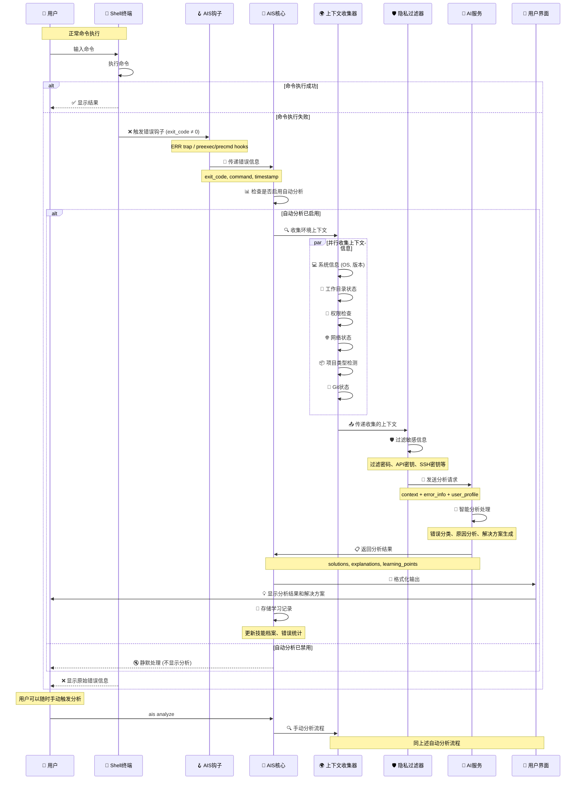

# Shell 集成

Shell 集成是 AIS 的核心功能，通过钩子机制自动捕获命令执行错误并触发智能分析。

## 🔄 Shell 集成工作流程



### 🚀 集成流程详解

#### 1. **钩子机制** 🪝
不同 Shell 使用不同的钩子机制捕获命令执行状态：

- **Bash**: `trap ERR` 捕获失败命令
- **Zsh**: `preexec` + `precmd` 组合捕获
- **Fish**: `fish_postexec` 事件处理

#### 2. **异步处理** ⚡
所有分析过程都在后台异步执行，确保不影响用户的正常操作：

```bash
# 后台异步执行，不阻塞 Shell
ais analyze --exit-code $exit_code --command "$command" &
```

#### 3. **智能触发** 🎯
只有在特定条件下才触发分析，避免不必要的资源消耗：

- 命令退出码非零
- 不是 AIS 内部命令
- 自动分析功能已启用

## 🐚 支持的 Shell

### 完全支持
- **Bash** 4.0+
- **Zsh** 5.0+  
- **Fish** 3.0+

### 基本支持
- **Dash** - 基本错误捕获
- **Ksh** - 基本错误捕获

### 特殊终端支持
- **Warp Terminal** - 完全兼容，自动适配其特殊的历史管理机制

## 🚀 自动设置

### 一键设置
```bash
# 自动检测并配置当前 Shell
ais setup

# 设置完成后重新加载配置
source ~/.bashrc    # Bash
source ~/.zshrc     # Zsh
exec fish          # Fish
```

### 验证设置
```bash
# 测试 Shell 集成
ais test-integration

# 测试集成状态
ais test-integration

# 触发测试错误
false && echo "这个命令会失败"
```

## 🔧 手动配置

### Bash 配置
```bash
# AIS 已自动配置 shell 集成，无需手动添加
# 如需重新配置，请运行：
ais setup

# 或者手动添加以下内容到 ~/.bashrc
__ais_trap() {
    local exit_code=$?
    if [[ $exit_code -ne 0 ]]; then
        ais analyze --exit-code $exit_code --command "$BASH_COMMAND" &
    fi
}
trap __ais_trap ERR
```

### Zsh 配置
```bash
# AIS 已自动配置 shell 集成，无需手动添加
# 如需重新配置，请运行：
ais setup

# 或者手动添加以下内容到 ~/.zshrc
__ais_preexec() {
    AIS_CURRENT_COMMAND="$1"
}
__ais_precmd() {
    local exit_code=$?
    if [[ $exit_code -ne 0 && -n "$AIS_CURRENT_COMMAND" ]]; then
        ais analyze --exit-code $exit_code --command "$AIS_CURRENT_COMMAND" &
    fi
    AIS_CURRENT_COMMAND=""
}
add-zsh-hook preexec __ais_preexec
add-zsh-hook precmd __ais_precmd
```

::: tip Warp Terminal 用户注意
AIS 会自动检测 Warp Terminal 环境并使用兼容的命令历史获取方式。如果遇到问题，请确保：
1. Shell 集成脚本是最新版本
2. 使用 `ais setup` 重新配置
3. 重启终端或运行 `source ~/.zshrc`
:::

### Fish 配置
```bash
# AIS 已自动配置 shell 集成，无需手动添加
# 如需重新配置，请运行：
ais setup

# 或者手动添加以下内容到 ~/.config/fish/config.fish
function __ais_command_not_found --on-event fish_command_not_found
    ais analyze --exit-code 127 --command "$argv[1]" &
end

function __ais_postexec --on-event fish_postexec
    if test $status -ne 0
        ais analyze --exit-code $status --command "$argv[1]" &
    end
end
```

## ⚙️ 集成选项

### 基本选项
```bash
# 查看当前配置
ais config

# 启用/禁用自动分析
ais on
ais off

# 设置上下文收集级别
ais config --set context_level=detailed
```


## 🎯 触发条件

### 默认触发条件
- 命令退出码非零（失败）
- 命令不是 AIS 内部命令

## 🔍 调试集成

### 常见问题诊断
```bash
# 检查集成状态
ais test-integration

# 验证钩子函数
type __ais_trap      # Bash
type __ais_precmd    # Zsh
functions __ais_postexec  # Fish

# Warp Terminal 特定检查
echo $WARP_SESSION_ID    # 检查是否在 Warp 环境
fc -l -1                  # 测试历史命令获取
```

## 🛠️ 高级配置

### 上下文收集
```bash
# 设置上下文收集级别
ais config --set context_level=standard
```

## 🔒 安全考虑

### 敏感信息保护
- AIS 默认已配置敏感目录保护
- 自动过滤常见的敏感信息（密码、密钥等）


## 🚫 禁用和卸载

### 临时禁用
```bash
# 临时禁用自动分析
ais off

# 重新启用
ais on
```

### 完全卸载
```bash
# 手动移除 AIS 集成配置
# 移除 Bash 集成
sed -i '/START AIS INTEGRATION/,/END AIS INTEGRATION/d' ~/.bashrc

# 移除 Zsh 集成
sed -i '/START AIS INTEGRATION/,/END AIS INTEGRATION/d' ~/.zshrc

# 或使用自动卸载脚本
curl -sSL https://raw.githubusercontent.com/kangvcar/ais/main/scripts/uninstall.sh | bash
```

## 📋 集成模板

### 开发环境模板
```bash
# 适合开发环境的集成配置
ais config --set auto_analysis=true
ais config --set context_level=detailed
```

### 生产环境模板
```bash
# 适合生产环境的集成配置
ais config --set auto_analysis=false
ais config --set context_level=minimal
```

---

## 下一步

- [隐私设置](./privacy-settings) - 配置隐私保护
- [错误分析](../features/error-analysis) - 了解错误分析功能
- [故障排除](../troubleshooting/common-issues) - 解决集成问题

---

::: tip 提示
建议使用 `ais setup` 命令自动配置 Shell 集成，它会自动检测并配置最佳设置。
:::

::: info 性能影响
Shell 集成对性能影响极小，分析过程在后台异步执行，不会影响正常命令执行。
:::

::: warning 注意
修改 Shell 集成配置后，需要重新加载 Shell 配置或重启终端才能生效。
:::