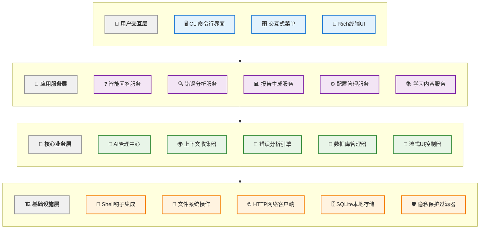
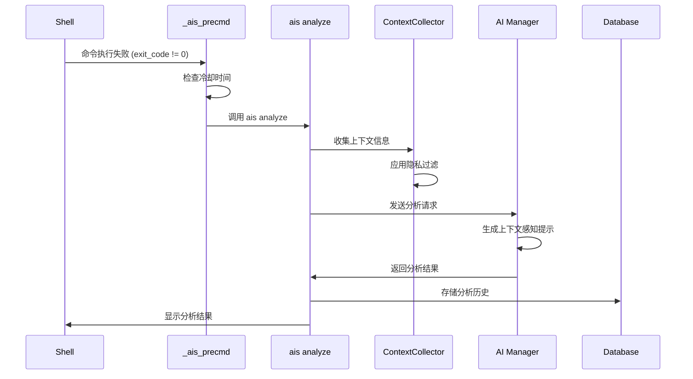
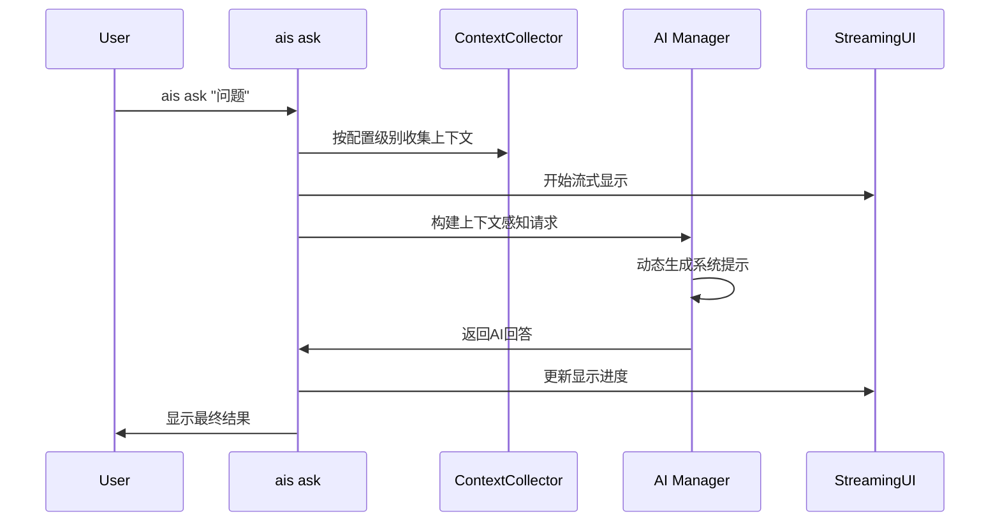
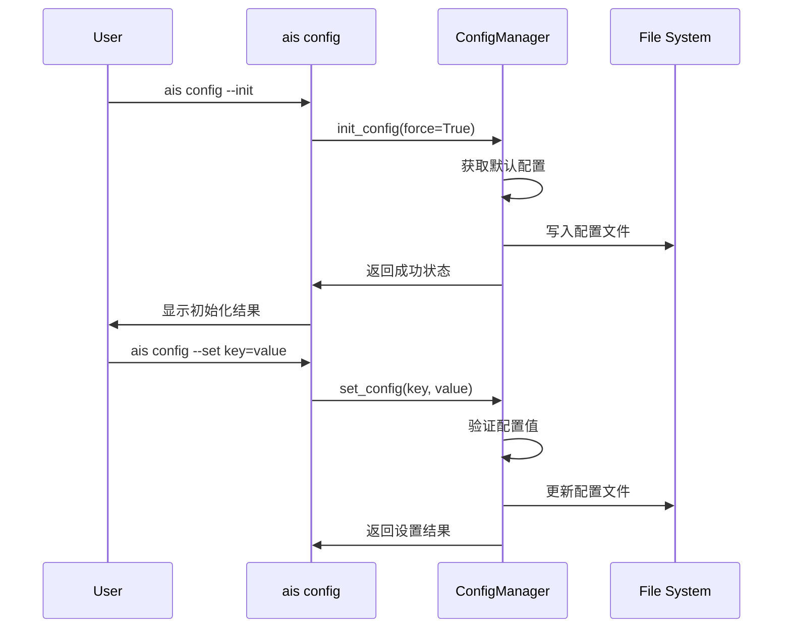

# AIS 架构设计

基于实际代码分析的AIS智能终端助手架构设计文档。本文档详细描述了系统的真实架构、核心组件和设计模式。

## 🏗️ 系统架构概览

AIS采用分层模块化架构，通过深度shell集成提供智能化的终端体验。

### 系统架构图



### 核心特性

- **深度Shell集成**: 通过hook机制自动捕获命令执行和错误
- **多层次上下文收集**: 智能的环境信息收集和隐私保护
- **AI驱动分析**: 支持多AI提供商的错误分析和问答
- **丰富的终端UI**: 基于Rich库的现代化终端界面
- **本地数据存储**: 所有数据本地存储，保护用户隐私

## 📁 真实目录结构

基于实际代码分析的目录组织：

```
src/ais/
├── __init__.py                 # 版本和元数据
├── cli/                        # 命令行界面层
│   ├── main.py                 # 主CLI命令 (1,451行)
│   └── interactive.py          # 交互式菜单 (1,305行)
├── core/                       # 核心业务逻辑
│   ├── ai.py                   # AI集成 (616行)
│   ├── analysis.py             # 错误分析 (421行)
│   ├── config.py               # 配置管理 (157行)
│   ├── context.py              # 上下文收集 (697行)
│   ├── database.py             # 数据库操作 (119行)
│   ├── html_report.py          # HTML报告 (624行)
│   ├── report.py               # 文本报告 (676行)
│   └── streaming.py            # 流式UI (307行)
├── shell/                      # Shell集成
│   └── integration.sh          # Hook脚本 (212行)
├── ui/                         # 用户界面
│   └── panels.py               # 面板组件 (137行)
└── utils/                      # 工具模块 (预留)
```

## 🔧 核心组件详解

### 1. CLI命令系统 (`cli/main.py`)

**设计模式**: Command Pattern + Click框架

```python
@click.group()
def main():
    """AIS智能终端助手主入口"""

# 核心命令
@main.command()
def ask(question):                    # 智能问答
@main.command() 
def analyze(exit_code, command):      # 错误分析
@main.command()
def learn(topic):                     # 学习内容生成
@main.command()
def config(set_key, get_key, init):   # 配置管理
@main.command()
def history(index, failed_only):      # 历史记录
@main.command()
def report(html, open_browser):       # 进度报告
@main.command()
def setup():                          # Shell集成设置
```

**关键特性**:
- 完整的命令集合，支持15+核心命令
- 丰富的参数选项和帮助系统
- 统一的错误处理和用户反馈

### 2. 交互式系统 (`cli/interactive.py`)

**设计模式**: Strategy Pattern + Risk Assessment

```python
class InteractiveMenu:
    def show_interactive_menu(self, suggestions, console, follow_up_questions):
        """智能命令推荐和风险评估"""
        # 多维度评分系统
        # 安全性评估
        # 上下文相关性排序
```

**核心算法**:
- **风险评估**: 三级风险分类(安全/中等/危险)
- **智能排序**: 基于用户上下文、命令复杂度和安全性
- **交互执行**: 直接命令执行与确认机制

### 3. AI集成管理 (`core/ai.py`)

**设计模式**: Provider Pattern + HTTP Client

```python
def _make_api_request(messages, config, temperature=0.7, max_tokens=1000):
    """统一的AI API请求函数"""
    # 多提供商支持
    # 可配置超时机制
    # 结构化错误处理
    
    provider_name = config.get("default_provider", "free")
    provider = config.get("providers", {}).get(provider_name)
    timeout = config.get("advanced", {}).get("request_timeout", 120.0)
```

**架构特点**:
- **通用HTTP客户端**: 支持所有OpenAI兼容API
- **提供商抽象**: 轻松切换AI服务(OpenAI、Claude、本地Ollama等)
- **上下文感知**: 动态系统提示生成
- **配置驱动**: 超时、模型参数完全可配置

### 4. 上下文收集器 (`core/context.py`)

**设计模式**: Template Method + Privacy Protection

```python
def collect_context(command, exit_code, stderr="", config=None):
    """多层次上下文信息收集"""
    context_level = config.get("context_level", "detailed")
    
    # 三级收集策略
    if context_level == "minimal":
        # 基础: 命令、退出码、目录
    elif context_level == "standard": 
        # + Git信息、文件列表、命令历史
    elif context_level == "detailed":
        # + 系统信息、网络状态、权限信息
```

**收集能力**:
- **网络上下文**: DNS解析、连接测试、代理检测
- **权限上下文**: 用户权限、sudo可用性、文件权限
- **项目上下文**: 自动检测Python、Node.js、Docker等项目类型
- **Git集成**: 分支信息、状态、变更检测
- **系统信息**: 硬件规格、运行服务、负载指标
- **隐私保护**: 敏感目录检测和数据过滤

### 5. 配置管理系统 (`core/config.py`)

**设计模式**: Layered Configuration + TOML Format

```python
def get_config() -> Dict[str, Any]:
    """分层配置合并"""
    # 用户配置与默认配置合并
    # 损坏文件的回退机制
    # 首次运行自动初始化

def init_config(force: bool = False) -> bool:
    """配置文件初始化/重置"""
    # 支持强制覆盖
    # 包含所有默认配置
```

**配置架构**:
```toml
# ~/.config/ais/config.toml
default_provider = "free"
auto_analysis = true
context_level = "detailed"
sensitive_dirs = ["~/.ssh", "~/.config/ais", "~/.aws"]

[providers.free]
base_url = "https://openrouter.ai/api/v1/chat/completions"
model_name = "openai/gpt-oss-20b:free"
api_key = "sk-..."

[advanced]
analysis_cooldown = 60        # 分析冷却时间
request_timeout = 120         # HTTP请求超时
max_context_length = 4000     # 最大上下文长度

[ask]
context_level = "minimal"     # Ask命令专用上下文级别
```

### 6. 数据库层 (`core/database.py`)

**设计模式**: Active Record + SQLModel ORM

```python
class CommandLog(SQLModel, table=True):
    """命令历史记录模型"""
    id: Optional[int] = Field(default=None, primary_key=True)
    command: str
    exit_code: int
    stderr: Optional[str] = None
    context: Optional[str] = None  # JSON存储
    suggestions: Optional[str] = None  # JSON存储
    timestamp: datetime = Field(default_factory=datetime.now)
```

**数据策略**:
- **单表存储**: 所有命令历史存储在一个表中
- **JSON字段**: 复杂数据使用JSON序列化
- **SQLite后端**: 轻量级本地存储 `~/.local/share/ais/history.db`
- **类型安全**: SQLModel提供完整的类型检查

### 7. 错误分析引擎 (`core/analysis.py`)

**设计模式**: Analyzer Pattern + Statistical Analysis

```python
class ErrorAnalyzer:
    """错误分析和技能评估"""
    
    def classify_error(self, log: CommandLog) -> str:
        """错误分类"""
        # 模式匹配识别错误类型
        # 命令特定的错误分类
        # 上下文相关的错误理解
    
    def assess_skill_level(self, logs: List[CommandLog]) -> str:
        """技能水平评估"""
        # 命令复杂度分析
        # 错误频率统计
        # 学习进度追踪
```

**分析能力**:
- **错误分类**: 命令未找到、权限拒绝、语法错误等
- **技能评估**: 初学者/中级/高级分类
- **学习建议**: 个性化改进建议
- **趋势分析**: 周期性进度跟踪

### 8. Shell集成系统 (`shell/integration.sh`)

**设计模式**: Hook Pattern + Event-Driven

```bash
_ais_precmd() {
    """Shell钩子函数"""
    # 捕获退出码、命令文本和stderr
    # 应用冷却逻辑防止频繁分析
    # 失败时自动调用 ais analyze
}

# Bash和Zsh通用集成
if [[ -n "$BASH_VERSION" ]]; then
    # Bash特定的集成逻辑
elif [[ -n "$ZSH_VERSION" ]]; then
    # Zsh特定的集成逻辑
fi
```

**集成特点**:
- **自动检测**: 支持bash和zsh自动检测
- **错误捕获**: 实时stderr收集
- **状态保持**: 维护shell状态和环境
- **冷却机制**: 可配置延迟防止重复分析

### 9. 用户界面系统 (`ui/panels.py` + `core/streaming.py`)

**设计模式**: Component Pattern + Progressive Enhancement

```python
class StreamingAnalyzer:
    """流式分析显示"""
    def analyze_with_streaming(self, analyzer_func, *args):
        """5步分析过程的可视化反馈"""
        # ✓ 收集环境上下文...
        # ✓ 解析错误信息...
        # ✓ 诊断问题根因...
        # ✓ 生成解决方案...
        # ✓ 优化建议内容...
```

**UI特性**:
- **Rich终端UI**: 现代化的终端界面
- **进度可视化**: 实时分析进度显示
- **颜色和图标**: 丰富的视觉反馈
- **响应式布局**: 适应不同终端尺寸

## 🔄 核心数据流

### 1. 自动错误分析流程



### 2. 智能问答流程



### 3. 配置管理流程



## 🔌 扩展机制

### 1. AI提供商扩展

系统支持任何OpenAI兼容的API端点：

```python
# 添加新的AI提供商
ais provider-add custom_provider http://localhost:11434/v1/chat/completions llama2 dummy_key
ais provider-use custom_provider

# 配置文件中会自动创建
[providers.custom_provider]
base_url = "http://localhost:11434/v1/chat/completions"
model_name = "llama2"
api_key = "dummy_key"
```

### 2. 上下文收集扩展

通过修改 `context.py` 可以添加新的上下文收集器：

```python
def collect_custom_context():
    """自定义上下文收集器"""
    # 添加特定环境的上下文信息
    return {"custom_info": "value"}
```

### 3. 错误分析模式扩展

可以通过 `analysis.py` 添加新的错误分类和分析模式：

```python
def classify_custom_error(stderr: str) -> str:
    """自定义错误分类"""
    # 实现特定领域的错误分类逻辑
    return "custom_error_type"
```

## 🛡️ 安全和隐私设计

### 1. 隐私保护机制

```python
# 敏感目录检测
sensitive_dirs = ["~/.ssh", "~/.config/ais", "~/.aws"]

def is_sensitive_path(path, sensitive_dirs):
    """检测敏感路径"""
    # 防止在敏感目录收集上下文
    # 用户可配置的敏感目录列表
    # 路径解析和验证
```

### 2. 本地数据存储

- **配置文件**: `~/.config/ais/config.toml`
- **数据库**: `~/.local/share/ais/history.db`
- **日志**: 本地临时文件，不包含敏感信息
- **网络**: 仅与配置的AI提供商通信

### 3. 安全通信

```python
# HTTP客户端配置
with httpx.Client(timeout=timeout) as client:
    # 强制HTTPS（除本地服务）
    # 证书验证
    # 连接超时保护
    response = client.post(base_url, json=payload, headers=headers)
```

## 📊 性能优化

### 1. 上下文收集优化

- **分级收集**: 三级上下文收集策略，避免不必要的信息收集
- **缓存机制**: 相同目录的项目信息缓存
- **异步IO**: 文件系统操作优化

### 2. AI请求优化

- **连接复用**: HTTP客户端连接池
- **超时控制**: 可配置的请求超时
- **错误重试**: 智能重试机制

### 3. 数据库优化

- **SQLite性能**: WAL模式和适当的索引
- **批量操作**: 减少数据库事务次数
- **查询优化**: 高效的历史记录查询

## 🧪 测试架构

### 测试组织

```
tests/
├── test_config.py              # 配置管理测试
├── test_context.py             # 上下文收集测试
├── test_database.py            # 数据库操作测试
├── test_ai.py                  # AI集成测试
├── test_analysis.py            # 错误分析测试
├── test_interactive.py         # 交互系统测试
├── test_cli.py                # CLI命令测试
└── test_integration.py         # 集成测试
```

### 测试策略

- **单元测试**: 每个核心模块的独立功能测试
- **集成测试**: 组件间交互测试
- **Mock测试**: AI API调用的模拟测试
- **端到端测试**: 完整用户场景测试

## 🔮 架构演进

### 当前架构优势

1. **模块化设计**: 清晰的职责分离
2. **可扩展性**: 易于添加新功能和提供商
3. **用户体验**: 丰富的终端UI和智能交互
4. **隐私保护**: 本地存储和敏感信息过滤
5. **配置灵活**: 全面的配置系统

### 潜在改进方向

1. **异步架构**: AI请求和上下文收集的异步化
2. **插件系统**: 标准化的扩展接口
3. **缓存层**: 减少重复的AI请求
4. **更多Shell支持**: Fish、PowerShell等
5. **性能监控**: 内建的性能指标收集
6. **协作功能**: 团队间的知识共享

### 架构约束

1. **Python依赖**: 需要Python 3.9+环境
2. **终端限制**: 主要针对命令行用户
3. **Shell集成**: 深度依赖bash/zsh钩子机制
4. **本地存储**: 不支持云端同步
5. **网络依赖**: AI功能需要网络连接

## 📋 架构决策记录

### ADR-001: 选择Click作为CLI框架
**决策**: 使用Click而不是argparse
**原因**: 更好的嵌套命令支持、自动帮助生成、类型检查
**影响**: 统一的CLI体验，但增加了依赖

### ADR-002: 使用Rich进行终端UI
**决策**: 采用Rich库进行终端美化
**原因**: 现代化的终端体验、丰富的组件、良好的跨平台支持
**影响**: 显著提升用户体验，但增加了包大小

### ADR-003: SQLModel作为ORM
**决策**: 使用SQLModel而不是原生SQL
**原因**: 类型安全、代码简洁、与Pydantic集成
**影响**: 更好的开发体验，但学习成本略高

### ADR-004: TOML配置格式
**决策**: 选择TOML而不是JSON或YAML
**原因**: 人类可读、支持注释、Python原生支持
**影响**: 用户友好的配置文件，但解析稍慢

### ADR-005: Shell钩子深度集成
**决策**: 使用Shell钩子而不是别名或包装器
**原因**: 自动错误捕获、透明集成、保持原始命令体验
**影响**: 功能强大但集成复杂度高

---

## 结论

AIS采用了现代化的模块化架构，通过深度Shell集成和AI驱动分析，为终端用户提供了智能化的命令行体验。架构设计充分考虑了可扩展性、隐私保护和用户体验，同时保持了代码的清晰度和维护性。

系统的核心优势在于：
- 真正的智能化终端集成
- 全面的上下文感知能力  
- 灵活的AI提供商支持
- 强大的隐私保护机制
- 现代化的用户界面

这种架构为未来的功能扩展和性能优化提供了坚实的基础。