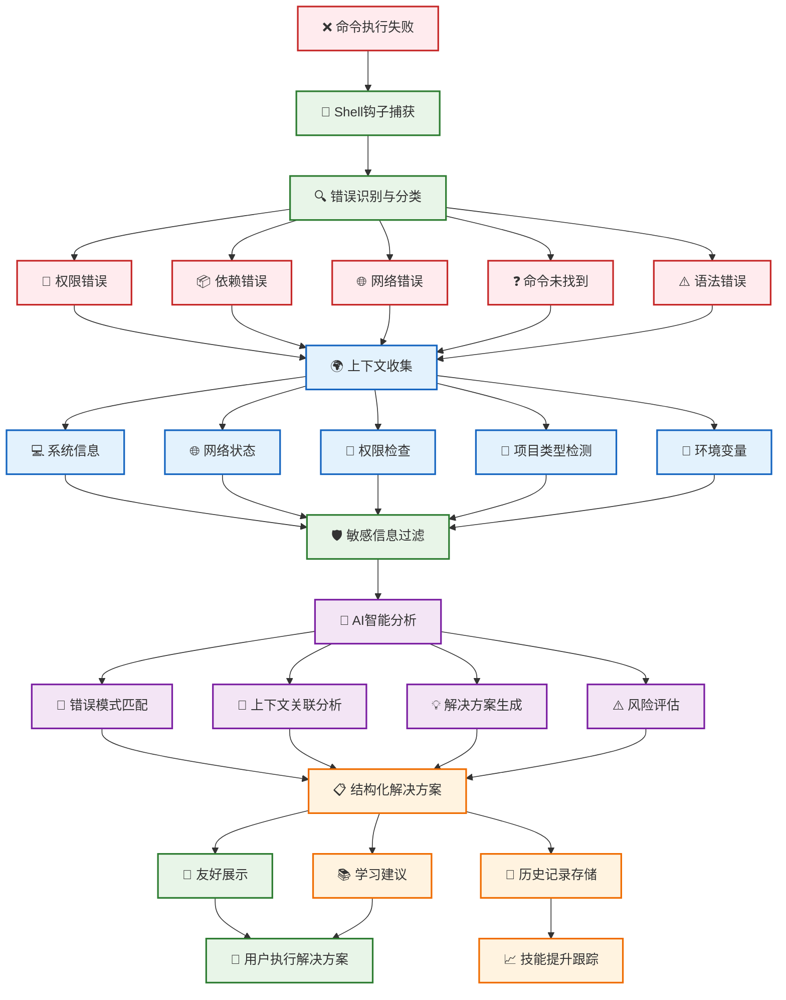

# 错误分析

AIS 的核心功能是智能错误分析，通过深度 Shell 集成和上下文感知，将每次命令行报错转化为学习和成长的机会。

## 🎯 功能概览

### 自动错误捕获
AIS 通过 Shell 钩子自动捕获命令执行错误，无需手动触发分析：

```bash
# 当命令执行失败时，AIS 会自动分析
sudo systemctl start nonexistent-service
# ✗ Failed to start nonexistent-service.service: Unit nonexistent-service.service not found.

# AIS 自动分析并提供解决方案
🔍 AIS 正在分析错误...
📋 错误类型: 服务未找到
💡 可能的解决方案:
  1. 检查服务名称拼写
  2. 查看可用的服务列表
  3. 安装缺失的服务包
```

### 上下文感知分析
AIS 收集多维度上下文信息，提供更精准的分析：

- **系统信息**：操作系统、发行版、内核版本
- **网络状态**：连接状态、DNS 解析、代理设置
- **权限检查**：用户权限、sudo 可用性、文件权限
- **项目类型**：Git 仓库、Python 项目、Node.js 项目等
- **环境变量**：PATH、PYTHONPATH、NODE_PATH 等

## 🚀 使用方式

### 自动分析
安装并设置 Shell 集成后，AIS 会自动分析每个失败的命令：

```bash
# 设置 Shell 集成
ais setup

# 重新加载配置
source ~/.bashrc  # 或 ~/.zshrc

# 现在所有失败的命令都会被自动分析
```

### 手动分析
也可以手动触发错误分析：

```bash
# 分析最近的错误
ais analyze

# 分析特定命令
ais analyze --command "npm install"

# 分析特定退出码
ais analyze --exit-code 127 --command "python app.py"
```

## 🔍 智能分析流程



### 分析过程详解

#### 1. 错误识别与分类
AIS 自动识别不同类型的错误：

```bash
# 权限错误
sudo: unable to resolve host
# 🔍 检测到权限相关错误

# 依赖错误
ModuleNotFoundError: No module named 'requests'
# 🔍 检测到 Python 依赖错误

# 网络错误
Could not resolve host: github.com
# 🔍 检测到网络连接错误

# 命令未找到错误
bash: docker: command not found
# 🔍 检测到命令未找到错误
```

#### 2. 上下文收集
收集相关的环境信息：

```bash
📊 收集上下文信息...
  ✓ 系统信息
  ✓ 网络状态
  ✓ 权限检查
  ✓ 项目类型检测
  ✓ 环境变量
```

#### 3. AI 智能分析
基于上下文信息，使用 AI 生成解决方案：

```bash
🤖 AI 分析中...
  ✓ 错误模式匹配
  ✓ 上下文关联分析
  ✓ 解决方案生成
  ✓ 风险评估
```

## 💡 解决方案展示

### 结构化建议
AIS 提供结构化的解决方案，包含风险评估：

```bash
📋 错误分析结果

🔍 错误类型: ModuleNotFoundError
📝 描述: Python 模块 'requests' 未找到

💡 解决方案:

1. 📦 安装 requests 模块 (推荐)
   命令: pip install requests
   风险: 🟢 安全 - 常用库，无风险
   
2. 🔧 使用虚拟环境
   命令: python -m venv venv && source venv/bin/activate && pip install requests
   风险: 🟢 安全 - 最佳实践
   
3. 📋 检查 requirements.txt
   命令: pip install -r requirements.txt
   风险: 🟡 中等 - 需要确认文件内容

🎯 学习建议:
  • 了解 Python 包管理
  • 学习虚拟环境使用
  • 掌握依赖管理最佳实践
```

### 风险评估
每个建议都包含风险评估：

- 🟢 **安全**：无风险，可以直接执行
- 🟡 **中等**：需要注意，建议先了解详情
- 🔴 **危险**：高风险，需要谨慎考虑

## 🎓 学习导向

### 知识点提取
AIS 从错误中提取相关的学习点：

```bash
📚 相关知识点:
  • Python 包管理系统
  • 虚拟环境的作用
  • requirements.txt 文件
  • pip 命令使用
```

### 深度学习建议
提供深度学习建议：

```bash
💡 建议学习:
  1. 运行 'ais learn python-packaging' 了解包管理
  2. 运行 'ais learn virtual-environments' 学习虚拟环境
  3. 查看历史类似错误: 'ais history --type dependency'
```

## 📊 错误统计

### 个人错误模式
AIS 分析你的个人错误模式：

```bash
# 查看错误统计
ais report

📊 错误分析报告
─────────────────────────────

📈 最常见错误类型:
  1. 权限错误 (32%)
  2. 依赖错误 (28%)
  3. 网络错误 (20%)
  4. 命令未找到 (20%)

🎯 改进建议:
  • 加强权限管理学习
  • 完善依赖管理流程
  • 改善网络环境配置
```

### 技能提升跟踪
跟踪你的技能提升情况：

```bash
📈 技能提升统计:
  • 权限管理: 初级 → 中级 (↑)
  • Python 开发: 中级 → 高级 (↑)
  • 网络诊断: 初级 → 初级 (→)
```

## ⚙️ 配置选项

### 自动分析设置
```bash
# 开启自动分析
ais on

# 关闭自动分析
ais off

# 查看当前状态
ais config
```

### 上下文收集级别
```bash
# 设置上下文收集级别
ais config --set context_level=minimal    # 最小信息
ais config --set context_level=standard   # 标准信息（默认）
ais config --set context_level=detailed   # 详细信息
```

### 敏感信息过滤
```bash
# 查看当前敏感目录配置
ais config

# 敏感目录已默认配置：
# ~/.ssh, ~/.config/ais, ~/.aws
# 这些目录的信息不会被收集
```

---

## 下一步

- [AI 问答](./ai-chat.md) - 了解 AI 问答功能
- [学习系统](./learning-system.md) - 了解学习系统功能
- [基本配置](../configuration/basic-config.md) - 配置 AIS 设置
- [Shell 集成](../configuration/shell-integration.md) - 配置 Shell 集成

---

::: tip 提示
错误分析是 AIS 的核心功能，建议开启自动分析以获得最佳体验。
:::

::: info 隐私保护
AIS 在分析过程中会自动过滤敏感信息，如密码、API 密钥等。
:::

::: warning 注意
某些解决方案可能需要管理员权限，请在执行前仔细阅读风险评估。
:::