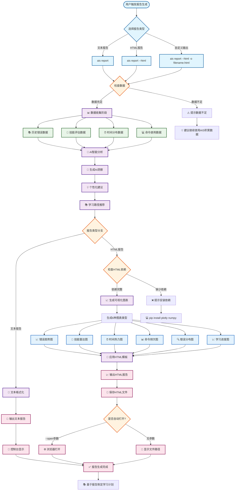

# 学习报告

AIS 的学习报告功能为您提供详细的学习成长分析，包括文本格式和可视化HTML两种报告形式，帮助您了解技能发展趋势、识别学习重点，并制定个性化的学习计划。

## 📊 功能概览

### 核心特性
- **错误模式分析**：统计最常见的错误类型和命令
- **技能评估**：基于历史错误数据评估用户技能水平
- **AI智能洞察**：提供个性化的深度分析和改进建议
- **趋势分析**：展示用户的学习进步趋势
- **多维度统计**：从时间、技能、领域等多个维度分析
- **可视化展示**：HTML格式支持6种专业图表类型

## 🚀 生成学习报告

### 📊 报告生成工作流程



### 📄 文本格式报告（默认）
```bash
# 生成文本格式学习报告（默认）
ais report

# 查看历史记录
ais history
ais history --failed-only
ais history 3  # 查看第3条记录详情
```

### 📈 HTML可视化报告（推荐）
```bash
# 生成HTML可视化报告
ais report --html

# 自定义输出文件名
ais report --html -o my_report.html

# 生成后自动打开浏览器
ais report --html --open

# 组合使用
ais report --html -o weekly_progress.html --open
```

#### HTML报告的6种图表类型：
- 📈 **错误趋势图**：30天错误变化趋势
- 🎯 **技能评估雷达图**：多维度技能水平展示
- ⏰ **时间热力图**：错误时间分布规律
- 📊 **命令频次图**：最常出错命令排序
- 🔍 **错误类型分布**：错误模式饼图分析
- 📈 **学习进度趋势**：错误减少与技能提升关系

### 安装可视化依赖

要使用HTML可视化报告功能，需要安装额外的依赖：

```bash
# 使用 pipx 安装（推荐）
pipx install "ais-terminal[html]"

# 或者在现有安装基础上添加
pip install plotly numpy

# 验证安装
ais report --html --help
```

## 📈 报告内容解析

### 📄 文本格式报告内容

AIS的文本报告包含以下主要部分：

#### 🧠 AI智能洞察
位于报告顶部的个性化分析总结，基于您的错误模式和学习轨迹生成3-5句深度洞察。

#### 🔍 错误概览
- 总错误数统计（最近30天）
- 最常出错的命令列表（前5名）
- 最常见的错误类型分布（前5名）

#### 💪 技能评估
- 当前技能水平（初学者/中级用户/熟练者/探索者）
- 技能优势领域识别
- 需要改进的薄弱环节
- 知识盲点提醒

#### 💡 改进洞察
基于错误频率和类型的智能分析：
- 高频错误警告和建议
- 错误趋势分析（上升/下降/稳定）
- 技能集中度分析

#### 🎯 学习建议
个性化学习路径推荐：
- 命令掌握建议（基于高频错误）
- 错误预防技巧学习
- 技能提升专项训练

#### 🚀 下一步行动
具体可执行的学习计划，包括优先级排序的学习步骤。

### 📊 HTML可视化报告内容

HTML报告提供更丰富的数据可视化体验：

#### 🎯 交互式图表展示
- **错误趋势图**：折线图显示30天错误变化
- **技能雷达图**：多维度技能水平可视化
- **时间热力图**：错误时间分布模式
- **命令频次图**：柱状图显示高频错误命令
- **错误类型分布**：饼图展示错误模式
- **学习进度趋势**：双轴图显示错误与技能关系

#### 🎨 现代化用户界面
- 响应式设计，完美适配各种设备
- 悬停交互，查看图表详细数据
- 专业配色方案和视觉效果
- AI洞察高亮展示

> 💡 **查看详细使用指南**：[HTML可视化报告完整文档](./html-reports.md)

::: tip 查看真实报告示例
想要查看 AIS 生成的真实 HTML 报告效果吗？  
👉 [点击查看报告示例](/report.html) - 这是一个包含完整数据可视化和AI洞察分析的真实报告示例！
:::

## 🎯 使用场景

### 📚 个人学习跟踪

定期生成报告，跟踪自己的技能成长轨迹：

```bash
# 每周生成学习报告
ais report --html -o "第$(date +%U)周学习报告.html"

# 每月生成技能评估
ais report --html -o "$(date +%Y年%m月)技能评估.html" --open
```

### 💼 技能展示

用于面试、求职或工作汇报：

```bash
# 生成技能展示报告
ais report --html -o "个人技能展示_$(date +%Y%m%d).html"
```

### 🎓 学习计划制定

基于报告数据制定针对性的学习计划：

1. 查看技能雷达图识别薄弱领域
2. 分析错误频次图找出重点命令
3. 利用时间热力图优化学习时间
4. 根据AI洞察调整学习策略

### 👥 团队技能分析

在团队中使用，了解团队整体技能分布：

```bash
# 团队成员分别生成报告
ais report --html -o "团队成员_张三_$(date +%m%d).html"
ais report --html -o "团队成员_李四_$(date +%m%d).html"
```

## 🔧 高级功能

### 📊 数据隐私控制

AIS注重用户隐私，所有数据本地存储：

```bash
# 查看数据存储位置
ais config | grep database

# 清理历史数据（谨慎操作）
# sqlite3 ~/.local/share/ais/ais.db "DELETE FROM command_logs WHERE timestamp < datetime('now', '-90 days');"
```

### ⚙️ 报告配置

```bash
# 查看当前配置
ais config

# 设置上下文收集级别（影响报告详细度）
ais config --set context_level=detailed

# 设置AI问答的上下文级别
ais config --set ask.context_level=standard
```

## 🚀 最佳实践

### 📅 建立定期报告习惯

```bash
# 可以添加到 crontab 定期执行
# 每周一上午9点生成报告
# 0 9 * * 1 ais report --html -o ~/reports/weekly_$(date +\%Y\%U).html
```

### 📈 持续改进流程

1. **每周回顾**：生成HTML报告，分析学习进展
2. **识别问题**：关注高频错误和薄弱技能
3. **制定计划**：基于AI建议制定下周学习重点
4. **实践练习**：针对性练习识别出的问题命令
5. **追踪效果**：下周报告对比，验证改进效果

### 🎯 目标导向学习

- 设定具体的技能提升目标
- 利用雷达图跟踪进度
- 关注错误趋势的下降
- 定期调整学习策略

## 📚 相关文档

- [HTML可视化报告详细指南](./html-reports.md) - 深入了解可视化功能
- [错误分析](./error-analysis.md) - 从错误中学习
- [学习系统](./learning-system.md) - 系统化技术学习
- [AI问答](./ai-chat.md) - 智能问答助手

## 💡 提示

- 报告质量随着使用时间增长而提高，建议持续使用
- AI洞察基于真实数据分析，比通用建议更有针对性
- HTML报告支持离线查看和分享
- 可视化图表有助于快速识别学习模式和趋势

## ⚠️ 注意事项

- HTML报告功能现在默认包含，无需额外安装依赖
- 技能评估基于错误分析，实际能力可能有差异
- 建议结合实际项目经验综合评估技能水平
- 数据完全本地存储，无云端上传风险