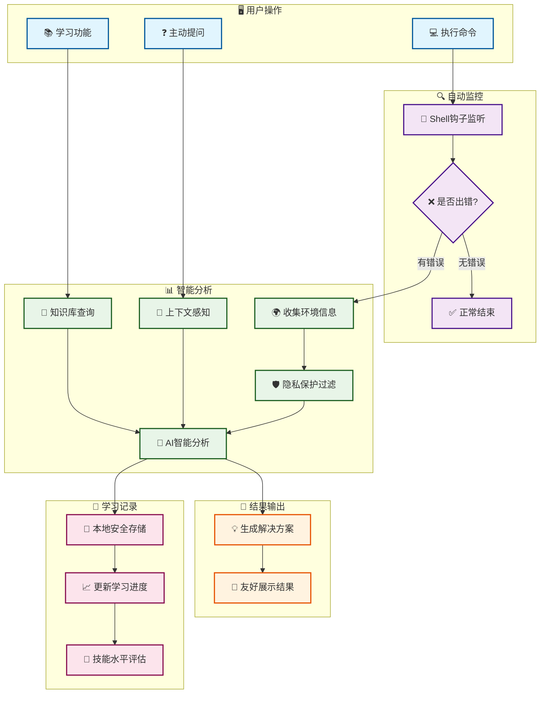
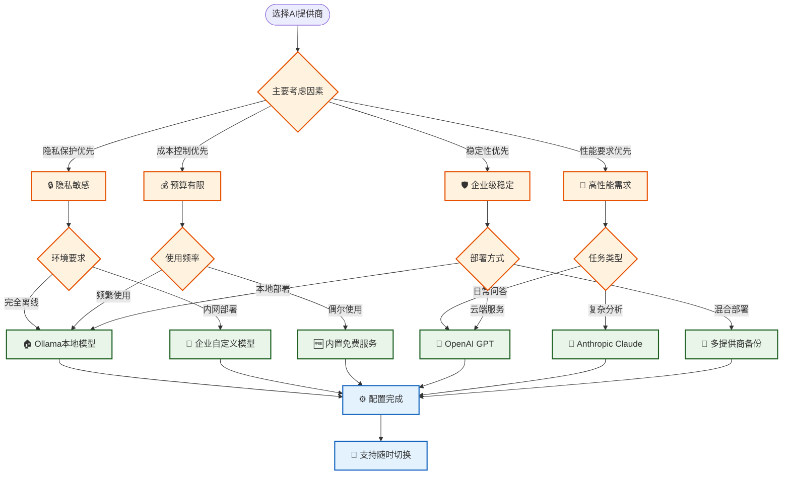
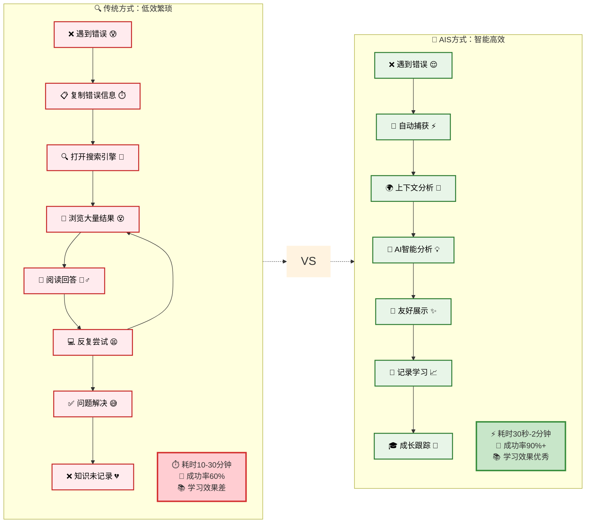
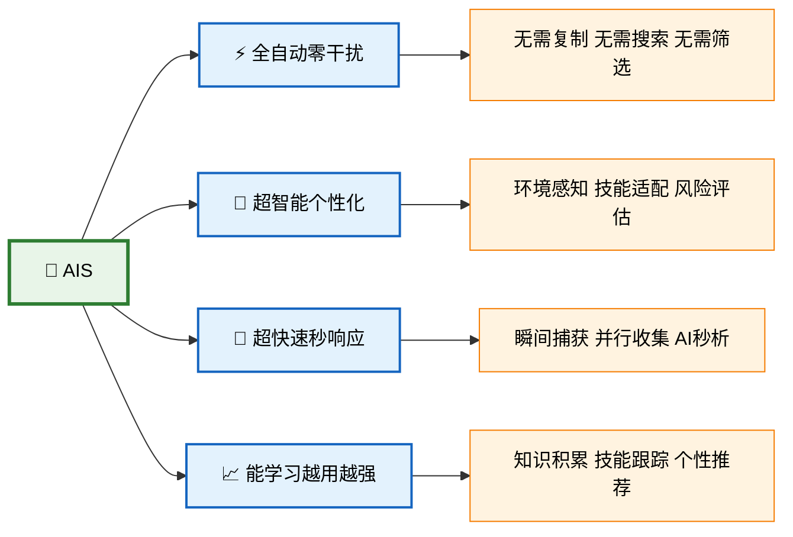
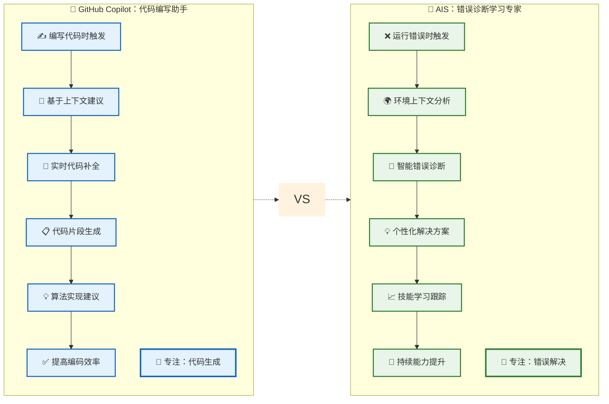
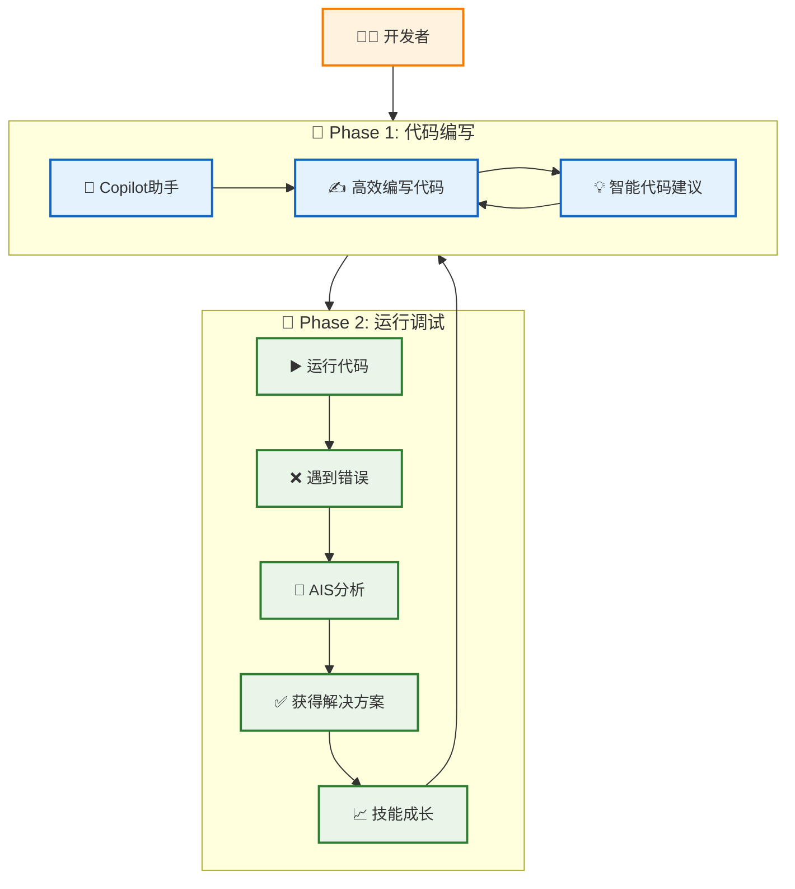

# 常见问答

本文档回答了用户最常问的问题，帮助您深入了解 AIS 的设计理念、使用价值和最佳实践。

## 🌟 项目愿景与设计哲学

### AIS 的设计初衷是什么？

AIS (AI Shell) 诞生于一个朴素的理念：**让每个人都能从错误中高效学习，将失败转化为成长的动力**。

我们观察到，在日常工作中：
- 开发者经常遇到相同的错误，但缺乏系统性的学习机制
- 新手面对错误信息往往感到困惑，不知道从何入手解决
- 经验丰富的工程师也会因为知识盲区而在某些问题上反复踩坑
- 传统的搜索引擎虽然能提供答案，但缺乏个性化和上下文感知

AIS 的核心理念是：**错误不是障碍，而是最好的学习机会**。通过 AI 技术将错误分析、问题解决和知识学习无缝整合，让每次失败都成为技能提升的阶梯。

### AIS 的设计理念有哪些？

#### 1. **上下文感知优先**
不同于传统工具的通用化回答，AIS 深度理解你的工作环境：
- 自动收集系统信息、项目结构、Git 状态
- 根据你的技能水平提供个性化建议
- 考虑当前工作场景给出针对性解决方案

#### 2. **无侵入式集成**
我们相信最好的工具是"隐形"的：
- 与现有工作流程无缝融合，不改变使用习惯
- 通过 Shell 钩子机制自动捕获错误，无需手动操作
- 后台智能分析，不干扰正常的命令执行

#### 3. **渐进式学习**
从被动的错误修复到主动的技能提升：
- 错误分析 → 问题解决 → 知识理解 → 技能内化
- 个性化学习路径，根据你的错误模式推荐学习内容
- 长期追踪学习进度，可视化技能成长轨迹

#### 4. **AI 增强的人机协作**
AI 不是替代人类思考，而是放大人类的学习能力：
- 快速定位问题根因，节省故障排除时间
- 提供多种解决方案，培养解决问题的思维
- 深层知识解析，帮助理解"为什么"而不仅是"怎么做"

#### 5. **隐私与安全第一**
在 AI 时代保护用户隐私：
- 所有数据本地存储，用户拥有完全控制权
- 支持完全离线的本地 AI 模型
- 自动过滤敏感信息，可配置的隐私保护级别
- 透明的数据使用政策，用户知情同意

### AIS 相比其他工具的独特价值是什么？

| 对比维度 | 传统搜索引擎 | Stack Overflow | AI 助手(ChatGPT) | AIS |
|---------|-------------|---------------|------------------|-----|
| **上下文理解** | ❌ 通用化回答 | ❌ 需要手动描述 | ⚠️ 有限的上下文 | ✅ 深度环境感知 |
| **学习追踪** | ❌ 无学习记录 | ❌ 分散的知识 | ❌ 无个人档案 | ✅ 系统化学习追踪 |
| **自动化集成** | ❌ 需要手动查询 | ❌ 需要手动提问 | ❌ 需要手动输入 | ✅ 自动错误捕获 |
| **个性化程度** | ❌ 千人一面 | ⚠️ 基于投票热度 | ⚠️ 对话内个性化 | ✅ 基于历史和技能 |
| **隐私保护** | ❌ 搜索记录上传 | ❌ 公开提问 | ❌ 对话数据训练 | ✅ 本地化+可选云端 |

## 🎯 目标用户与使用场景

### 谁最适合使用 AIS？

#### 1. **开发新手和学生** 🎓
- **痛点**：面对错误信息茫然无措，不知道从何入手
- **AIS 价值**：
  - 将复杂的错误信息转化为易懂的解释
  - 提供循序渐进的解决步骤
  - 建立系统化的知识体系，而不是碎片化学习
  - 可视化学习进度，增强学习成就感

**真实案例**：某计算机专业大一学生使用 AIS 三个月后，Docker 容器操作错误率从 85% 降低到 20%，并且能够独立解决 Git 合并冲突问题。

#### 2. **经验丰富的开发者** 💼
- **痛点**：虽然技能扎实，但在新技术栈或复杂环境中仍会遇到盲区
- **AIS 价值**：
  - 快速定位不熟悉领域的问题根因
  - 基于丰富经验提供高质量的上下文分析
  - 帮助探索新技术栈，降低学习成本
  - 记录和分享团队常见问题的解决方案

**真实案例**：某高级后端工程师在切换到 DevOps 角色时，使用 AIS 在两周内掌握了 Kubernetes 集群的常见故障排除技巧。

#### 3. **运维和 SRE 工程师** 🔧
- **痛点**：需要快速诊断和解决生产环境问题，时间压力大
- **AIS 价值**：
  - 实时的系统状态感知和智能分析
  - 基于历史故障模式的快速诊断
  - 多维度的系统健康状况分析
  - 形成可复用的故障处理知识库

**真实案例**：某 SRE 团队使用 AIS 后，平均故障解决时间从 45 分钟缩短到 15 分钟，并且建立了包含 200+ 常见问题的智能知识库。

#### 4. **技术团队 Leader** 👨‍💼
- **痛点**：需要提升团队整体技术水平，规范化问题解决流程
- **AIS 价值**：
  - 团队技能水平可视化分析
  - 统一的问题诊断和解决标准
  - 新员工快速上手的学习路径
  - 基于数据的技能培训决策支持

**真实案例**：某创业公司 CTO 使用 AIS 为 10 人技术团队建立了标准化的故障处理流程，新员工上手时间从 3 周缩短到 1 周。

#### 5. **自学者和技术爱好者** 🚀
- **痛点**：缺乏系统性的学习路径，容易迷失在海量的技术资料中
- **AIS 价值**：
  - 个性化的学习路径推荐
  - 实践驱动的学习方式（从解决实际问题中学习）
  - 技能成长可视化，保持学习动力
  - 与实际工作场景结合的深度学习

### 典型使用场景分析

#### 场景 1：日常开发调试 🐛
**情况描述**：在开发过程中遇到各种技术问题

```bash
# 场景：Docker 容器启动失败
$ docker run my-app
Error: failed to create endpoint on network bridge: failed to add the host...

# AIS 自动分析
📊 错误分析完成
📋 问题类型：Docker 网络配置冲突
🔍 根本原因：端口 8080 已被占用，且防火墙规则阻止容器网络访问
💡 解决建议：
1. 检查端口占用：lsof -i :8080
2. 修改容器端口映射：docker run -p 8081:8080 my-app
3. 或终止占用进程：sudo kill $(lsof -t -i:8080)

📚 相关学习：建议学习 "docker" 主题以深入了解容器网络
```

#### 场景 2：生产环境故障排除 🚨
**情况描述**：生产系统出现问题，需要快速定位和解决

```bash
# 场景：服务器性能异常
$ top
# AIS 检测到系统负载异常高

# 主动分析
$ ais ask "系统负载突然升高到 15.0，如何快速定位问题？"

🧠 基于当前环境分析：
💻 系统状态：Linux Ubuntu 20.04, 8核16GB, 当前负载15.23
📊 资源使用：CPU 95%, 内存 89%, 磁盘I/O 高
🔍 异常进程：检测到 mysqld 进程CPU占用 89%

📋 推荐排查步骤：
1. 立即检查数据库慢查询：SHOW PROCESSLIST;
2. 查看最近的查询日志：tail -f /var/log/mysql/slow.log
3. 检查是否有死锁：SHOW ENGINE INNODB STATUS;
4. 临时限制连接数：SET GLOBAL max_connections=50;

⚡ 紧急处理：如果问题持续，建议重启 mysql 服务
```

#### 场景 3：技能学习和提升 📖
**情况描述**：系统化学习新技术或深入理解某个领域

```bash
# 主动学习
$ ais learn kubernetes

🎓 Kubernetes 容器编排学习指南

📚 学习路径：
├── 基础概念（Pod、Service、Deployment）
├── 集群架构（Master/Node 组件）
├── 存储管理（PV、PVC、StorageClass）
├── 网络配置（CNI、Ingress、NetworkPolicy）
├── 监控运维（Prometheus、Grafana）
└── 故障排除（常见问题诊断）

🎯 基于你的历史错误，建议重点关注：
- Pod 调度失败的常见原因
- Service 网络连通性问题
- 存储挂载权限配置

💡 实践建议：
建议先在本地搭建 minikube 环境进行练习
```

#### 场景 4：学生编程学习 🎓
**情况描述**：计算机专业学生在学习过程中遇到的技术问题

```bash
# 场景：Python 作业调试
$ python homework.py
Traceback (most recent call last):
  File "homework.py", line 15, in <module>
    result = divide(10, 0)
  File "homework.py", line 3, in divide
    return a / b
ZeroDivisionError: division by zero

# AIS 自动分析
📊 错误分析完成
📋 问题类型：除零错误 (ZeroDivisionError)
🔍 根本原因：函数 divide() 在第3行尝试用0作除数

💡 解决建议：
1. 添加异常处理：
   def divide(a, b):
       if b == 0:
           return "Error: Cannot divide by zero"
       return a / b

2. 使用 try-except 结构：
   try:
       result = a / b
   except ZeroDivisionError:
       print("除数不能为零")

📚 学习重点：Python 异常处理机制
建议学习：try-except、raise、自定义异常类
```

## 🏗️ 技术架构与设计选择

### 为什么选择 Shell 集成而不是 IDE 插件？

这是一个深思熟虑的设计决策：

#### **Shell 集成的优势**：
1. **环境完整性**：Shell 是最接近实际运行环境的地方，能够捕获真实的系统状态
2. **工具无关性**：无论你使用 vim、VS Code、IntelliJ 还是其他编辑器，都能获得一致的体验
3. **系统级视角**：能够收集完整的系统信息、环境变量、进程状态等上下文
4. **实时性**：在问题发生的第一时间进行捕获和分析

#### **与 IDE 插件的对比**：
```
IDE 插件方式：代码编写 → 编译/运行 → 切换到终端 → 出现错误 → 回到 IDE → 查看错误
AIS Shell 集成：代码编写 → 运行命令 → 错误捕获 → 即时分析 → 解决方案
```

### AIS 的工作流程是怎样的？



### 为什么支持多种 AI 提供商？



#### **多提供商策略优势**：

1. **技术多样性**：
   - **OpenAI GPT**：综合能力强，API 稳定，适合日常使用
   - **Anthropic Claude**：推理能力突出，安全性好，适合复杂分析
   - **本地模型 (Ollama)**：完全离线，隐私保护，适合敏感环境
   - **自定义模型**：企业内部模型，满足特殊需求

2. **风险分散**：
   - 避免单一供应商依赖
   - 服务中断时的备用方案
   - 成本控制和优化选择

3. **灵活切换**：
   ```bash
   # 根据需要随时切换AI提供商
   ais provider-use openai    # 使用OpenAI
   ais provider-use claude    # 切换到Claude
   ais provider-use ollama    # 切换到本地模型
   ```

## 🆚 与竞品对比分析

### AIS vs. 传统错误查询方式



### 📊 一目了然的优势对比

| 🔥 对比维度 | 😰 传统方式 | 🚀 AIS方式 | 🎯 提升幅度 |
|------------|------------|------------|------------|
| **⏱️ 响应时间** | 10-30分钟 | 30秒-2分钟 | **🚀 提升15倍** |
| **🎯 解决成功率** | ~60% | >90% | **📈 提升50%** |
| **🧠 操作复杂度** | 需要7-10个手动步骤 | 完全自动化 | **⚡ 零操作** |
| **🔄 重复问题处理** | 每次都要重新搜索 | 智能识别秒解 | **🎯 瞬间识别** |
| **📚 学习积累** | 知识分散难记忆 | 系统化成长跟踪 | **📈 指数增长** |
| **🌍 上下文理解** | 通用答案不精准 | 环境感知个性化 | **💯 量身定制** |

### 🎉 AIS核心优势亮点



#### **效率对比分析**
| 对比维度 | 传统方式 | AIS方式 |
|---------|---------|---------|
| **时间成本** | 10-30分钟 | 30秒-2分钟 |
| **准确性** | 需要自行判断 | 基于上下文精准分析 |
| **学习效果** | 碎片化知识 | 系统化学习记录 |
| **重复问题** | 每次都要重新搜索 | 智能识别并快速解决 |

### AIS vs. GitHub Copilot / CodeWhisperer



### 🔄 完美互补关系



#### **核心差异对比**
| 🔥 对比维度 | 🤖 GitHub Copilot | 🧠 AIS | 🎯 互补价值 |
|------------|-------------------|---------|------------|
| **⚡ 工作阶段** | 代码编写时 | 代码出错时 | **覆盖完整开发周期** |
| **🎯 核心功能** | 代码生成建议 | 错误诊断解决 | **写代码+调代码** |
| **🌍 上下文范围** | 当前项目代码 | 完整系统环境 | **代码+运行环境** |
| **📚 学习方式** | 代码模式学习 | 错误解决学习 | **技能全面提升** |
| **🔄 触发方式** | 主动编写触发 | 自动错误捕获 | **主动+被动结合** |

### 💡 **最佳实践建议**

1. **🤖 Copilot 优势场景**：
   - 函数实现、算法编写
   - 代码补全、模板生成
   - 新语言语法学习

2. **🧠 AIS 优势场景**：
   - 运行时错误诊断
   - 环境配置问题
   - 系统级故障排除

3. **🔄 协同使用**：
   - Copilot 帮你写出代码 → AIS 帮你解决运行问题 → 学习积累 → 更好地使用 Copilot

### AIS vs. 企业级监控工具

| 对比维度 | Datadog/NewRelic | AIS |
|---------|------------------|-----|
| **目标用户** | 企业运维团队 | 个人开发者+小团队 |
| **部署复杂度** | 高（需要专业配置） | 低（一键安装） |
| **成本** | 高（企业级收费） | 低（开源+可选AI服务） |
| **个性化** | 有限 | 高（基于个人技能） |
| **学习功能** | 无 | 核心功能 |

## 📈 成功案例与用户故事

### 案例 1：中职学生Linux课堂的学习兴趣提升

**背景**：某职业技术学校计算机应用专业，18岁学生小李，Linux系统管理课程

**学习现状**：
- 对黑屏命令行界面感到恐惧和抗拒
- 经常因为命令输错而产生挫败感
- 觉得Linux "太难了"，学习兴趣低落
- 课堂注意力不集中，成绩处于班级中下游

**AIS 介入后的转变**：
```bash
# 场景：第一次尝试创建目录
$ mkdir /root/test
mkdir: cannot create directory '/root/test': Permission denied

# AIS 友好分析
📊 权限错误分析
🔍 问题原因：普通用户无法在 /root 目录下创建文件夹
💡 这很常见，不要担心！Linux 系统为了安全会限制某些目录的访问

🛠️ 简单解决方案：
1. 在自己的主目录创建：mkdir ~/test
2. 或者使用管理员权限：sudo mkdir /root/test
3. 推荐使用第一种方法，更安全！

📚 知识点：Linux 目录权限保护机制
~ 代表你的家目录，这里你有完全控制权
```

**3个月学习变化**：
- **心理层面**：从"Linux太难"到"我也能搞定Linux"
- **操作技能**：掌握50+个常用命令，错误率从90%降到20%
- **课堂表现**：从后排开小差到主动举手回答问题
- **学习成绩**：从班级倒数第5名提升到前10名
- **职业规划**：开始考虑往Linux运维方向发展

### 案例 2：软件工程实习生的快速成长

**背景**：某软件公司实习生，计算机专业大三学生，第一次接触企业级开发

**实习困难**：
- Linux 命令不熟悉，经常操作错误
- Git 工作流程复杂，合并冲突频繁
- Docker 容器化部署完全陌生

**AIS 实际应用**：
```bash
# 场景：Git 合并冲突处理
$ git merge feature-branch
Auto-merging src/main.py
CONFLICT (content): Merge conflict in src/main.py
Automatic merge failed; fix conflicts and then commit the result.

# AIS 智能指导
🔥 Git 合并冲突检测
📁 冲突文件：src/main.py
🎯 冲突类型：内容冲突 (content conflict)

📋 解决步骤：
1. 打开冲突文件查看标记：
   <<<<<<< HEAD
   当前分支的代码
   =======
   要合并分支的代码
   >>>>>>> feature-branch

2. 手动编辑解决冲突，删除标记符号
3. 添加解决后的文件：git add src/main.py
4. 完成合并：git commit -m "resolve merge conflict"

💡 预防建议：定期 git pull 保持代码同步
```

**成长轨迹**：
- **第1周**：每天遇到20+个操作问题，需要导师指导
- **第2周**：通过AIS学习，独立解决60%的常见问题
- **第4周**：掌握基本Git工作流，能够独立处理合并冲突
- **第8周**：成为实习生中的"技术小达人"，帮助其他同学解决问题

### 案例 3：企业运维工程师的故障排除效率提升

**背景**：某电商公司运维工程师老王，5年工作经验，负责维护20+台服务器的稳定运行

**工作挑战**：
- 生产环境故障压力大，需要快速定位问题
- 服务器种类多样，不同系统的错误信息记不全
- 新技术栈学习成本高，Docker、K8s等容器化技术不熟悉
- 夜间故障需要远程处理，缺乏现场支持

**AIS 实际应用场景**：
```bash
# 场景：凌晨3点收到MySQL服务异常告警
$ systemctl status mysql
● mysql.service - MySQL Community Server
   Loaded: loaded (/lib/systemd/system/mysql.service; enabled; vendor preset: enabled)
   Active: failed (Result: exit-code) since Wed 2025-01-15 03:15:22 CST; 2min ago
  Process: 12345 ExitCode=1 (failure)

# AIS 快速诊断
📊 MySQL服务故障分析
🔍 服务状态：failed (exit-code=1)
⏰ 故障时间：03:15:22，持续2分钟

💡 可能原因分析：
1. 磁盘空间不足导致MySQL无法启动
2. 配置文件语法错误
3. 端口占用冲突
4. 数据库文件损坏

🛠️ 快速排查步骤：
1. 检查磁盘空间：df -h
2. 查看MySQL错误日志：tail -50 /var/log/mysql/error.log
3. 检查端口占用：netstat -tlnp | grep 3306
4. 验证配置文件：mysqld --help --verbose

⚡ 紧急恢复：如果是磁盘空间问题，立即清理日志文件
```

**使用AIS后的改变**：
- **故障响应时间**：从平均30分钟缩短到8分钟
- **解决问题成功率**：一次性解决率从60%提升到85%
- **技术能力拓展**：通过错误学习，掌握了Docker和K8s故障排除
- **工作压力减轻**：有了智能助手，夜班值守不再那么焦虑
- **团队价值提升**：成为同事眼中的"故障排除专家"

## 🤔 深度问答

### AIS 如何平衡智能化和用户控制权？

这是我们设计中的核心考量：

#### **渐进式智能**：
1. **新手模式**：提供详细的步骤指导，解释每个操作的原理
2. **进阶模式**：给出多种解决方案，让用户选择最适合的
3. **专家模式**：提供简洁的诊断结果，用户自主决策

#### **透明性原则**：
- 所有 AI 分析都显示置信度和依据
- 用户可以查看完整的上下文收集内容
- 解决方案包含风险提示和副作用说明

#### **可控性保证**：
```bash
# 用户可以完全控制 AIS 的行为
$ ais config --set auto_analysis=false      # 关闭自动分析
$ ais config --set ask.context_level=minimal # 最小化上下文收集
$ ais provider-use ollama                    # 使用本地模型
```

### 如何确保 AIS 给出的建议是安全的？

#### **多层安全机制**：

1. **命令风险评估**：
```bash
# AIS 会对建议的命令进行风险评级
💡 解决方案 [风险等级：中等 ⚠️]
建议执行：sudo rm -rf /tmp/problematic_dir
⚠️ 风险提示：该命令使用 sudo 权限，请确认路径正确
🛡️ 安全建议：先使用 ls -la /tmp/problematic_dir 确认内容
```

2. **用户确认机制**：
对于高风险操作，AIS 会要求明确确认：
```bash
⚡ 检测到高风险操作：sudo systemctl stop database
❓ 该操作将停止数据库服务，可能影响业务，是否继续？
   输入 'YES' 确认执行，或按 Ctrl+C 取消
```

3. **历史操作追踪**：
```bash
# AIS 记录所有建议的操作，支持查看历史
$ ais history 10  # 查看最近10条历史记录
```

### AIS 的学习效果如何量化？

#### **多维度指标体系**：

1. **技能进步指标**：
- **错误率变化**：同类问题的错误频率下降
- **解决时间缩短**：从发现问题到解决的时间趋势
- **独立解决率**：无需查询外部资源的问题比例

2. **知识广度指标**：
- **工具熟练度**：使用的命令和工具种类增长
- **错误类型覆盖**：遇到和解决的问题类型多样性
- **最佳实践采用**：使用推荐方案的频率

3. **可视化报告**：
```bash
$ ais report --html

📊 30天学习分析报告
├── 技能提升：Docker 熟练度 6.2→8.1 ⬆️
├── 效率改善：问题解决时间平均缩短 65%
├── 知识扩展：新掌握 23 个命令和工具
└── 错误预防：重复性错误减少 78%
```


## 🔚 结语

AIS 不只是一个工具，更是一种学习理念的体现。我们相信，在 AI 时代，最重要的不是记住所有的知识，而是学会如何高效地学习和解决问题。

**每一次错误，都是成长的机会。**  
**每一次学习，都让我们变得更强。**

让我们一起，将失败转化为智慧，将困惑转化为洞察，在技术的道路上永远保持学习的热情。

---

::: tip 💡 提示
这个 FAQ 会持续更新，如果您有任何问题或建议，欢迎通过 GitHub Issues 与我们交流。
:::

::: info ℹ️ 版本信息
当前 FAQ 版本基于 AIS v2.5.4，最后更新时间：2025-07-23
:::

::: warning ⚠️ 免责声明
AIS 提供的建议仅供参考，用户应根据实际情况谨慎操作。对于生产环境的操作，建议先在测试环境验证。
:::