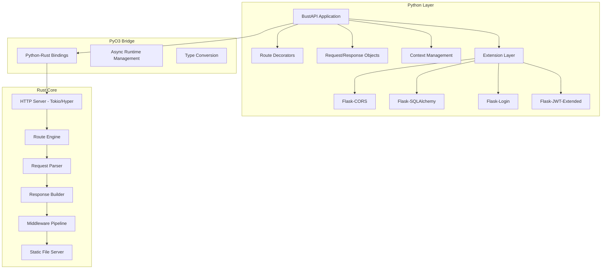
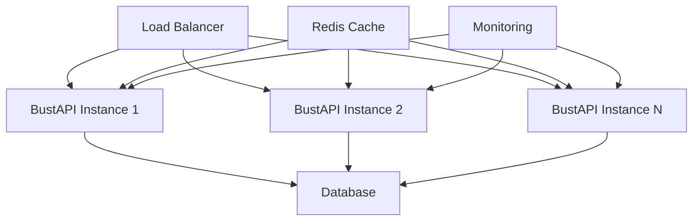

# BustAPI Technical Architecture

## Overview

BustAPI is a high-performance, Flask-compatible Python web framework built with a Rust backend using PyO3. It provides seamless support for both synchronous and asynchronous route handlers while maintaining compatibility with popular Flask extensions.

## Design Principles

1. **Performance First**: Leverage Rust's performance for the HTTP server and routing engine
2. **Developer Experience**: Maintain Flask's simplicity and ease of use
3. **Hybrid Async/Sync**: Support both programming models without friction
4. **Extension Compatibility**: Work with existing Flask ecosystem
5. **Production Ready**: Built for high-load production environments

## System Architecture



## Technology Stack

### Python Layer
- **Core**: Python 3.8+
- **Async**: asyncio for coroutine handling
- **Type Hints**: Full typing support for better DX
- **Packaging**: uv for fast dependency management

### Rust Layer
- **HTTP Server**: Tokio + Hyper for async HTTP handling
- **Python Integration**: PyO3 for Python-Rust bindings
- **Build Tool**: Maturin for Python package building
- **Async Runtime**: Tokio for high-performance concurrency

### Development Tools
- **CI/CD**: GitHub Actions for automated testing and releases
- **Code Quality**: pre-commit hooks, clippy, black, mypy
- **Testing**: pytest for Python, cargo test for Rust
- **Documentation**: mkdocs with material theme

## Core Components

### 1. HTTP Server (Rust)
```rust
// High-level server structure
pub struct BustServer {
    router: Router,
    middleware: Vec<Box<dyn Middleware>>,
    config: ServerConfig,
}
```

**Features:**
- Built on Tokio + Hyper for maximum performance
- Connection pooling and keep-alive support
- Configurable timeouts and limits
- Built-in health checks and metrics

### 2. Router Engine (Rust)
```rust
pub struct Router {
    routes: HashMap<String, RouteHandler>,
    static_routes: HashMap<String, PathBuf>,
    middleware_stack: Vec<MiddlewareLayer>,
}
```

**Features:**
- Fast path matching using trie-based routing
- Support for path parameters and wildcards
- Method-based routing (GET, POST, PUT, DELETE, etc.)
- Route groups and prefixes

### 3. Python API Layer
```python
class BustAPI:
    def __init__(self):
        self._rust_app = _bustapi_core.create_app()
        self.config = Config()
        self.extensions = {}
    
    def route(self, path, methods=None):
        """Flask-compatible route decorator"""
        
    async def run_async(self, host="127.0.0.1", port=5000):
        """Run with async support"""
        
    def run(self, host="127.0.0.1", port=5000, debug=False):
        """Flask-compatible sync runner"""
```

### 4. Request/Response Objects
```python
class Request:
    """Flask-compatible request object"""
    @property
    def json(self) -> dict: ...
    @property 
    def form(self) -> dict: ...
    @property
    def args(self) -> dict: ...
    @property
    def files(self) -> dict: ...

class Response:
    """Flask-compatible response object"""
    def __init__(self, response=None, status=200, headers=None): ...
```

## Performance Optimizations

### 1. Zero-Copy Operations
- Minimize data copying between Rust and Python
- Use PyO3's buffer protocol for large payloads
- Stream responses directly from Rust layer

### 2. Connection Management
- HTTP/2 support with multiplexing
- Connection pooling and reuse
- Configurable keep-alive settings

### 3. Memory Management
- Rust's ownership model prevents memory leaks
- Efficient request/response object pooling
- Minimal Python object creation in hot paths

## Flask Compatibility Layer

### Extension Integration Strategy
```python
class ExtensionCompat:
    """Compatibility layer for Flask extensions"""
    
    def register_extension(self, ext_class, app):
        # Analyze extension requirements
        # Provide Flask-like interface
        # Map to BustAPI internals
```

### Key Compatibility Features
1. **Application Context**: Thread-local storage for request context
2. **Blueprint Support**: Route grouping and modular applications
3. **Template Integration**: Jinja2 template support
4. **Session Management**: Cookie-based and server-side sessions
5. **Error Handling**: Flask-compatible error handlers

## Development Features

### Hot Reload System


### Debugging Support
- Integrated debugger with async support
- Request/response logging
- Performance profiling hooks
- Memory usage monitoring

## Async/Sync Hybrid Support

### Route Handler Detection
```python
import inspect

def register_route(self, handler, path, methods):
    if inspect.iscoroutinefunction(handler):
        # Register as async handler
        self._rust_app.add_async_route(path, methods, handler)
    else:
        # Register as sync handler in thread pool
        self._rust_app.add_sync_route(path, methods, handler)
```

### Execution Models
- **Async Routes**: Execute directly in async runtime
- **Sync Routes**: Execute in thread pool to avoid blocking
- **Middleware**: Support both sync and async middleware
- **Background Tasks**: Built-in task queue for async operations

## Security Features

### Built-in Security
- CSRF protection
- XSS prevention
- SQL injection protection through parameterized queries
- Rate limiting and DDoS protection
- Secure headers by default

### Security Headers
```python
DEFAULT_SECURITY_HEADERS = {
    'X-Content-Type-Options': 'nosniff',
    'X-Frame-Options': 'DENY',
    'X-XSS-Protection': '1; mode=block',
    'Strict-Transport-Security': 'max-age=31536000; includeSubDomains'
}
```

## Testing Strategy

### Unit Tests
- Rust components tested with cargo test
- Python components tested with pytest
- Mock external dependencies

### Integration Tests  
- Full application testing
- Extension compatibility testing
- Performance regression testing

### Benchmarking
- Continuous performance monitoring
- Comparison with Flask, FastAPI, and other frameworks
- Memory usage and latency tracking

## Deployment Architecture

### Production Deployment


### Scaling Considerations
- Stateless design for horizontal scaling
- Built-in health checks for load balancers
- Graceful shutdown for zero-downtime deployments
- Resource usage monitoring and alerting

## Migration Path from Flask

### Compatibility Checklist
- [ ] Route definitions work without changes
- [ ] Request/response objects are compatible
- [ ] Extensions work with minimal modifications
- [ ] Template rendering is identical
- [ ] Error handling behaves the same way

### Migration Tools
- Automated compatibility checker
- Code transformation utilities  
- Performance comparison tools
- Extension compatibility matrix

This architecture provides a solid foundation for building BustAPI as a high-performance, Flask-compatible web framework that leverages Rust's performance while maintaining Python's ease of use.