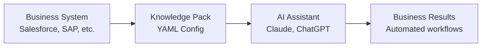

# Catalyst Pack Builder

**Build AI-powered integrations for any business system in minutes, not months.**

Catalyst transforms complex enterprise integrations into simple, reusable "Knowledge Packs" that connect AI assistants directly to your business tools - databases, APIs, cloud services, and more.

[](https://pypi.org/project/catalyst-pack-schemas/)
[](https://www.python.org/downloads/)
[](https://opensource.org/licenses/MIT)

## What is Catalyst?

**Catalyst** is an enterprise-grade system that connects AI assistants (like Claude, ChatGPT) directly to your business systems through structured "Knowledge Packs."

Instead of building complex integrations from scratch, you create simple YAML configurations that automatically generate:
- ✅ **API connections** with authentication
- ✅ **Database queries** with security controls  
- ✅ **Business logic** with validation
- ✅ **AI-friendly tools** ready for Claude Desktop, ChatGPT, and more

## Why Choose Catalyst?

| Traditional Integration | Catalyst Knowledge Packs |
|------------------------|---------------------------|
| 🔴 Weeks of custom development | ✅ **Minutes** to configure |
| 🔴 Complex authentication code | ✅ **Built-in security** patterns |
| 🔴 One-off, hard-to-maintain | ✅ **Reusable across teams** |
| 🔴 AI assistants can't use directly | ✅ **AI-native** tool generation |
| 🔴 No validation or testing | ✅ **Enterprise-grade** validation |

## Quick Start

### 1. Install Catalyst Pack Builder

```bash
pip install catalyst-pack-schemas
```

### 2. Create Your First Pack

```bash
# Create a REST API integration
catalyst-packs create salesforce-api \
  --type rest \
  --description "Salesforce CRM integration"
```

### 3. Configure Connection (Generated YAML)

```yaml
# salesforce-api/pack.yaml
metadata:
  name: salesforce-api
  description: "Salesforce CRM integration"
  domain: crm

connection:
  type: rest
  base_url: https://your-instance.salesforce.com/services/data/v58.0/
  auth:
    method: bearer
    token: "${SALESFORCE_TOKEN}"

tools:
  - name: get_account
    type: details
    description: "Retrieve account information"
    endpoint: "/sobjects/Account/{id}"
```

### 4. Install and Use with AI

```bash
# Install pack for AI use
catalyst-packs install salesforce-api/

# Now available in Claude Desktop, ChatGPT, etc.
# AI can automatically call: get_account, create_contact, search_opportunities
```

## Complete Workflow

### Business Integration → AI-Ready in 3 Steps



1. **Define**: Create pack configuration (5 minutes)
2. **Deploy**: Install to Catalyst MCP server (1 command)  
3. **Use**: AI assistants automatically access your tools

## Supported Integration Types

### 🌐 REST APIs
Perfect for: Salesforce, HubSpot, Stripe, custom APIs
```bash
catalyst-packs create my-api --type rest --base-url https://api.example.com
```

### 🗄️ Databases  
Perfect for: PostgreSQL, MySQL, SQL Server, MongoDB
```bash
catalyst-packs create my-db --type database --engine postgresql
```

### ☁️ Cloud Services
Perfect for: AWS, Azure, GCP services
```bash
catalyst-packs create aws-tools --type rest --base-url https://ec2.amazonaws.com
```

### 📁 File Systems
Perfect for: S3, SharePoint, network drives
```bash  
catalyst-packs create file-ops --type filesystem
```

## Real-World Examples

### CRM Integration (5 minutes setup)
```yaml
tools:
  - name: search_contacts
    description: "Find contacts by name or email"
    endpoint: "/contacts/search"
    parameters:
      query: {type: string, required: true}
      
  - name: create_opportunity  
    description: "Create new sales opportunity"
    endpoint: "/opportunities"
    method: POST
```

**Result**: AI can now "search for contacts named John" or "create an opportunity for ACME Corp"

### Database Analytics (3 minutes setup)
```yaml
tools:
  - name: sales_report
    description: "Generate sales report for date range"  
    sql: |
      SELECT region, SUM(amount) as total_sales
      FROM sales WHERE date BETWEEN {start_date} AND {end_date}
      GROUP BY region
```

**Result**: AI can now "show me Q4 sales by region" with live data

## Enterprise Features

- 🔒 **Security**: Built-in authentication, environment variables, access controls
- 📊 **Validation**: Comprehensive testing and error handling
- 🔄 **Scalability**: Works with enterprise systems and high-volume APIs  
- 🎯 **Customization**: Transform responses, handle complex business logic
- 📈 **Monitoring**: Built-in logging, metrics, and health checks

## Documentation

| Resource | Description |
|----------|-------------|
| [Pack Development Guide](docs/PACK_DEVELOPMENT.md) | Complete guide to creating packs |
| [Integration Patterns](docs/INTEGRATION_PATTERNS.md) | Common integration examples |
| [Security Guide](docs/SECURITY.md) | Authentication and security best practices |
| [CLI Reference](docs/CLI_REFERENCE.md) | Complete command-line interface guide |
| [API Documentation](docs/API.md) | Python API for advanced usage |

## Getting Started

### For Business Users
1. [Install Catalyst](docs/INSTALLATION.md)
2. [Create your first pack](docs/GETTING_STARTED.md)
3. [Deploy to AI assistants](docs/DEPLOYMENT.md)

### For Developers  
1. [Development Setup](docs/DEVELOPMENT.md)
2. [Pack Architecture](docs/ARCHITECTURE.md)
3. [Contributing Guide](docs/CONTRIBUTING.md)

## Support & Community

- **Documentation**: [docs.catalyst.dev](https://docs.catalyst.dev)
- **GitHub Issues**: [Report bugs and request features](https://github.com/billebel/catalyst-pack-schemas/issues)
- **Examples**: [Community pack repository](https://github.com/billebel/catalyst-pack-schemas/tree/main/examples)

## License

MIT License - Build commercial products, contribute back to the community.

---

**Ready to transform your business integrations?**

```bash
pip install catalyst-pack-schemas
catalyst-packs create my-first-pack --type rest
```

*Turn any business system into an AI-accessible tool in under 10 minutes.*