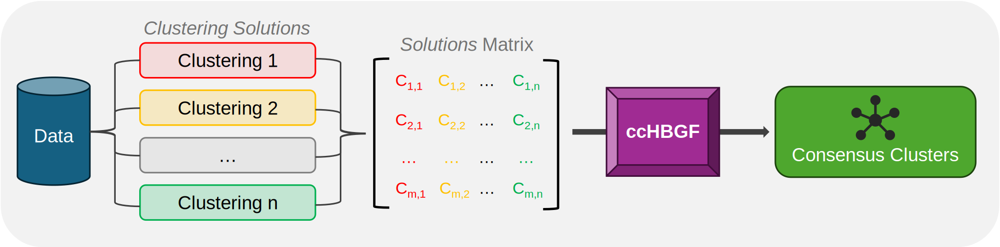

# ccHBGF: Graph-based Consensus Clustering

<p align="center">
  
</p>

A python-based consensus clustering function utilising Hybrid Bipartite Graph Formulation (HBGF). 

The `ccHBGF.find_consensus` function performs consensus clustering by following these steps:
1. Definition of a bipartite graph adjaceny matrix `A`
2. Decomposition of `A` into a spectral embedding `UVt`
3. K-means clustering of `UVt` into a consensus solution

## Installation

```bash
pip install ccHBGF
pip install 'ccHBGF[tutorial]' # When running example notebooks
```

## Hybrid Bipartite Graph Formulation (HBGF)

<p align="center">
  
</p>

HBGF is a graph-based consensus ensemble clustering technique. This method constructs a bipartite graph with two types of vertices: observations and clusters from different clusteirng solutions. An edge exists only between an observation vertex and a cluster vertex, indicating the object's membership in that cluster. The graph is then partitioned using spectral partitioning to derive consensus labels for all observations.

## Example Usage

```python
from ccHBGF import find_consensus, config

config.LOG_LEVEL = 2 # Info level (0=silent, 1=warnings)

consensus_labels = find_consensus(solutions_matrix, init='orthogonal', tol=0.1, random_state=0)

```
Where the `solutions_matrix` is of shape (m,n):
- m = the number of observations
- n = the number of different clustering solutions.

Please refer to `notebooks/` for more detailed examples.

## References

[1] Hu, Tianming, et al. "A comparison of three graph partitioning based methods for consensus clustering." Rough Sets and Knowledge Technology: First International Conference, RSKT 2006, Chongquing, China, July 24-26, 2006. Proceedings 1. Springer Berlin Heidelberg, 2006.

[2] Fern, Xiaoli Zhang, and Carla E. Brodley. "Solving cluster ensemble problems by bipartite graph partitioning." Proceedings of the twenty-first international conference on Machine learning. 2004.

[3] Ng, Andrew, Michael Jordan, and Yair Weiss. "On spectral clustering: Analysis and an algorithm." Advances in neural information processing systems 14 (2001).