# chunkle

**Smart token-based chunking** that respects both line and token limits while preserving clean starts.

GitHub: [https://github.com/allen2c/chunkle](https://github.com/allen2c/chunkle)
Pypi: [https://pypi.org/project/chunkle/](https://pypi.org/project/chunkle/)

## Install

```bash
pip install chunkle
```

## Quick Start

```python
from chunkle import chunk

# Basic usage
for piece in chunk(text, lines_per_chunk=20, tokens_per_chunk=500):
    print(piece)

# Custom limits
chunks = list(chunk(text, lines_per_chunk=5, tokens_per_chunk=100))
```

## How It Works (Token-based)

```mermaid
flowchart TD
    A["📝 Start encoding to tokens"] --> B["📊 Accumulate token ids<br/>Track newline-token count"]
    B --> C{"✅ Both limits met?<br/>(lines ≥ min AND tokens ≥ min)"}
    C -->|No| B
    C -->|Yes| D{"🔀 Current token is breaking?"}
    D -->|Yes| E["🟡 Arm emit (should_emit=True)"] --> F{"🔤 Next token non-breaking?"}
    D -->|No| G{"🚀 Force beyond multiplier?"}
    G -->|Yes| H{"🔡 Token boundary is whitespace?"}
    H -->|Yes| E
    H -->|No| B
    G -->|No| B
    F -->|Yes| I["✂️ Emit buffer; new chunk starts meaningful"]
    F -->|No| B
    I --> J{"📄 More tokens?"}
    J -->|Yes| B
    J -->|No| K["🏁 Emit remaining buffer (merge trailing breaks)"]
```



### Rules

1. **Dual Requirements**: Emit only when both line and token minimums are met.
2. **Clean Starts**: New chunks begin at the first non-breaking token.
3. **Trailing Breaks Merge**: Line breaks at the boundary are absorbed into the previous chunk.
4. **Force Emit (2x multiplier)**: When exceeding thresholds×multiplier, force emit only if current token boundary is whitespace.

## Examples

**English Text:**

```python
text = "Hello world!\nThis is a test.\nAnother line here."
chunks = list(chunk(text, lines_per_chunk=1, tokens_per_chunk=8))
# Result: ['Hello world!\nThis is a test.\n', 'Another line here.']
```

**English Text (force split):**

```python
text = " ".join(["This is a long sentence without newlines."] * 4)
chunks = list(chunk(text, lines_per_chunk=1, tokens_per_chunk=8, force_chunk_over_threshold_times=2))
# ['This is a long sentence without newlines. This is a long sentence without new', 'lines. This is a long sentence without newlines. This is a long sentence', ' without newlines.']
```

## API

```python
def chunk(
    content: str,
    *,
    lines_per_chunk: int = 20,
    tokens_per_chunk: int = 500,
    force_chunk_over_threshold_times: int = 2,
    encoding: tiktoken.Encoding | None = None,
) -> Generator[str, None, None]:
```

**Parameters:**

- `content`: Text to split
- `lines_per_chunk`: Minimum lines per chunk (default: 20)
- `tokens_per_chunk`: Minimum tokens per chunk (default: 500)
- `force_chunk_over_threshold_times`: Force emit multiplier (default: 2)
- `encoding`: Custom tiktoken encoding (default: gpt-4o-mini)

## License

MIT © 2025 Allen Chou
