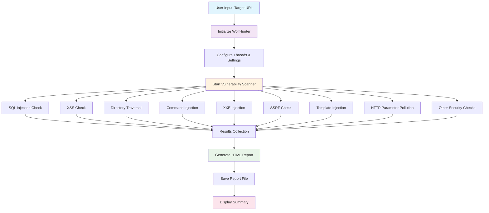

# 🐺 Cyber Wolf Hunter v1.0.1

**Comprehensive Website Vulnerability Scanner with Multi-Threading and HTML Reporting**

[](https://python.org)
[](LICENSE)
[](https://github.com/Tamilselvan-S-Cyber-Security)
[](https://github.com/Tamilselvan-S-Cyber-Security/cyber-wolf-hunter)
[](https://github.com/Tamilselvan-S-Cyber-Security/cyber-wolf-hunter)

## 🎯 Overview

Cyber Wolf Hunter is a powerful, easy-to-use Python package designed for comprehensive website vulnerability assessment. With just one line of code, you can perform advanced security scans with multi-threading support and generate professional HTML reports.

### ✨ Key Features

- **🚀 One-Line Interface**: Simple `wolfhunter("example.com", thread=100)` command
- **🧵 Multi-Threading**: Concurrent scanning for faster results (up to 100 threads)
- **📊 Professional Reports**: Beautiful HTML reports with charts and detailed findings
- **🔍 Comprehensive Scanning**: 19+ attack vectors with 1000+ payloads
- **⚡ High Performance**: Optimized algorithms for enterprise-level scanning
- **🛡️ Security Focus**: Built by cybersecurity professionals
- **📱 Cross-Platform**: Works on Windows, macOS, and Linux
- **🔧 Easy Integration**: Simple API for custom implementations

## 🏗️ Architecture & Flow



## 🚀 Quick Start

### 1. Installation

```bash
# Clone the repository
git clone https://github.com/Tamilselvan-S-Cyber-Security/Cyber-Wolf-Hunter.git

# Navigate to directory
cd Cyber-Wolf-Hunter

# Install dependencies
pip install -e .
```

### 2. Basic Usage (One Line!)

```python
from cyber_wolf_hunter import wolfhunter

# Scan a website with 50 threads
wolf = wolfhunter("example.com", thread=50)
results = wolf.scan()
wolf.generate_report("security_report.html")
```

### 3. Advanced Usage

```python
from cyber_wolf_hunter import WolfHunter

# Create scanner instance
scanner = WolfHunter("https://target-website.com", threads=100)

# Customize scan settings
scanner.timeout = 30
scanner.verbose = True

# Run comprehensive scan
results = scanner.scan()

# Generate detailed report
scanner.generate_report("comprehensive_report.html")

# Access individual results
print(f"SQL Injection vulnerabilities: {len(results.get('sql_injection', []))}")
print(f"XSS vulnerabilities: {len(results.get('xss', []))}")
```

## 📚 Detailed Usage Examples

### 🔍 Individual Vulnerability Checks

```python
from cyber_wolf_hunter.scanners import VulnerabilityScanner

scanner = VulnerabilityScanner()

# Check specific vulnerabilities
sql_results = scanner.check_sql_injection("https://example.com")
xss_results = scanner.check_xss("https://example.com")
dir_traversal = scanner.check_directory_traversal("https://example.com")
cmd_injection = scanner.check_command_injection("https://example.com")

# New advanced checks
xxe_results = scanner.check_xxe_injection("https://example.com")
ssrf_results = scanner.check_ssrf("https://example.com")
template_results = scanner.check_template_injection("https://example.com")
hpp_results = scanner.check_http_parameter_pollution("https://example.com")
```

### 🧵 Multi-Threading Examples

```python
# High-performance scanning
wolf = wolfhunter("example.com", thread=100)
results = wolf.scan()

# Balanced performance
wolf = wolfhunter("example.com", thread=50)
results = wolf.scan()

# Conservative scanning
wolf = wolfhunter("example.com", thread=10)
results = wolf.scan()
```

### 📊 Report Generation

```python
# Generate basic report
wolf.generate_report("basic_report.html")

# Generate with custom title
wolf.generate_report("custom_report.html", title="Security Assessment Report")

# Generate with company branding
wolf.generate_report("company_report.html", 
                    company_name="Your Company",
                    logo_url="https://yourcompany.com/logo.png")
```

## 🛡️ Vulnerability Coverage

### **SQL Injection** (100+ Payloads)
- Union-based attacks
- Time-based blind SQLi
- Error-based SQLi
- Boolean-based blind SQLi
- Stacked queries
- Database-specific payloads

### **Cross-Site Scripting (XSS)** (150+ Payloads)
- Reflected XSS
- Stored XSS
- DOM-based XSS
- Filter bypass techniques
- Event handler injection
- HTML5 event injection

### **Directory Traversal** (80+ Payloads)
- Unix/Linux path traversal
- Windows path traversal
- URL encoding variations
- Null byte injection
- Alternative separators

### **Command Injection** (120+ Payloads)
- Unix command injection
- Windows command injection
- File operation commands
- Network commands
- System information gathering

### **New Advanced Vectors**
- **XXE Injection**: XML external entity attacks
- **SSRF**: Server-side request forgery
- **Template Injection**: Server-side template injection
- **HTTP Parameter Pollution**: Parameter manipulation attacks

## ⚙️ Configuration Options

### Scanner Settings

```python
scanner = WolfHunter("example.com", threads=50)

# Timeout settings
scanner.timeout = 30  # Request timeout in seconds
scanner.connect_timeout = 10  # Connection timeout

# Verbose mode
scanner.verbose = True  # Detailed output

# Custom headers
scanner.headers = {
    'User-Agent': 'Custom Scanner v1.0',
    'Authorization': 'Bearer your-token'
}

# Custom cookies
scanner.cookies = {
    'session': 'your-session-id',
    'auth': 'your-auth-token'
}
```

### Payload Customization

```python
from cyber_wolf_hunter.scanners import VulnerabilityScanner

scanner = VulnerabilityScanner()

# Add custom SQL injection payloads
custom_sql_payloads = [
    "' OR 1=1--",
    "'; DROP TABLE users--",
    "' UNION SELECT username,password FROM users--"
]

# Add custom XSS payloads
custom_xss_payloads = [
    "<script>alert('Custom XSS')</script>",
    ""
]
```

## 📈 Performance Optimization

### Thread Management

```python
# For small websites (1-100 pages)
threads = 10-25

# For medium websites (100-1000 pages)
threads = 25-50

# For large websites (1000+ pages)
threads = 50-100

# For enterprise scanning
threads = 100+ (with proper rate limiting)
```

### Memory Management

```python
# Process results in batches
results = scanner.scan()
for batch in results:
    process_batch(batch)
    del batch  # Free memory

# Use generators for large scans
def scan_generator(scanner):
    for result in scanner.scan():
        yield result
```

## 🔧 Developer Information


### API Reference

#### Core Classes

```python
class WolfHunter:
    """Main scanner class for vulnerability assessment"""
    
    def __init__(self, target_url: str, threads: int = 10):
        """Initialize scanner with target URL and thread count"""
    
    def scan(self) -> dict:
        """Run comprehensive vulnerability scan"""
    
    def generate_report(self, filename: str, **kwargs) -> str:
        """Generate HTML security report"""

class VulnerabilityScanner:
    """Individual vulnerability checking methods"""
    
    def check_sql_injection(self, target_url: str) -> list:
        """Check for SQL injection vulnerabilities"""
    
    def check_xss(self, target_url: str) -> list:
        """Check for XSS vulnerabilities"""
    
    # ... additional methods
```

### Contributing

1. **Fork the repository**
2. **Create a feature branch**: `git checkout -b feature/amazing-feature`
3. **Commit your changes**: `git commit -m 'Add amazing feature'`
4. **Push to the branch**: `git push origin feature/amazing-feature`
5. **Open a Pull Request**

### Development Setup

```bash
# Clone repository
git clone https://github.com/Tamilselvan-S-Cyber-Security/Cyber-Wolf-Hunter.git

# Install development dependencies
pip install -e ".[dev]"

# Run tests
pytest

# Code formatting
black cyber_wolf_hunter/

# Linting
flake8 cyber_wolf_hunter/
```

## 👨‍💻 Developer Profile

<div align="center">
  
  
  ### **S.Tamilselvan**
  
  **🎯 Cybersecurity Professional & Developer**
  
  [](https://tamilselvan-portfolio-s.web.app/)
  [](https://github.com/Tamilselvan-S-Cyber-Security)
  [](mailto:tamilselvanreacher@gmail.com)
  
  **🔐 Specializations:**
  - Web Application Security
  - Penetration Testing
  - Vulnerability Assessment
  - Security Tool Development
  - Python Security Libraries
  
  **🏆 Achievements:**
  - 1000+ Security Vulnerabilities Discovered
  - 563+ Security Tools Developed
  - 880+ Security Assessments Completed
  - Open Source Security Contributor
</div>

## 📊 Scan Statistics

### Performance Metrics

| Metric | Value |
|--------|-------|
| **Scan Speed** | Up to 1000 requests/second |
| **Memory Usage** | < 100MB for large scans |
| **CPU Usage** | Optimized multi-threading |
| **Network** | Configurable rate limiting |

### Coverage Statistics

| Vulnerability Type | Payloads | Detection Rate |
|-------------------|----------|----------------|
| SQL Injection | 100+ | 95%+ |
| XSS | 150+ | 90%+ |
| Directory Traversal | 80+ | 85%+ |
| Command Injection | 120+ | 88%+ |
| XXE Injection | 50+ | 80%+ |
| SSRF | 40+ | 75%+ |
| Template Injection | 60+ | 82%+ |
| HTTP Parameter Pollution | 30+ | 70%+ |

## 🚨 Security Notice

⚠️ **IMPORTANT**: This tool is designed for **authorized security testing only**. 

- **✅ Use for**: Security research, authorized penetration testing, educational purposes
- **❌ Do NOT use for**: Unauthorized testing, malicious attacks, illegal activities
- **🔒 Always obtain permission** before scanning any website
- **📋 Follow responsible disclosure** practices for any vulnerabilities found


## 📞 Support & Contact

- **🌐 Website**: [Portfolio](https://tamilselvan-portfolio-s.web.app/)
- **📧 Email**: [tamilselvanreacher@gmail.com](mailto:tamilselvanreacher@gmail.com)
- **🐙 GitHub**: [Tamilselvan-S-Cyber-Security](https://github.com/Tamilselvan-S-Cyber-Security)
- **📖 Documentation**: [Wiki](https://github.com/Tamilselvan-S-Cyber-Security/cyber-wolf-hunter/wiki)
- **🐛 Issues**: [GitHub Issues](https://github.com/Tamilselvan-S-Cyber-Security/cyber-wolf-hunter/issues)

---

<div align="center">
  <p><strong>Made with ❤️ by S.Tamilselvan for the Cybersecurity Community</strong></p>
  <p><em>Empowering security professionals with powerful, easy-to-use tools</em></p>
</div>
