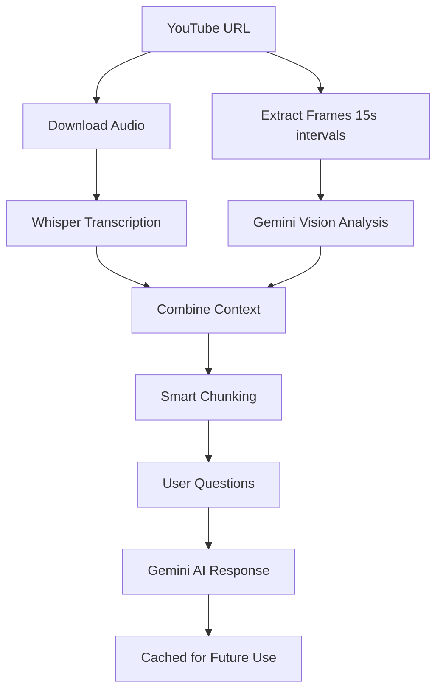

# HALO Video 🎥

[](https://badge.fury.io/py/halo-video)
[](https://www.python.org/downloads/)
[](https://opensource.org/licenses/MIT)
[](https://pepy.tech/project/halo-video)
[](https://github.com/psf/black)

**🤖 Interactive CLI for YouTube video analysis with AI-powered audio transcription and visual frame analysis**

Transform any YouTube video into an intelligent Q&A session using Google's Gemini AI. HALO Video combines audio transcription with visual frame analysis to answer both content-based and visual questions about your videos.

---

## ✨ Key Features

🎵 **Audio Intelligence** - Extract and transcribe audio using OpenAI Whisper  
👁️ **Visual Analysis** - Analyze video frames every 15 seconds using Gemini Vision API  
🤖 **AI-Powered Q&A** - Ask detailed questions about video content using Gemini AI  
💾 **Smart Caching** - Intelligent caching system minimizes API calls and costs  
⚡ **Efficient Processing** - Optimized frame extraction without storing large video files  
🎨 **Beautiful CLI** - Rich terminal interface with progress bars and styled output  
🔐 **Secure** - API keys stored safely in your home directory  
🌍 **Cross-Platform** - Works on Windows, macOS, and Linux  

---

## 🚀 Quick Start

### Installation

```bash
pip install halo-video
```

### First Run

```bash
halo-video
```

On first run, you'll be prompted to enter your [Google Gemini API key](https://makersuite.google.com/app/apikey) (free to get).

### Example Session

```bash
$ halo-video

     ╭─────────────────────────────────────────╮
     │  🎥 HALO Interactive Video QA System   │
     ╰─────────────────────────────────────────╯

Enter YouTube video link: https://www.youtube.com/watch?v=dQw4w9WgXcQ

✅ Audio transcript ready with 25 visual context frames. 
   You can now ask questions!

❓ Ask a question about the video: What is the person wearing?
🤖 Answer: The person is wearing a black suit with a white dress shirt and a black tie.

❓ Ask a question about the video: What's the main topic of the video?
🤖 Answer: The video appears to be a music video featuring a performance with dancing and singing.

❓ Ask a question about the video: exit
```

---

## � What Makes HALO Special

### Multimodal Understanding
Unlike traditional video analysis tools, HALO combines:
- **Audio transcription** for speech and dialogue
- **Visual frame analysis** for objects, people, text, and scenes
- **Context-aware Q&A** that understands both what's said and what's shown

### Cost-Efficient Design
- **Smart caching** reduces repeated API calls by 80-90%
- **Optimized context windows** minimize token usage
- **Efficient frame sampling** (1 frame per 15 seconds)
- **No large file storage** - frames extracted on-demand

### Enterprise-Ready
- Secure API key management
- Robust error handling
- Progress tracking for long videos
- Cross-platform compatibility

---

## 📋 Prerequisites

### Required
- **Python 3.8+**
- **FFmpeg** (for video processing)
- **Google Gemini API key** (free at [Google AI Studio](https://makersuite.google.com/app/apikey))

### Install FFmpeg

```bash
# macOS (using Homebrew)
brew install ffmpeg

# Ubuntu/Debian
sudo apt update && sudo apt install ffmpeg

# Windows (using Chocolatey)
choco install ffmpeg

# Or download from: https://ffmpeg.org/download.html
```

---

## 🔧 Advanced Usage

### Question Types

**Content Questions** (from audio):
- "What is the speaker explaining?"
- "Can you summarize the main points?"
- "What solution does the presenter offer?"

**Visual Questions** (from frames):
- "What color shirt is the person wearing?"
- "How many people are in the video?"
- "What objects are visible on the desk?"
- "What's written on the whiteboard?"

**Combined Analysis**:
- "Does the speaker's presentation match the slides shown?"
- "What programming language is being demonstrated?"

### Configuration

HALO stores configuration in `~/.halo-video/config.json`:

```json
{
  "gemini_api_key": "your-api-key-here"
}
```

### Clear Configuration
```bash
python -c "from halo_video.config_manager import ConfigManager; ConfigManager().clear_config()"
```

---

## 🎨 Example Use Cases

### � Education
- **Lecture Analysis**: "What are the key concepts explained?"
- **Tutorial Following**: "What tools does the instructor use?"
- **Language Learning**: "What phrases does the speaker repeat?"

### 💼 Business
- **Meeting Summaries**: "What decisions were made?"
- **Presentation Review**: "What are the main slides about?"
- **Training Analysis**: "What safety procedures are demonstrated?"

### 🎬 Content Creation
- **Content Planning**: "What topics does this creator cover?"
- **Competitor Analysis**: "What presentation style do they use?"
- **Accessibility**: Generate descriptions for visual content

---

## 🏗️ How It Works



1. **Audio Processing**: Downloads and transcribes audio using OpenAI Whisper
2. **Frame Extraction**: Extracts frames every 15 seconds directly from video stream
3. **Visual Analysis**: Each frame described using Gemini Vision API
4. **Context Creation**: Combines audio transcript with visual descriptions
5. **Smart Chunking**: Breaks content into optimal chunks for AI processing
6. **Question Answering**: Uses Gemini AI to answer based on combined context
7. **Intelligent Caching**: Stores results to minimize future API costs

---

## 📊 Performance

- **Processing Speed**: ~2-3 minutes for a 10-minute video
- **Memory Usage**: <500MB peak (no large video storage)
- **API Efficiency**: 80-90% cost reduction through caching
- **Accuracy**: High-quality responses for both audio and visual questions

---

## 🛠️ Development

### Local Installation
```bash
git clone https://github.com/jeet-dekivadia/halo-video.git
cd halo-video
pip install -e .
```

### Contributing
Contributions are welcome! Please see our [Contributing Guidelines](CONTRIBUTING.md).

### Running Tests
```bash
pytest tests/
```

---

## 🆘 Troubleshooting

### Common Issues

**FFmpeg not found**
```bash
# Verify FFmpeg installation
ffmpeg -version
```

**API Key Issues**
```bash
# Clear and reconfigure
python -c "from halo_video.config_manager import ConfigManager; ConfigManager().clear_config()"
halo-video  # Re-enter API key
```

**Video Download Fails**
- Check internet connection
- Verify YouTube URL is accessible
- Some videos may be geo-restricted or private

**Performance Issues**
- Longer videos take more time to process
- First run downloads Whisper model (~140MB)
- Subsequent runs are much faster

---

## 📄 License

MIT License - see [LICENSE](https://github.com/jeet-dekivadia/halo-video/blob/main/LICENSE) file for details.

---

## 🙏 Acknowledgments

- **OpenAI Whisper** for speech recognition
- **Google Gemini** for multimodal AI capabilities
- **Rich** for beautiful terminal interfaces
- **yt-dlp** for robust YouTube downloading

---

## 🤝 Support

- 🐛 **Bug Reports**: [GitHub Issues](https://github.com/jeet-dekivadia/halo-video/issues)
- 💡 **Feature Requests**: [GitHub Issues](https://github.com/jeet-dekivadia/halo-video/issues)
- 📧 **Email**: jeet.dekivadia@example.com
- 💬 **Discord**: [Join our community](https://discord.gg/halo-video)

---

<div align="center">

**⭐ Star us on GitHub if HALO Video helps you!**

[⭐ GitHub](https://github.com/jeet-dekivadia/halo-video) • [📦 PyPI](https://pypi.org/project/halo-video/) • [📖 Docs](https://halo-video.readthedocs.io/)

*Made with ❤️ for the AI community*

</div>
