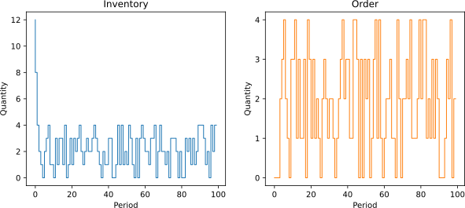

# Summary

Identifying optimal policies for replenishing inventory from multiple suppliers is a key problem in inventory management. Solving such optimization problems requires determining the quantities to order from each supplier based on the current inventory and outstanding orders, minimizing the expected ordering, holding, and out-of-stock costs. Despite over 60 years of extensive research on inventory management problems, even fundamental dual-sourcing problems—where orders from an expensive supplier arrive faster than orders from a low-cost supplier—remain analytically intractable [@barankin1961delivery; @fukuda1964optimal]. Additionally, there is a growing interest in optimization algorithms that can handle real-world inventory problems with non-stationary demand [@song2020capacity].

We provide a Python package, `idinn`, which implements inventory dynamics-informed neural networks designed to control both single-sourcing and dual-sourcing problems. In single-sourcing problems, a single supplier delivers an ordered quantity to a firm within a known lead time and at a known unit cost. In dual-sourcing problems, which are more complex, a company has two potential suppliers of a product, each with different known lead times and unit costs. The objective is to place orders that minimize the expected order, inventory, and out-of-stock costs over a finite or infinite horizon. `idinn` implements neural network controllers and inventory dynamics as customizable objects using PyTorch as the backend, allowing users to identify near-optimal ordering policies with reasonable computational resources.

The methods used in `idinn` take advantage of advances in automatic differentiation [@paszke2017automatic; @PaszkeGMLBCKLGA19] and the growing use of neural networks in dynamical system identification [@wang1998runge; @ChenRBD18; @fronk2023interpretable] and control [@asikis2022neural; @bottcher2022ai; @bottcher2022near; @mowlavi2023optimal; @bottcher2023gradient; @bottcher2024control]. 

# Statement of need

Inventory management problems arise in many industries, including manufacturing, retail, warehousing, and energy. A fundamental but analytically intractable inventory management problem is dual sourcing [@barankin1961delivery; @fukuda1964optimal; @xin2023dual]. Single sourcing, in contrast, is analytically tractable and is frequently employed as a baseline for testing and comparing policies used in more complex multi-sourcing setups. `idinn` is a Python package for controlling both dual-sourcing and single-sourcing problems using dynamics-informed neural networks. The sourcing problems we consider are usually formulated as infinite-horizon problems focusing on minimizing average cost while considering stationary stochastic demand. Using neural networks, we minimize costs over multiple demand trajectories. This approach allows us to address not only non-stationary demand, but also finite-horizon and infinite-horizon discounted problems. Unlike traditional reinforcement-learning approaches, our optimization approach takes into account how the system to be optimized behaves over time, leading to more efficient training and accurate solutions.

Training neural networks for inventory-dynamics control presents a unique challenge. The adjustment of neural network weights during training relies on propagating real-valued gradients, while the neural network outputs - representing replenishment orders - must be integers. To address this challenge in optimizing a discrete problem with real-valued gradient-descent learning algorithms, we apply a problem-tailored straight-through estimator [@yang2022injecting; @asikis2023multi; @dyer2023]. This approach enables us to obtain integer-valued neural network outputs while backpropagating real-valued gradients.

While general-purpose reinforcement learning libraries like ``Stable Baselines3`` [@stable-baselines3] support policy optimization, they do not offer inventory-specific modeling or enforce integer constraints required for replenishment decisions. A related, more specialized library, ``ddop`` [@philippi2021], focuses on machine learning for operations management, but does not address multi-period inventory dynamics. ``Abmarl`` [@rusu2021] connects multi-agent reinforcement learning with agent-based simulations. In contrast, ``idinn`` is tailored to single- and dual-sourcing problems, combining domain-specific inventory dynamics with neural networks and integer-constrained outputs.

`idinn` has been developed for researchers, practitioners, and students working at the intersection of optimization, operations research, and machine learning. It has been made available to students in a machine learning course at the Frankfurt School of Finance & Management, as well as in a tutorial at the California State University, Northridge. In a previous publication [@bottcher2023control], a proof-of-concept codebase was used to compute near-optimal solutions of dozens of dual-sourcing instances.

# Example usage

As an example, we describe how to solve single-sourcing problems using `idinn`. Excess inventory incurs a holding cost $h$, while unmet demand results in an out-of-stock cost $b$. With `idinn`, we initialize the sourcing model and neural network controller, train the controller on cost data from the model, and use the trained controller to compute near-optimal, state-dependent order quantities.

## Initialization

We use the `SingleSourcingModel` class to initialize a single-sourcing model.

```python
import torch
from idinn.sourcing_model import SingleSourcingModel
from idinn.single_controller import SingleSourcingNeuralController
from idinn.demand import UniformDemand

single_sourcing_model = SingleSourcingModel(
    lead_time=0,
    holding_cost=5,
    shortage_cost=495,
    batch_size=32,
    init_inventory=10,
    demand_generator=UniformDemand(low=0, high=4)
)
```

This single-sourcing model has a lead time of 0 (i.e., an order arrives immediately after it is placed) and an initial inventory of 10. The holding cost, $h$, and the out-of-stock cost, $b$, are 5 and 495, respectively. Demand is drawn from a discrete uniform distribution over the integers $\{0,1,\dots,4\}$. We use a batch size of 32 to train the neural network, i.e., the sourcing model generates 32 samples simultaneously.

To identify an ordering policy that minimizes total costs over a given time horizon, we initialize a neural network controller using the `SingleSourcingNeuralController` class. For illustration purposes, we use a simple neural network with 1 hidden layer and 2 neurons. The activation function is `torch.nn.CELU(alpha=1)`.

```python
single_controller = SingleSourcingNeuralController(
    hidden_layers=[2],
    activation=torch.nn.CELU(alpha=1)
)
```

## Training

We train the neural network controller using the `fit()` method. To monitor the training process, we specify the `tensorboard_writer` parameter:

```python
from torch.utils.tensorboard import SummaryWriter

single_controller.fit(
    sourcing_model=single_sourcing_model,
    sourcing_periods=50,
    validation_sourcing_periods=1000,
    epochs=2000,
    tensorboard_writer=SummaryWriter(comment="_single_1"),
    seed=1
)
```

To evaluate the neural network controller, we compute the average cost over a specified number of periods for the previously defined sourcing model: 

```python
single_controller.get_average_cost(single_sourcing_model, sourcing_periods=1000)
```

For the selected single-sourcing parameters, the optimal average cost is 10.



To further evaluate a controller's performance in a given sourcing environment, users can visualize the inventory and order histories (see Figure 1):

```python
single_controller.plot(sourcing_model=single_sourcing_model, sourcing_periods=100)
```

## Order calculation

For a given inventory level and trained controller, we use the `predict` function to compute the corresponding orders:

```python
single_controller.predict(current_inventory=10)
```

## Additional control methods

In addition to the neural network control method, single-sourcing dynamics can also be managed using a traditional base-stock controller [@arrow1951optimal; @scarf1958inventory], available in `idinn` as the `BaseStockController` class.

For dual-sourcing problems, `idinn` supports both neural and classical control approaches. Neural control is provided through the `DualSourcingModel` and `DualSourcingNeuralController` classes. Classical methods include the capped dual index controller [@sun2019robust] and a dynamic programming-based controller, implemented in the `CappedDualIndexController` and `DynamicProgrammingController` classes, respectively.

# Acknowledgements

LB acknowledges financial support from hessian.AI and the Army Research Office (grant W911NF-23-1-0129). TA acknowledges financial support from the Schweizerischer Nationalfonds zur Förderung der Wissenschaf­tlichen Forschung through NCCR Automation (grant P2EZP2 191888).

# References