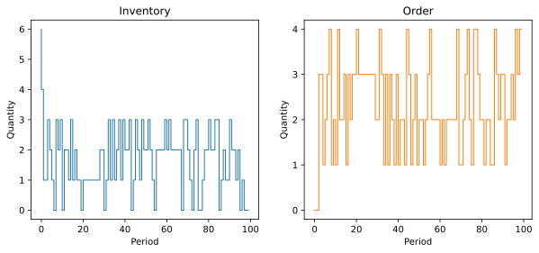

Plot Simulation Results
=======================

We can inspect how the controller performs in the specified sourcing environment by plotting the inventory and order histories. This applies to all controllers.

.. doctest::

    >>> # Simulate and plot the results
    >>> single_controller.plot(sourcing_model=single_sourcing_model, sourcing_periods=100)

