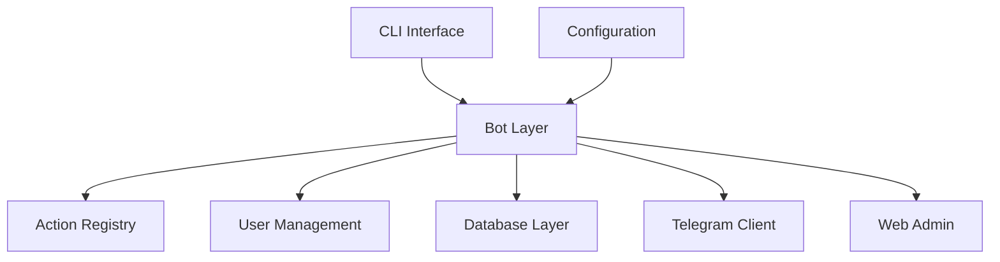

This design document details Kamihi's implementation strategy for rapid Telegram bot development, evaluating architectural choices based on developer productivity, maintainability, and scalability constraints.

## Problem Statement

Telegram bot development suffers from excessive complexity and repetitive boilerplate. Existing frameworks require developers to manually integrate database management, user authentication, message routing, and administrative interfaces — concerns that should be handled automatically.

This complexity creates three critical problems:

- **High development overhead**: Simple bots require hundreds of lines of configuration
- **Inconsistent patterns**: Teams reinvent authentication and database integration differently
- **Maintenance burden**: Bot evolution requires coordinated changes across multiple integration layers

## Solution: Convention-Over-Configuration Architecture

Kamihi eliminates this complexity through opinionated defaults and automatic integration. The framework provides batteries-included functionality while maintaining escape hatches for customization when needed.

## System overview

Kamihi's architecture centers on automatic service integration and zero-configuration defaults. The framework handles infrastructure concerns transparently, allowing developers to focus exclusively on bot behavior.



## Core components

### Bot module (`kamihi.bot`)

The `Bot` class orchestrates all framework subsystems through a singleton instance. This pattern prevents configuration drift and ensures consistent state across the application.

Actions register automatically through Python decorators, mapping functions to Telegram commands. The framework stores actions as `Action` objects containing metadata for runtime execution and administrative introspection.

```python
from kamihi import bot

@bot.action(description="Handle user greetings")
def start(update, context):
    return "Hello! Bot is running."
```

**Why singleton pattern?** Multiple bot instances would create conflicting Telegram webhook registrations and database connections. The singleton ensures exactly one bot per process, preventing these conflicts.

### Configuration module (`kamihi.base.config`)

Pydantic models provide type safety and validation for configuration. The `KamihiSettings` class loads from multiple sources in priority order: programmatic settings, YAML files, environment variables, then defaults.

This hierarchy supports development convenience with production security. Developers use YAML files locally while production deployments rely on environment variables.

### Database module (`kamihi.db`)

MongoDB integration through MongoEngine provides document-based persistence. The framework handles connection lifecycle automatically and provides base models for common bot entities.

**Why MongoDB over SQL?** SQL schemas require complex migrations for changes, while MongoDB handles schema evolution transparently. This is essential for database model extensibility, given that different users of the framework will likely need to store different data schemas for the users of their bots.

Database configuration defaults to local development (`mongodb://localhost:27017`) but supports production connection strings through configuration.

### Telegram module (`kamihi.tg`)

The `TelegramClient` abstraction wraps `python-telegram-bot`, providing a consistent interface for message handling and API communication. This isolation protects the framework from Telegram API changes and centralizes error handling.

### Web module (`kamihi.web`)

Starlette-based admin interface runs on a separate thread, exposing user and permission management without interfering with bot operations. This separation ensures bot availability during administrative tasks.

Non-technical users can manage bot access without code changes or deployments through the web interface.

### User module (`kamihi.users`)

Role-based access control provides built-in authentication and authorization. The system supports configurable user registration flows and permission checking for action execution.

This eliminates custom authentication implementations while providing granular bot access control.

### CLI tool (`kamihi.cli`)

The command-line interface manages project lifecycle: initialization, action scaffolding, user administration, and bot execution. CLI commands integrate with project templates to maintain consistent structures.

```bash
kamihi init my-bot        # Create new project
kamihi action new greet   # Scaffold new action
kamihi run               # Start bot with web interface
```

## Design Decisions and Trade-offs

### MongoDB vs SQL Databases

Kamihi uses MongoDB instead of traditional SQL databases. This choice prioritizes rapid development and schema flexibility over strict relational integrity.

**Addressing scalability concerns:** MongoDB's horizontal scaling through sharding supports bot growth from hundreds to millions of users without application changes. Document queries for user lookups and message history remain performant with proper indexing.

### Singleton Bot Pattern

The singleton pattern for the Bot class prevents multiple instances that would create conflicting webhook registrations and database connections. While this limits some advanced use cases, it eliminates the most common source of bot deployment failures. It also transfers the responsibility of managing the bot's lifecycle to the framework, simplifying application code.

**Alternative considered:** Factory pattern for multiple bot instances was rejected because it complicates configuration management and provides no clear benefit for the target use case of single-bot applications.

### Decorator-Based Action Registration

Python decorators enable automatic action discovery during module import. This approach trades some flexibility for developer convenience, eliminating the need for explicit registration calls.

**Runtime discovery trade-off:** All actions must be imported at startup, slightly increasing initialization time. This cost is negligible compared to the productivity gain from automatic registration, and simplifies the project structure, eliminating the need for a central registry file, and avoiding circular import errors common to these scenarios.

## Implementation Strategy

### Action Registration Flow

Actions register automatically when Python imports their modules. The CLI's `run` command recursively imports the `actions/` directory, ensuring all bot commands are available at startup.

### Database Connection Lifecycle

Database connections initialize lazily during bot startup with automatic reconnection handling for production resilience. Models inherit from framework base classes providing common fields and behaviors.

### Configuration Priority Chain

Settings load through priority: programmatic overrides → YAML configuration → environment variables → defaults. This pattern supports development convenience while maintaining production security.

## Why This Architecture

This design optimizes for developer velocity while maintaining production reliability. The architecture trades flexibility for productivity, making it optimal for teams prioritizing development speed and operational simplicity over custom infrastructure requirements.

**Reduced Cognitive Load**: Developers focus on business logic rather than infrastructure integration. The framework handles database connections, user management, and Telegram API complexities automatically.

**Rapid Prototyping**: New bots can be created and deployed within minutes using the CLI scaffolding tools. Template-based project generation ensures consistency across teams.

**Operational Simplicity**: The web interface provides non-technical stakeholders access to user management and bot monitoring without requiring code changes or deployments.

**Testability**: Clear separation between framework components and application logic enables comprehensive testing strategies. Functional tests can validate end-to-end bot behavior through Docker-based integration testing.

**Scalability Path**: The modular architecture supports both simple single-command bots and complex multi-action applications. Database abstraction and connection pooling handle growing user bases without application changes.
