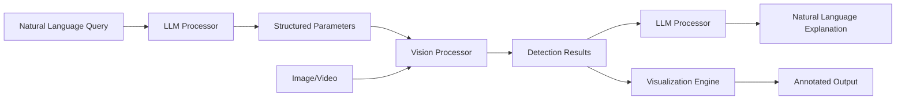

# Langvio Documentation

Welcome to **Langvio** - a powerful Python framework that connects large language models (LLMs) with computer vision models to enable natural language visual analysis.

## What is Langvio?

Langvio bridges the gap between natural language understanding and computer vision by allowing you to analyze images and videos using simple, conversational queries. Instead of writing complex computer vision code, you can ask questions like:

- "Count how many people are in this image"
- "Find all red objects in this video" 
- "Are there any vehicles moving from left to right?"
- "Describe the spatial relationships between objects"

## Key Features

### 🔍 **Natural Language Interface**
Query visual content using everyday language - no computer vision expertise required.

### 🤖 **Multi-Modal Integration** 
Seamlessly connects leading LLMs (OpenAI GPT, Google Gemini) with state-of-the-art vision models (YOLOv11, YOLOe).

### 📊 **Rich Analysis Capabilities**
- Object detection and identification
- Object counting and tracking
- Attribute analysis (color, size, position)
- Spatial relationship detection
- Motion analysis and speed estimation
- Activity recognition

### 🎯 **YOLO11 Enhanced**
Advanced features powered by YOLO11 Solutions:
- Precise object counting with boundary crossing detection
- Speed estimation and movement analysis
- Object tracking across video frames

### 🌐 **Flexible Deployment**
- Python API for integration
- Web interface for interactive use
- Command-line interface for automation
- Configurable pipeline architecture

### 🚀 **Production Ready**
- Memory-optimized processing
- Configurable confidence thresholds
- Comprehensive error handling
- Extensible architecture for custom models

## Quick Example

```python
import langvio

# Create a pipeline
pipeline = langvio.create_pipeline()

# Analyze an image with natural language
result = pipeline.process(
    query="Count how many people are wearing red clothing",
    media_path="street_scene.jpg"
)

print(f"Analysis: {result['explanation']}")
print(f"Visualization saved to: {result['output_path']}")
```

## Supported Use Cases

### 🏭 **Industrial & Manufacturing**
- Quality control and defect detection
- Assembly line monitoring
- Safety compliance verification
- Inventory management

### 🚗 **Transportation & Traffic**
- Vehicle counting and classification
- Traffic flow analysis
- Speed monitoring
- Parking space management

### 🏥 **Healthcare & Research**
- Medical image analysis
- Research data analysis
- Equipment monitoring
- Patient safety applications

### 🛒 **Retail & E-commerce**
- Product catalog analysis
- Customer behavior insights
- Inventory tracking
- Visual search applications

### 🏠 **Security & Surveillance**
- Perimeter monitoring
- Activity detection
- Crowd analysis
- Incident investigation

## Architecture Overview

Langvio uses a modular pipeline architecture:



### Core Components

- **LLM Processors**: Parse queries and generate explanations (OpenAI GPT, Google Gemini)
- **Vision Processors**: Perform object detection and analysis (YOLOv11, YOLOe)
- **Media Processors**: Handle visualization and output generation
- **Configuration System**: Flexible model and parameter management

## Getting Started

### Installation

```bash
# Basic installation
pip install langvio

# With OpenAI support
pip install langvio[openai]

# With Google Gemini support  
pip install langvio[google]

# With all LLM providers
pip install langvio[all-llm]
```

### Environment Setup

```bash
# Create .env file with your API keys
echo "OPENAI_API_KEY=your_openai_key" >> .env
echo "GOOGLE_API_KEY=your_google_key" >> .env
```

### First Analysis

```python
import langvio

# Create pipeline with best available models
pipeline = langvio.create_pipeline()

# Process an image
result = pipeline.process(
    query="What objects are in this image?",
    media_path="path/to/your/image.jpg"
)

print(result['explanation'])
```

# Langvio Documentation

## Quick Links
- [Getting Started](getting-started.md) - Installation and first analysis
- [Configuration](configuration.md) - Customize models and settings
- [Examples](examples.md) - Practical use cases and code samples
- [API Reference](api-reference.md) - Complete function documentation
- [Advanced Features](advanced-features.md) - Complex workflows and optimization

## Additional Resources
- [GitHub Repository](https://github.com/MugheesMehdi07/langvio)
- [PyPI Package](https://pypi.org/project/langvio/)
- [Issues & Support](https://github.com/MugheesMehdi07/langvio/issues)

## Community & Support

- **GitHub**: [github.com/MugheesMehdi07/langvio](https://github.com/MugheesMehdi07/langvio)
- **Issues**: Report bugs and request features on GitHub
- **Discussions**: Join the community discussions
- **Documentation**: Complete API reference and guides

## License

Langvio is released under the MIT License. See [License](license.md) for details.

---