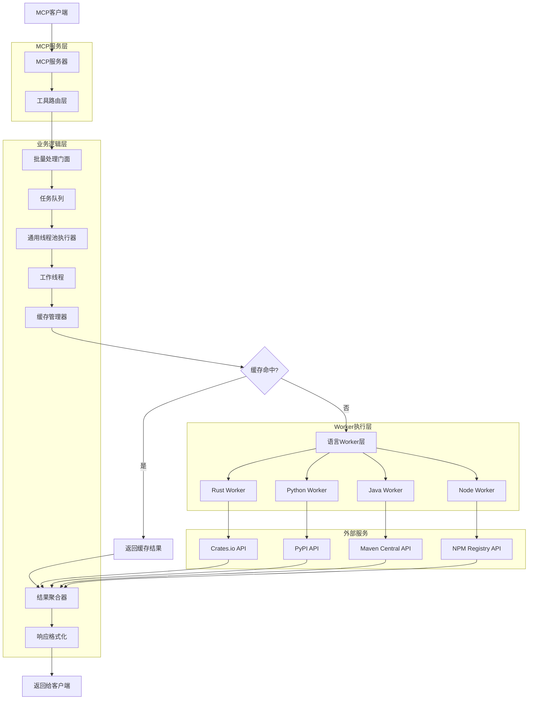
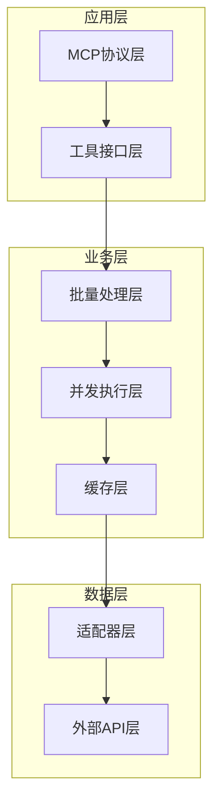
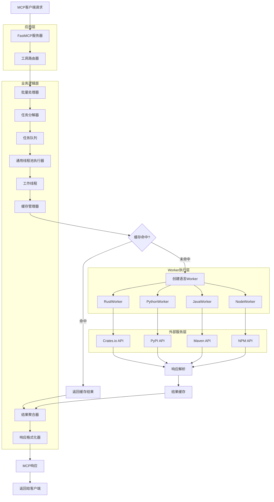
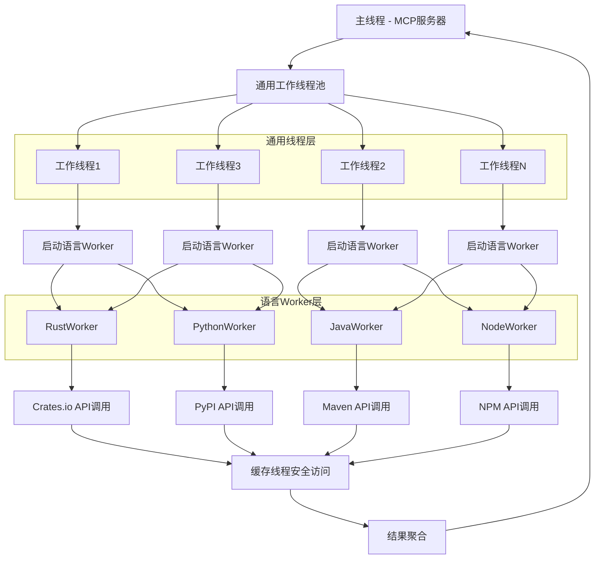
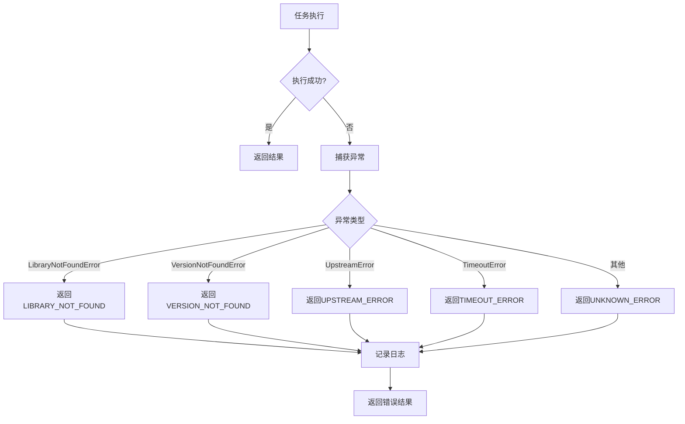

# MCP LibraryMaster - 技术架构文档

## 1. 架构设计

### 1.1 整体架构图



### 1.2 系统分层架构



## 2. 技术描述

### 2.1 核心技术栈
- **开发语言**: Python 3.10+
- **MCP框架**: mcp[cli] (Model Context Protocol Python SDK)
- **项目管理**: uv (Python包管理工具)
- **并发处理**: concurrent.futures.ThreadPoolExecutor
- **HTTP客户端**: httpx (异步HTTP客户端)
- **缓存**: 内存缓存 (dict + TTL)
- **日志**: Python标准库logging
- **配置管理**: pydantic-settings
- **数据验证**: pydantic

### 2.2 依赖库清单
```toml
[dependencies]
mcp = "^1.0.0"
httpx = "^0.25.0"
pydantic = "^2.5.0"
pydantic-settings = "^2.1.0"
typing-extensions = "^4.8.0"

[dev-dependencies]
pytest = "^7.4.0"
pytest-asyncio = "^0.21.0"
pytest-cov = "^4.1.0"
black = "^23.0.0"
ruff = "^0.1.0"
mypy = "^1.7.0"
```

## 3. 路由定义

### 3.1 MCP工具路由

| 工具名称 | 功能描述 | 处理器 |
|---------|---------|--------|
| find_latest_versions | 批量查询最新版本 | BatchVersionHandler |
| find_library_docs | 批量查询文档链接 | BatchDocHandler |
| check_versions_exist | 批量检查版本存在性 | BatchExistenceHandler |
| find_library_dependencies | 批量查询依赖关系 | BatchDependencyHandler |

### 3.2 内部路由架构

```python
# 工具路由映射
TOOL_HANDLERS = {
    "find_latest_versions": BatchVersionHandler,
    "find_library_docs": BatchDocHandler,
    "check_versions_exist": BatchExistenceHandler,
    "find_library_dependencies": BatchDependencyHandler,
}

# 语言Worker映射
LANGUAGE_WORKERS = {
    "rust": RustWorker,
    "python": PythonWorker,
    "java": JavaWorker,
    "node": NodeWorker,
}
```

## 4. 核心组件设计

### 4.1 MCP服务器组件

```python
from mcp.server.fastmcp import FastMCP
from typing import List, Dict, Any

class LibraryMasterServer:
    """MCP LibraryMaster服务器主类"""
    
    def __init__(self):
        self.mcp = FastMCP("LibraryMaster")
        self.batch_processor = BatchProcessor()
        self._register_tools()
    
    def _register_tools(self):
        """注册MCP工具"""
        self.mcp.tool()(self.find_latest_versions)
        self.mcp.tool()(self.find_library_docs)
        self.mcp.tool()(self.check_versions_exist)
        self.mcp.tool()(self.find_library_dependencies)
```

### 4.2 批量处理器组件

```python
from concurrent.futures import ThreadPoolExecutor, as_completed
from queue import Queue
from typing import List, Dict, Any, Callable

class BatchProcessor:
    """批量处理器 - 负责任务分发和结果聚合"""
    
    def __init__(self, max_workers: int = 10):
        self.max_workers = max_workers
        self.task_queue = Queue()
        self.cache_manager = CacheManager()
        self.provider_factory = ProviderFactory()
    
    async def process_batch(self, 
                          libraries: List[Dict[str, Any]], 
                          operation: str) -> Dict[str, Any]:
        """批量处理查询请求"""
        # 1. 任务分解
        tasks = self._create_tasks(libraries, operation)
        
        # 2. 并发执行
        results = await self._execute_tasks(tasks)
        
        # 3. 结果聚合
        return self._aggregate_results(results)
    
    def _create_tasks(self, libraries: List[Dict], operation: str) -> List[Task]:
        """将批量请求分解为单个任务"""
        tasks = []
        for lib in libraries:
            task = Task(
                language=lib['language'],
                library=lib['name'],
                version=lib.get('version'),
                operation=operation
            )
            tasks.append(task)
        return tasks
    
    async def _execute_tasks(self, tasks: List[Task]) -> List[TaskResult]:
        """使用通用线程池并发执行任务"""
        results = []
        
        with ThreadPoolExecutor(max_workers=self.max_workers) as executor:
            # 提交所有任务到通用工作线程
            future_to_task = {
                executor.submit(self._execute_task_with_worker, task): task 
                for task in tasks
            }
            
            # 收集结果
            for future in as_completed(future_to_task):
                task = future_to_task[future]
                try:
                    result = future.result(timeout=30)  # 30秒超时
                    results.append(result)
                except Exception as e:
                    error_result = TaskResult(
                        task=task,
                        status="error",
                        error={"code": "EXECUTION_ERROR", "message": str(e)}
                    )
                    results.append(error_result)
        
        return results
    
    def _execute_task_with_worker(self, task: Task) -> TaskResult:
        """通用工作线程执行任务，启动特定语言的Worker"""
        try:
            # 1. 检查缓存
            cache_key = self.cache_manager.generate_key(
                task.language, task.library, task.operation, task.version
            )
            cached_result = self.cache_manager.get(cache_key)
            if cached_result:
                return TaskResult(
                    task=task,
                    status="success",
                    data=cached_result,
                    execution_time=0.0
                )
            
            # 2. 创建语言特定的Worker
            worker = self._create_language_worker(task.language)
            
            # 3. 执行查询
            start_time = time.time()
            result_data = worker.execute_query(task)
            execution_time = time.time() - start_time
            
            # 4. 缓存结果
            self.cache_manager.set(cache_key, result_data)
            
            return TaskResult(
                task=task,
                status="success",
                data=result_data,
                execution_time=execution_time
            )
            
        except Exception as e:
            return TaskResult(
                task=task,
                status="error",
                error={"code": "WORKER_ERROR", "message": str(e)},
                execution_time=time.time() - start_time if 'start_time' in locals() else 0.0
            )
    
    def _create_language_worker(self, language: str) -> 'BaseWorker':
        """创建特定语言的Worker实例"""
        worker_classes = {
            "rust": RustWorker,
            "python": PythonWorker,
            "java": JavaWorker,
            "node": NodeWorker,
        }
        
        worker_class = worker_classes.get(language)
        if not worker_class:
            raise ValueError(f"Unsupported language: {language}")
        
        return worker_class()
```

### 4.3 缓存管理器组件

```python
import time
from typing import Optional, Dict, Any
from threading import RLock

class CacheManager:
    """内存缓存管理器"""
    
    def __init__(self, default_ttl: int = 3600):
        self.cache: Dict[str, CacheEntry] = {}
        self.default_ttl = default_ttl
        self.lock = RLock()
    
    def get(self, key: str) -> Optional[Any]:
        """获取缓存值"""
        with self.lock:
            entry = self.cache.get(key)
            if entry and not entry.is_expired():
                entry.access_count += 1
                entry.last_accessed = time.time()
                return entry.value
            elif entry:
                # 过期则删除
                del self.cache[key]
            return None
    
    def set(self, key: str, value: Any, ttl: Optional[int] = None) -> None:
        """设置缓存值"""
        with self.lock:
            ttl = ttl or self.default_ttl
            self.cache[key] = CacheEntry(
                value=value,
                expires_at=time.time() + ttl,
                created_at=time.time()
            )
            
            # 清理过期缓存
            self._cleanup_expired()
    
    def _cleanup_expired(self) -> None:
        """清理过期缓存"""
        current_time = time.time()
        expired_keys = [
            key for key, entry in self.cache.items() 
            if entry.expires_at < current_time
        ]
        for key in expired_keys:
            del self.cache[key]
    
    def generate_key(self, language: str, library: str, 
                    operation: str, version: Optional[str] = None) -> str:
        """生成缓存键"""
        parts = [language, library, operation]
        if version:
            parts.append(version)
        return ":".join(parts)

class CacheEntry:
    """缓存条目"""
    
    def __init__(self, value: Any, expires_at: float, created_at: float):
        self.value = value
        self.expires_at = expires_at
        self.created_at = created_at
        self.last_accessed = created_at
        self.access_count = 0
    
    def is_expired(self) -> bool:
        return time.time() > self.expires_at
```

### 4.4 语言Worker基类

```python
from abc import ABC, abstractmethod
from typing import Dict, Any, List, Optional
import httpx
import time

class BaseWorker(ABC):
    """语言Worker基类 - 由通用工作线程启动的特定语言查询执行器"""
    
    def __init__(self):
        self.client = httpx.Client(timeout=30.0)  # 同步客户端，适合线程环境
        self.base_url = self._get_base_url()
    
    @abstractmethod
    def _get_base_url(self) -> str:
        """获取API基础URL"""
        pass
    
    def execute_query(self, task: 'Task') -> Dict[str, Any]:
        """执行查询任务 - 根据操作类型调用相应方法"""
        operation_map = {
            "find_latest_versions": self.get_latest_version,
            "find_library_docs": self.get_documentation_url,
            "check_versions_exist": self.check_version_exists,
            "find_library_dependencies": self.get_dependencies,
        }
        
        operation_func = operation_map.get(task.operation)
        if not operation_func:
            raise ValueError(f"Unsupported operation: {task.operation}")
        
        # 根据操作类型调用相应方法
        if task.operation == "find_latest_versions":
            return operation_func(task.library)
        else:
            # 其他操作需要版本参数
            version = task.version or "latest"
            return operation_func(task.library, version)
    
    @abstractmethod
    def get_latest_version(self, library: str) -> Dict[str, Any]:
        """获取最新版本"""
        pass
    
    @abstractmethod
    def get_documentation_url(self, library: str, version: str) -> Dict[str, Any]:
        """获取文档URL"""
        pass
    
    @abstractmethod
    def check_version_exists(self, library: str, version: str) -> Dict[str, Any]:
        """检查版本是否存在"""
        pass
    
    @abstractmethod
    def get_dependencies(self, library: str, version: str) -> Dict[str, Any]:
        """获取依赖关系"""
        pass
    
    def _make_request(self, url: str, **kwargs) -> httpx.Response:
        """发起HTTP请求"""
        try:
            response = self.client.get(url, **kwargs)
            response.raise_for_status()
            return response
        except httpx.HTTPStatusError as e:
            if e.response.status_code == 404:
                raise LibraryNotFoundError(f"Resource not found: {url}")
            else:
                raise UpstreamError(f"HTTP {e.response.status_code}: {e.response.text}")
        except httpx.TimeoutException:
            raise TimeoutError(f"Request timeout: {url}")
        except Exception as e:
            raise UpstreamError(f"Request failed: {str(e)}")


class RustWorker(BaseWorker):
    """Rust语言Worker - 处理Crates.io查询"""
    
    def _get_base_url(self) -> str:
        return "https://crates.io/api/v1"
    
    def get_latest_version(self, library: str) -> Dict[str, Any]:
        """获取Rust库的最新版本"""
        url = f"{self.base_url}/crates/{library}"
        response = self._make_request(url)
        data = response.json()
        return {
            "version": data["crate"]["max_version"],
            "url": f"https://crates.io/crates/{library}"
        }
    
    def get_documentation_url(self, library: str, version: str) -> Dict[str, Any]:
        """获取Rust库的文档URL"""
        return {
            "doc_url": f"https://docs.rs/{library}/{version}"
        }
    
    def check_version_exists(self, library: str, version: str) -> Dict[str, Any]:
        """检查Rust库版本是否存在"""
        url = f"{self.base_url}/crates/{library}/{version}"
        try:
            self._make_request(url)
            return {"exists": True}
        except LibraryNotFoundError:
            return {"exists": False}
    
    def get_dependencies(self, library: str, version: str) -> Dict[str, Any]:
        """获取Rust库的依赖关系"""
        url = f"{self.base_url}/crates/{library}/{version}/dependencies"
        response = self._make_request(url)
        data = response.json()
        dependencies = [
            {"name": dep["crate_id"], "version": dep["req"]}
            for dep in data["dependencies"]
        ]
        return {"dependencies": dependencies}


class PythonWorker(BaseWorker):
    """Python语言Worker - 处理PyPI查询"""
    
    def _get_base_url(self) -> str:
        return "https://pypi.org/pypi"
    
    def get_latest_version(self, library: str) -> Dict[str, Any]:
        """获取Python包的最新版本"""
        url = f"{self.base_url}/{library}/json"
        response = self._make_request(url)
        data = response.json()
        return {
            "version": data["info"]["version"],
            "url": data["info"]["package_url"]
        }
    
    def get_documentation_url(self, library: str, version: str) -> Dict[str, Any]:
        """获取Python包的文档URL"""
        url = f"{self.base_url}/{library}/json"
        response = self._make_request(url)
        data = response.json()
        doc_url = data["info"].get("project_urls", {}).get("Documentation")
        if not doc_url:
            doc_url = data["info"].get("home_page")
        return {"doc_url": doc_url}
    
    def check_version_exists(self, library: str, version: str) -> Dict[str, Any]:
        """检查Python包版本是否存在"""
        url = f"{self.base_url}/{library}/{version}/json"
        try:
            self._make_request(url)
            return {"exists": True}
        except LibraryNotFoundError:
            return {"exists": False}
    
    def get_dependencies(self, library: str, version: str) -> Dict[str, Any]:
        """获取Python包的依赖关系"""
        url = f"{self.base_url}/{library}/{version}/json"
        response = self._make_request(url)
        data = response.json()
        requires_dist = data["info"].get("requires_dist", [])
        dependencies = []
        if requires_dist:
            for req in requires_dist:
                # 简单解析依赖字符串
                name = req.split()[0] if req else ""
                dependencies.append({"name": name, "version": "*"})
        return {"dependencies": dependencies}


class JavaWorker(BaseWorker):
    """Java语言Worker - 处理Maven Central查询"""
    
    def _get_base_url(self) -> str:
        return "https://search.maven.org/solrsearch/select"
    
    def get_latest_version(self, library: str) -> Dict[str, Any]:
        """获取Java库的最新版本"""
        # Maven查询需要group:artifact格式
        params = {
            "q": f"a:{library}",
            "rows": 1,
            "wt": "json"
        }
        response = self._make_request(self.base_url, params=params)
        data = response.json()
        if data["response"]["docs"]:
            doc = data["response"]["docs"][0]
            return {
                "version": doc["latestVersion"],
                "url": f"https://mvnrepository.com/artifact/{doc['g']}/{doc['a']}"
            }
        raise LibraryNotFoundError(f"Java library not found: {library}")
    
    def get_documentation_url(self, library: str, version: str) -> Dict[str, Any]:
        """获取Java库的文档URL"""
        # 简化实现，返回Maven仓库页面
        return {
            "doc_url": f"https://mvnrepository.com/artifact/{library}/{version}"
        }
    
    def check_version_exists(self, library: str, version: str) -> Dict[str, Any]:
        """检查Java库版本是否存在"""
        params = {
            "q": f"a:{library} AND v:{version}",
            "rows": 1,
            "wt": "json"
        }
        response = self._make_request(self.base_url, params=params)
        data = response.json()
        exists = len(data["response"]["docs"]) > 0
        return {"exists": exists}
    
    def get_dependencies(self, library: str, version: str) -> Dict[str, Any]:
        """获取Java库的依赖关系"""
        # Maven Central API不直接提供依赖信息，这里返回空列表
        return {"dependencies": []}


class NodeWorker(BaseWorker):
    """Node.js语言Worker - 处理NPM查询"""
    
    def _get_base_url(self) -> str:
        return "https://registry.npmjs.org"
    
    def get_latest_version(self, library: str) -> Dict[str, Any]:
        """获取Node.js包的最新版本"""
        url = f"{self.base_url}/{library}"
        response = self._make_request(url)
        data = response.json()
        return {
            "version": data["dist-tags"]["latest"],
            "url": f"https://www.npmjs.com/package/{library}"
        }
    
    def get_documentation_url(self, library: str, version: str) -> Dict[str, Any]:
        """获取Node.js包的文档URL"""
        url = f"{self.base_url}/{library}/{version}"
        response = self._make_request(url)
        data = response.json()
        doc_url = data.get("homepage") or f"https://www.npmjs.com/package/{library}"
        return {"doc_url": doc_url}
    
    def check_version_exists(self, library: str, version: str) -> Dict[str, Any]:
        """检查Node.js包版本是否存在"""
        url = f"{self.base_url}/{library}/{version}"
        try:
            self._make_request(url)
            return {"exists": True}
        except LibraryNotFoundError:
            return {"exists": False}
    
    def get_dependencies(self, library: str, version: str) -> Dict[str, Any]:
        """获取Node.js包的依赖关系"""
        url = f"{self.base_url}/{library}/{version}"
        response = self._make_request(url)
        data = response.json()
        deps = data.get("dependencies", {})
        dependencies = [
            {"name": name, "version": version}
            for name, version in deps.items()
        ]
        return {"dependencies": dependencies}
```

## 5. 服务器架构图

### 5.1 组件交互图



### 5.2 线程模型



## 6. 数据模型

### 6.1 核心数据结构

```python
from pydantic import BaseModel
from typing import List, Optional, Dict, Any
from enum import Enum

class Language(str, Enum):
    """支持的编程语言"""
    RUST = "rust"
    PYTHON = "python"
    JAVA = "java"
    NODE = "node"

class LibraryRequest(BaseModel):
    """库查询请求"""
    language: Language
    name: str
    version: Optional[str] = None

class BatchRequest(BaseModel):
    """批量查询请求"""
    libraries: List[LibraryRequest]

class LibraryResult(BaseModel):
    """库查询结果"""
    language: str
    library: str
    version: Optional[str] = None
    status: str  # success, error
    error: Optional[Dict[str, str]] = None
    
    # 特定功能的结果字段
    url: Optional[str] = None  # 最新版本查询
    doc_url: Optional[str] = None  # 文档查询
    exists: Optional[bool] = None  # 版本存在性检查
    dependencies: Optional[List[Dict[str, str]]] = None  # 依赖查询

class BatchResponse(BaseModel):
    """批量查询响应"""
    results: List[LibraryResult]
    summary: Dict[str, int]  # total, success, failed

class Task(BaseModel):
    """内部任务模型"""
    language: str
    library: str
    version: Optional[str]
    operation: str
    created_at: float

class TaskResult(BaseModel):
    """任务执行结果"""
    task: Task
    status: str
    data: Optional[Dict[str, Any]] = None
    error: Optional[Dict[str, str]] = None
    execution_time: Optional[float] = None
```

### 6.2 配置模型

```python
from pydantic_settings import BaseSettings

class Settings(BaseSettings):
    """应用配置"""
    
    # 服务配置
    service_name: str = "LibraryMaster"
    log_level: str = "INFO"
    
    # 并发配置
    max_workers: int = 10
    request_timeout: int = 30
    
    # 缓存配置
    cache_ttl: int = 3600  # 1小时
    cache_max_size: int = 10000
    
    # API配置
    crates_io_base_url: str = "https://crates.io/api/v1"
    pypi_base_url: str = "https://pypi.org/pypi"
    maven_base_url: str = "https://search.maven.org/solrsearch/select"
    npm_base_url: str = "https://registry.npmjs.org"
    
    # 重试配置
    max_retries: int = 3
    retry_delay: float = 1.0
    
    class Config:
        env_prefix = "LIBRARY_MASTER_"
        env_file = ".env"
```

## 7. 错误处理架构

### 7.1 异常层次结构

```python
class LibraryMasterError(Exception):
    """基础异常类"""
    pass

class ValidationError(LibraryMasterError):
    """参数验证错误"""
    pass

class LibraryNotFoundError(LibraryMasterError):
    """库不存在错误"""
    pass

class VersionNotFoundError(LibraryMasterError):
    """版本不存在错误"""
    pass

class UpstreamError(LibraryMasterError):
    """上游服务错误"""
    pass

class TimeoutError(LibraryMasterError):
    """超时错误"""
    pass

class CacheError(LibraryMasterError):
    """缓存错误"""
    pass
```

### 7.2 错误处理流程



## 8. 性能优化策略

### 8.1 缓存策略
- **多级缓存**: 内存缓存 + 可选的Redis缓存
- **缓存键设计**: `{language}:{library}:{operation}:{version?}`
- **TTL策略**: 版本信息1小时，文档链接6小时
- **缓存预热**: 热门库的预加载
- **缓存淘汰**: LRU + TTL混合策略

### 8.2 并发优化
- **线程池**: 可配置的线程池大小
- **连接池**: HTTP客户端连接复用
- **批量处理**: 减少网络往返次数
- **异步处理**: 非阻塞I/O操作

### 8.3 网络优化
- **请求超时**: 合理的超时设置
- **重试机制**: 指数退避重试
- **连接复用**: Keep-Alive连接
- **压缩传输**: Gzip压缩支持

## 9. 监控与日志

### 9.1 日志架构

```python
import logging
from typing import Dict, Any

class StructuredLogger:
    """结构化日志记录器"""
    
    def __init__(self, name: str):
        self.logger = logging.getLogger(name)
        
    def log_request(self, operation: str, libraries_count: int, **kwargs):
        """记录请求日志"""
        self.logger.info(
            "Request received",
            extra={
                "operation": operation,
                "libraries_count": libraries_count,
                "timestamp": time.time(),
                **kwargs
            }
        )
    
    def log_task_result(self, task: Task, result: TaskResult):
        """记录任务结果日志"""
        self.logger.info(
            "Task completed",
            extra={
                "language": task.language,
                "library": task.library,
                "operation": task.operation,
                "status": result.status,
                "execution_time": result.execution_time,
                "timestamp": time.time()
            }
        )
```

### 9.2 性能指标
- **响应时间**: P50, P95, P99响应时间
- **吞吐量**: 每秒处理的请求数
- **错误率**: 各类错误的发生率
- **缓存命中率**: 缓存的有效性
- **线程池利用率**: 并发资源使用情况

## 10. 部署架构

### 10.1 容器化部署

```dockerfile
FROM python:3.11-slim

# 安装uv
RUN pip install uv

# 设置工作目录
WORKDIR /app

# 复制项目文件
COPY pyproject.toml uv.lock ./
COPY src/ ./src/

# 安装依赖
RUN uv sync --frozen

# 暴露端口（如果需要HTTP接口）
EXPOSE 8000

# 启动命令
CMD ["uv", "run", "python", "-m", "src.main"]
```

### 10.2 配置管理
- **环境变量**: 通过环境变量配置
- **配置文件**: 支持.env文件
- **运行时配置**: 支持配置热更新
- **密钥管理**: 敏感信息加密存储

### 10.3 健康检查
- **存活检查**: 服务进程状态
- **就绪检查**: 依赖服务可用性
- **性能检查**: 响应时间阈值
- **资源检查**: 内存和CPU使用率

## 11. 安全考虑

### 11.1 输入验证
- **参数校验**: 严格的输入参数验证
- **注入防护**: 防止代码注入攻击
- **长度限制**: 防止DoS攻击
- **字符过滤**: 特殊字符处理

### 11.2 网络安全
- **HTTPS**: 加密传输
- **证书验证**: SSL证书校验
- **请求限流**: 防止滥用
- **访问控制**: IP白名单（如需要）

### 11.3 数据安全
- **敏感信息**: 不记录敏感数据
- **日志脱敏**: 日志中的敏感信息处理
- **缓存安全**: 缓存数据的安全性
- **错误信息**: 避免泄露系统信息

## 12. 测试策略

### 12.1 测试层次
- **单元测试**: 各组件的独立测试
- **集成测试**: 组件间的交互测试
- **端到端测试**: 完整流程测试
- **性能测试**: 负载和压力测试

### 12.2 测试覆盖
- **代码覆盖率**: 目标90%+
- **分支覆盖**: 所有逻辑分支
- **异常测试**: 各种异常情况
- **边界测试**: 极限条件测试

### 12.3 测试工具
- **pytest**: 测试框架
- **pytest-asyncio**: 异步测试支持
- **pytest-cov**: 覆盖率统计
- **httpx-mock**: HTTP请求模拟
- **pytest-benchmark**: 性能基准测试
