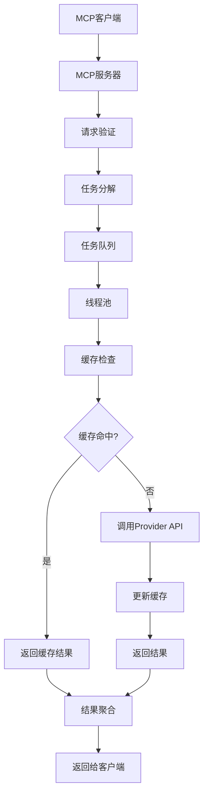

# MCP LibraryMaster - 多语言代码库查询服务产品需求文档 (PRD)

## 1. 产品概述

### 1.1 背景与问题
在现代软件开发中，项目通常依赖多种开发语言的第三方库。开发者、DevOps工程师以及CI/CD流程需要频繁检查这些库的最新版本、依赖关系、文档等信息，用于依赖更新、安全审计或物料清单（SBOM）管理。然而，每种语言都有其独立的包管理生态系统和查询方式（如Rust的Crates.io、Python的PyPI、Java的Maven Central、Node.js的npm），导致查询过程分散、繁琐，增加了开发和运维的复杂度。

### 1.2 产品简介
**MCP LibraryMaster** 是一个基于Model Context Protocol (MCP)的多语言代码库查询服务。它提供统一的工具接口，支持批量查询多种主流开发语言库的版本信息、依赖关系、文档链接等。通过MCP协议，该服务可以无缝集成到支持MCP的AI助手和开发工具中，为用户提供高效的包管理查询能力。

### 1.3 目标用户
- **AI助手用户**: 通过MCP协议在对话中快速查询包信息
- **软件开发者**: 在日常开发中快速查询依赖库信息
- **DevOps工程师**: 在CI/CD流水线中自动化检查依赖更新
- **安全工程师**: 用于构建工具，扫描项目依赖的安全状态
- **自动化脚本与工具**: 作为上层应用的数据来源

## 2. 核心特性

### 2.1 用户角色
本产品作为MCP工具，不区分用户角色，所有功能对所有用户开放。

### 2.2 功能模块

本产品包含以下核心功能模块：

1. **批量版本查询**: 支持同时查询多个库的最新版本信息
2. **批量文档查询**: 支持同时查询多个库指定版本的文档链接
3. **批量版本存在性检查**: 支持同时检查多个库的指定版本是否存在
4. **批量依赖查询**: 支持同时查询多个库指定版本的依赖关系

### 2.3 页面详情

作为MCP工具，本产品不包含传统的页面界面，而是通过MCP协议提供工具接口：

| 工具名称 | 功能描述 | 输入参数 |
|---------|---------|----------|
| find_latest_versions | 批量查询库的最新版本 | 库信息列表（语言+库名） |
| find_library_docs | 批量查询库的文档链接 | 库信息列表（语言+库名+版本） |
| check_versions_exist | 批量检查版本是否存在 | 库信息列表（语言+库名+版本） |
| find_library_dependencies | 批量查询库的依赖关系 | 库信息列表（语言+库名+版本） |

## 3. 核心流程

### 3.1 主要操作流程

用户通过支持MCP的客户端（如Claude Desktop、其他AI助手）调用工具：

1. 用户发起批量查询请求
2. MCP服务接收请求并验证参数
3. 请求被分解为多个查询任务并加入队列
4. 线程池从队列中获取任务并并发执行
5. 查询结果通过缓存机制优化性能
6. 所有任务完成后组装结果并返回

### 3.2 系统流程图



## 4. 用户界面设计

### 4.1 设计风格
作为MCP工具，本产品不包含图形用户界面，通过MCP协议提供结构化的数据交互。

### 4.2 交互设计
- **输入格式**: JSON结构化数据，包含库信息列表
- **输出格式**: JSON结构化数据，包含查询结果列表
- **错误处理**: 提供详细的错误信息和状态码
- **性能优化**: 支持并发查询和缓存机制

### 4.3 响应性
- **并发处理**: 支持多线程并发查询
- **缓存机制**: 内存缓存减少重复查询
- **超时控制**: 合理的超时设置避免长时间等待

## 5. 技术需求

### 5.1 支持的语言
- **Rust**: 通过crates.io API查询
- **Python**: 通过PyPI API查询
- **Java**: 通过Maven Central API查询（格式：groupId:artifactId）
- **Node.js**: 通过npm registry API查询

### 5.2 性能要求
- **响应时间**: 单个查询P95响应时间 < 500ms
- **并发能力**: 支持同时处理多个批量查询请求
- **缓存命中率**: 内存缓存命中率 > 80%
- **可用性**: 服务可用性 > 99.9%

### 5.3 扩展性要求
- **语言扩展**: 支持新增更多编程语言
- **功能扩展**: 支持新增更多查询功能
- **性能扩展**: 支持水平扩展和负载均衡

## 6. API规范

### 6.1 MCP工具定义

#### 6.1.1 find_latest_versions
**功能**: 批量查询库的最新版本

**输入参数**:
```json
{
  "libraries": [
    {
      "language": "python",
      "name": "requests"
    },
    {
      "language": "rust", 
      "name": "serde"
    }
  ]
}
```

**输出结果**:
```json
{
  "results": [
    {
      "language": "python",
      "library": "requests",
      "version": "2.31.0",
      "url": "https://pypi.org/project/requests/",
      "status": "success"
    },
    {
      "language": "rust",
      "library": "serde", 
      "version": "1.0.190",
      "url": "https://crates.io/crates/serde",
      "status": "success"
    }
  ],
  "summary": {
    "total": 2,
    "success": 2,
    "failed": 0
  }
}
```

#### 6.1.2 find_library_docs
**功能**: 批量查询库的文档链接

**输入参数**:
```json
{
  "libraries": [
    {
      "language": "rust",
      "name": "serde",
      "version": "1.0.190"
    }
  ]
}
```

**输出结果**:
```json
{
  "results": [
    {
      "language": "rust",
      "library": "serde",
      "version": "1.0.190",
      "doc_url": "https://docs.rs/serde/1.0.190/serde/",
      "status": "success"
    }
  ],
  "summary": {
    "total": 1,
    "success": 1,
    "failed": 0
  }
}
```

#### 6.1.3 check_versions_exist
**功能**: 批量检查版本是否存在

**输入参数**:
```json
{
  "libraries": [
    {
      "language": "python",
      "name": "requests",
      "version": "2.31.0"
    }
  ]
}
```

**输出结果**:
```json
{
  "results": [
    {
      "language": "python",
      "library": "requests",
      "version": "2.31.0",
      "exists": true,
      "status": "success"
    }
  ],
  "summary": {
    "total": 1,
    "success": 1,
    "failed": 0
  }
}
```

#### 6.1.4 find_library_dependencies
**功能**: 批量查询库的依赖关系

**输入参数**:
```json
{
  "libraries": [
    {
      "language": "node",
      "name": "express",
      "version": "4.18.2"
    }
  ]
}
```

**输出结果**:
```json
{
  "results": [
    {
      "language": "node",
      "library": "express",
      "version": "4.18.2",
      "dependencies": [
        {
          "name": "accepts",
          "version_constraint": "~1.3.8"
        },
        {
          "name": "body-parser",
          "version_constraint": "1.20.1"
        }
      ],
      "status": "success"
    }
  ],
  "summary": {
    "total": 1,
    "success": 1,
    "failed": 0
  }
}
```

### 6.2 错误处理

**错误响应格式**:
```json
{
  "results": [
    {
      "language": "python",
      "library": "nonexistent-lib",
      "status": "error",
      "error": {
        "code": "LIBRARY_NOT_FOUND",
        "message": "Library 'nonexistent-lib' not found for language 'python'"
      }
    }
  ],
  "summary": {
    "total": 1,
    "success": 0,
    "failed": 1
  }
}
```

**错误代码**:
- `LIBRARY_NOT_FOUND`: 库不存在
- `VERSION_NOT_FOUND`: 版本不存在
- `LANGUAGE_NOT_SUPPORTED`: 不支持的语言
- `UPSTREAM_ERROR`: 上游服务错误
- `TIMEOUT_ERROR`: 查询超时
- `INVALID_PARAMETER`: 参数格式错误

## 7. 非功能性需求

### 7.1 性能需求
- **响应时间**: P95响应时间 < 500ms
- **吞吐量**: 支持每秒处理100+批量查询请求
- **并发度**: 线程池支持可配置的并发数量
- **缓存效率**: 内存缓存减少80%以上的重复查询

### 7.2 可靠性需求
- **服务可用性**: 99.9%
- **错误处理**: 完善的错误处理和重试机制
- **超时控制**: 合理的超时设置避免资源泄露
- **故障恢复**: 上游服务故障时的降级策略

### 7.3 可维护性需求
- **日志记录**: 详细的操作日志和错误日志
- **监控指标**: 性能指标和健康状态监控
- **配置管理**: 支持运行时配置调整
- **代码质量**: 高测试覆盖率和代码规范

## 8. 约束条件

### 8.1 技术约束
- **开发语言**: Python 3.10+
- **项目管理**: 使用uv作为包管理工具
- **协议标准**: 严格遵循MCP协议规范
- **依赖管理**: 最小化外部依赖

### 8.2 业务约束
- **API限制**: 遵守各语言包管理平台的API使用限制
- **数据准确性**: 确保查询结果的准确性和时效性
- **隐私保护**: 不存储用户查询历史
- **开源协议**: 遵循相关开源协议要求

## 9. 风险与缓解

### 9.1 技术风险
- **上游API变更**: 定期更新适配器以应对API变更
- **性能瓶颈**: 通过缓存和并发优化提升性能
- **内存泄露**: 合理的缓存策略和内存管理

### 9.2 业务风险
- **API限流**: 实现请求频率控制和重试机制
- **数据不一致**: 建立数据验证和校正机制
- **服务依赖**: 多重备份和降级策略

## 10. 发布计划

### 10.1 V1.0 (MVP)
- 支持四种语言的基础查询功能
- 实现批量查询和缓存机制
- 完整的MCP协议支持
- 基础的错误处理和日志记录

### 10.2 V1.1
- 性能优化和缓存策略改进
- 增加更多编程语言支持
- 增强错误处理和重试机制
- 添加监控和指标收集

### 10.3 V1.2
- 支持更多查询功能（如安全漏洞信息）
- 实现分布式缓存
- 支持配置热更新
- 完善的测试覆盖和文档
