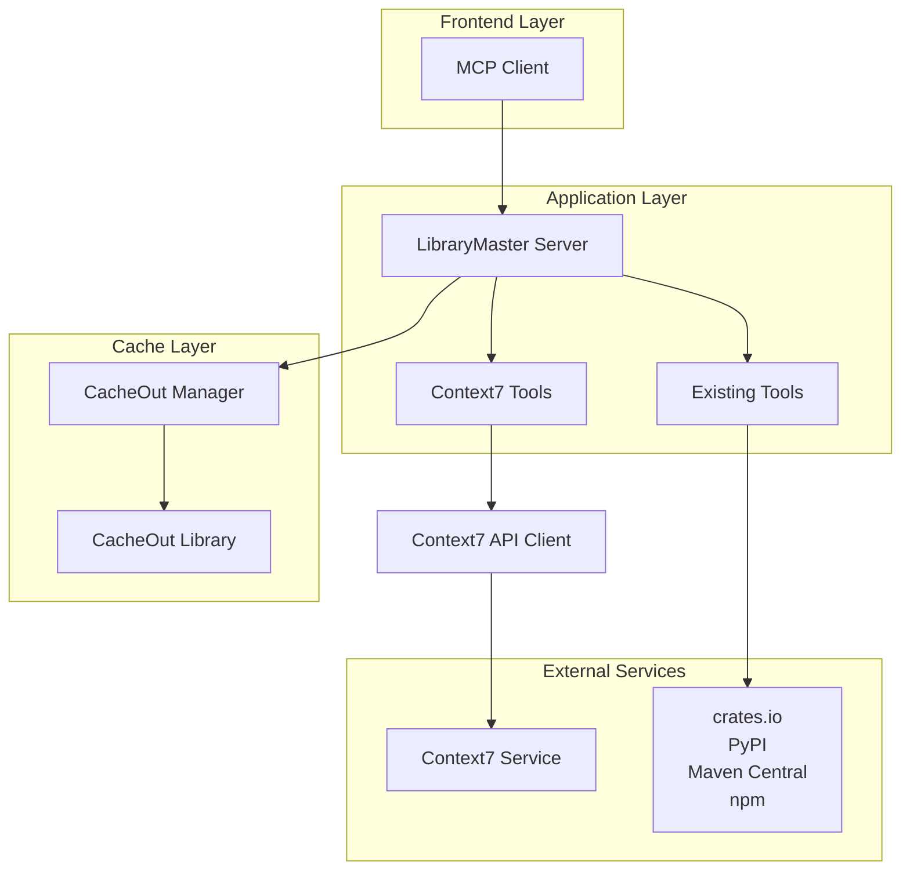
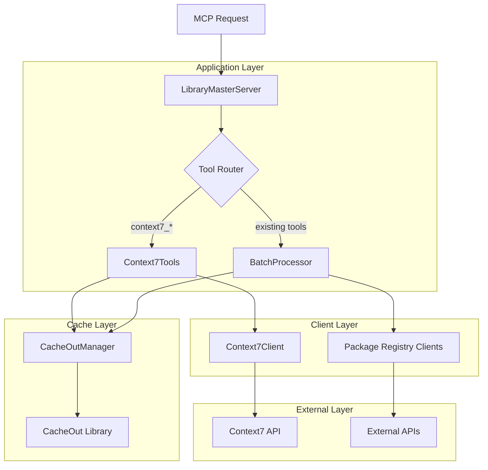
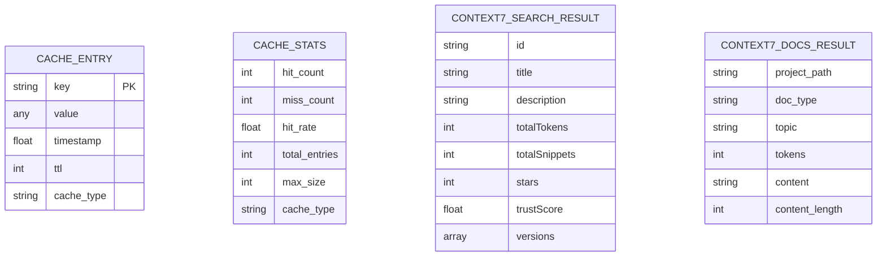
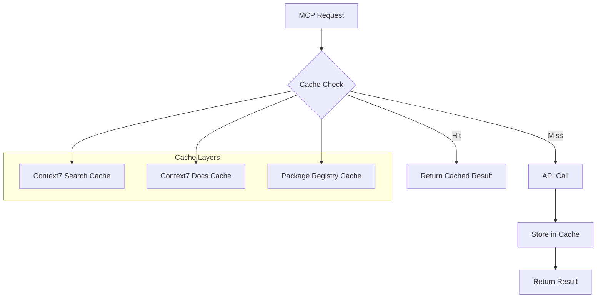
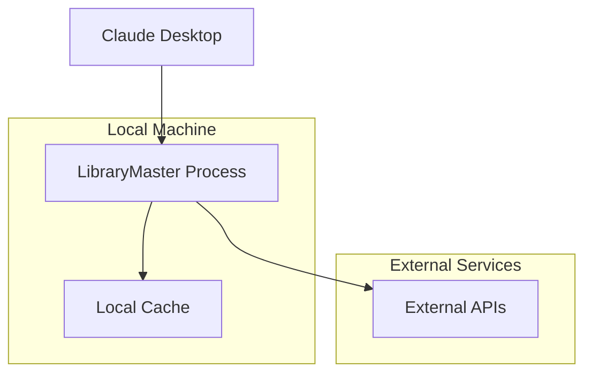

# LibraryMaster v0.1.1 技术架构文档

## 1. 架构设计



## 2. 技术描述

### 核心技术栈
- **Frontend**: MCP Client (Claude Desktop等)
- **Backend**: Python 3.10+ + FastMCP
- **缓存**: CacheOut库 (替代自定义缓存)
- **HTTP客户端**: httpx (异步)
- **数据验证**: Pydantic v2
- **新增依赖**: cacheout>=0.16.0

### 主要组件
- **LibraryMasterServer**: 核心MCP服务器
- **Context7Tools**: Context7 API集成工具
- **CacheOutManager**: 基于CacheOut的缓存管理器
- **Context7Client**: Context7 API客户端
- **BatchProcessor**: 批量请求处理器

## 3. 路由定义

### MCP工具路由

| 工具名称 | 功能描述 | 新增/现有 |
|----------|----------|----------|
| find_latest_versions | 查询库的最新版本 | 现有 |
| find_library_docs | 查询库的文档链接 | 现有 |
| check_versions_exist | 检查版本是否存在 | 现有 |
| find_library_dependencies | 查询库的依赖关系 | 现有 |
| get_cache_stats | 获取缓存统计信息 | 现有 |
| clear_cache | 清空缓存 | 现有 |
| **context7_search** | **Context7搜索** | **新增** |
| **context7_docs** | **Context7文档获取** | **新增** |

## 4. API定义

### 4.1 Context7 Search API

**工具**: `context7_search`

**请求参数**:
| 参数名 | 参数类型 | 是否必需 | 描述 |
|--------|----------|----------|------|
| query | string | true | 搜索查询字符串 |

**响应格式**:
```json
{
  "results": [
    {
      "id": "/react-hook-form/documentation",
      "title": "React Hook Form",
      "description": "📋 Official documentation",
      "totalTokens": 50275,
      "totalSnippets": 274,
      "stars": 741,
      "trustScore": 9.1,
      "versions": []
    }
  ]
}
```

**错误响应**:
```json
{
  "error": "Context7 API key not configured",
  "results": []
}
```

### 4.2 Context7 Docs API

**工具**: `context7_docs`

**请求参数**:
| 参数名 | 参数类型 | 是否必需 | 描述 |
|--------|----------|----------|------|
| project_path | string | true | 项目路径，如"vercel/next.js" |
| doc_type | string | false | 文档类型，默认"txt" |
| topic | string | false | 主题过滤，可选 |
| tokens | integer | false | 返回的token数量限制，默认5000 |

**响应格式**:
```json
{
  "project_path": "vercel/next.js",
  "doc_type": "txt",
  "topic": "ssr",
  "tokens": 5000,
  "content": "TITLE: Dynamically Load Component Client-Side Only...\n\nDESCRIPTION: Explains how to disable Server-Side Rendering...",
  "content_length": 2048
}
```

**错误响应**:
```json
{
  "error": "Context7 API key not configured",
  "content": ""
}
```

## 5. 服务器架构图



## 6. 数据模型

### 6.1 缓存数据模型



### 6.2 配置数据模型

```python
class Settings(BaseSettings):
    # 现有配置
    log_level: str = "INFO"
    max_workers: int = 10
    request_timeout: int = 30
    cache_ttl: int = 3600
    cache_max_size: int = 1000
    
    # Context7配置
    context7_api_key: Optional[str] = None
    context7_base_url: str = "https://context7.com/api/v1"
    
    # 缓存配置
    cache_type: str = "cacheout"  # "memory" | "cacheout"
    cache_default_ttl: int = 3600
    cache_max_entries: int = 1000
```

## 7. 组件详细设计

### 7.1 CacheOutManager

**职责**: 使用CacheOut库实现高性能缓存管理

**核心特性**:
- LRU淘汰策略
- TTL过期机制
- 线程安全
- 统计信息收集
- 向后兼容API

**接口设计**:
```python
class CacheOutManager:
    def __init__(self, default_ttl: int = 3600, max_size: int = 1000)
    def get(self, key: str) -> Optional[Any]
    def set(self, key: str, value: Any, ttl: Optional[int] = None) -> None
    def delete(self, key: str) -> bool
    def clear(self) -> None
    def size(self) -> int
    def get_stats(self) -> Dict[str, Any]
    def generate_key(self, language: str, library: str, operation: str, version: Optional[str] = None) -> str
```

### 7.2 Context7Client

**职责**: 封装Context7 API调用逻辑

**核心特性**:
- 异步HTTP客户端
- 错误处理和重试
- 请求超时控制
- API密钥管理

**接口设计**:
```python
class Context7Client:
    def __init__(self, api_key: str, base_url: str = "https://context7.com/api/v1")
    async def search(self, query: str) -> Dict[str, Any]
    async def get_docs(self, project_path: str, doc_type: str = "txt", 
                      topic: Optional[str] = None, tokens: int = 5000) -> str
```

### 7.3 Context7Tools

**职责**: 集成Context7功能到MCP工具系统

**核心特性**:
- 缓存集成
- 错误处理
- 日志记录
- 参数验证

**接口设计**:
```python
class Context7Tools:
    def __init__(self, api_key: str, cache_manager: CacheOutManager)
    async def search(self, query: str) -> Dict[str, Any]
    async def get_docs(self, project_path: str, doc_type: str = "txt", 
                      topic: Optional[str] = None, tokens: int = 5000) -> Dict[str, Any]
```

## 8. 缓存策略设计

### 8.1 缓存层次



### 8.2 缓存键策略

| 工具类型 | 缓存键格式 | TTL |
|----------|------------|-----|
| Context7 Search | `context7:search:{query}` | 30分钟 |
| Context7 Docs | `context7:docs:{project_path}:{doc_type}:{topic}:{tokens}` | 2小时 |
| Package Registry | `{language}:{library}:{operation}:{version?}` | 1小时 |

### 8.3 缓存配置

```python
CACHE_CONFIG = {
    "context7_search": {
        "ttl": 1800,  # 30分钟
        "max_entries": 200
    },
    "context7_docs": {
        "ttl": 7200,  # 2小时
        "max_entries": 100
    },
    "package_registry": {
        "ttl": 3600,  # 1小时
        "max_entries": 700
    }
}
```

## 9. 错误处理策略

### 9.1 错误分类

| 错误类型 | 处理策略 | 返回格式 |
|----------|----------|----------|
| API密钥缺失 | 优雅降级 | `{"error": "API key not configured"}` |
| 网络错误 | 重试机制 | `{"error": "Network request failed"}` |
| API限流 | 指数退避 | `{"error": "Rate limit exceeded"}` |
| 参数错误 | 立即返回 | `{"error": "Invalid parameter: {param}"}` |
| 服务不可用 | 缓存回退 | `{"error": "Service temporarily unavailable"}` |

### 9.2 重试策略

```python
RETRY_CONFIG = {
    "max_retries": 3,
    "backoff_factor": 2,
    "retry_status_codes": [429, 500, 502, 503, 504],
    "timeout": 30
}
```

## 10. 性能优化

### 10.1 并发处理

- 使用`asyncio`实现异步处理
- 批量请求并发执行
- 连接池复用
- 请求去重机制

### 10.2 缓存优化

- LRU淘汰策略
- 智能TTL设置
- 缓存预热机制
- 内存使用监控

### 10.3 资源管理

- HTTP连接池管理
- 内存使用限制
- 超时控制
- 资源清理机制

## 11. 监控与日志

### 11.1 关键指标

- 缓存命中率
- API响应时间
- 错误率统计
- 内存使用情况
- 并发请求数

### 11.2 日志策略

```python
LOG_CONFIG = {
    "level": "INFO",
    "format": "%(asctime)s - %(name)s - %(levelname)s - %(message)s",
    "handlers": ["console", "file"],
    "rotation": "daily"
}
```

## 12. 安全考虑

### 12.1 API密钥管理

- 环境变量存储
- 运行时验证
- 敏感信息脱敏
- 访问权限控制

### 12.2 数据安全

- 缓存数据加密（可选）
- 敏感信息过滤
- 请求参数验证
- 输出内容清理

## 13. 部署架构

### 13.1 单机部署



### 13.2 容器化部署

```dockerfile
FROM python:3.10-slim

WORKDIR /app
COPY requirements.txt .
RUN pip install -r requirements.txt

COPY src/ ./src/
ENV PYTHONPATH=/app/src

CMD ["python", "-m", "librarymaster.main"]
```

## 14. 测试策略

### 14.1 测试层次

- **单元测试**: 组件功能测试
- **集成测试**: API集成测试
- **性能测试**: 缓存性能测试
- **端到端测试**: MCP工具测试

### 14.2 测试覆盖

- 代码覆盖率 > 85%
- 关键路径 100% 覆盖
- 错误场景全覆盖
- 性能基准测试

## 15. 版本兼容性

### 15.1 向后兼容

- 现有MCP工具接口不变
- 现有配置参数继续有效
- 缓存API保持兼容
- 错误处理格式一致

### 15.2 迁移策略

- 平滑升级路径
- 配置自动迁移
- 缓存数据兼容
- 回滚机制支持

---

## 总结

LibraryMaster v0.1.1版本通过集成Context7 API和重构缓存系统，在保持完全向后兼容的前提下，显著扩展了功能范围和提升了性能表现。新的架构设计确保了系统的可扩展性、可维护性和可靠性，为后续版本的发展奠定了坚实基础。