# LocalPort Architecture

This document provides a comprehensive overview of LocalPort's architecture, designed to help developers understand the system design and contribute effectively.

## Overview

LocalPort is built using **Hexagonal Architecture** (also known as Ports and Adapters), which provides clean separation of concerns, testability, and extensibility. The architecture ensures that business logic is isolated from external dependencies, making the system maintainable and adaptable.

## Hexagonal Architecture

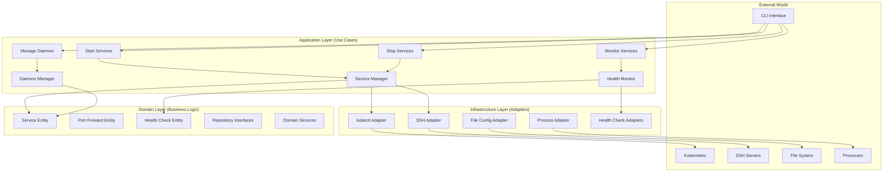

## Layer Responsibilities

### 1. Domain Layer (Core Business Logic)

The innermost layer contains pure business logic with no external dependencies.

#### Entities
- **Service**: Represents a port forwarding service with its configuration
- **PortForward**: Represents an active port forwarding process
- **HealthCheck**: Represents health monitoring configuration and state

#### Value Objects
- **Port**: Encapsulates port number validation and behavior
- **ConnectionInfo**: Encapsulates connection details for different technologies

#### Repository Interfaces
- **ServiceRepository**: Interface for service persistence
- **ConfigRepository**: Interface for configuration management

#### Domain Services
- Business rules that don't belong to a specific entity
- Cross-entity operations and validations

### 2. Application Layer (Use Cases & Services)

Orchestrates domain objects to fulfill specific use cases.

#### Use Cases
- **StartServicesUseCase**: Coordinates starting multiple services
- **StopServicesUseCase**: Coordinates stopping services gracefully
- **MonitorServicesUseCase**: Manages health monitoring workflows
- **ManageDaemonUseCase**: Controls daemon lifecycle operations

#### Application Services
- **ServiceManager**: Manages service lifecycle and coordination
- **HealthMonitor**: Handles health checking and restart logic
- **DaemonManager**: Manages background daemon operations
- **ConfigurationManager**: Handles configuration hot-reloading

#### DTOs (Data Transfer Objects)
- **ServiceDTO**: Data structures for service information transfer
- **HealthDTO**: Data structures for health status information

### 3. Infrastructure Layer (Adapters)

Implements interfaces defined by inner layers and handles external system integration.

#### Port Forwarding Adapters
- **KubectlAdapter**: Implements kubectl port-forward operations
- **SSHAdapter**: Implements SSH tunnel management
- **AdapterFactory**: Creates appropriate adapters based on technology

#### Health Check Adapters
- **TCPHealthCheck**: Basic connectivity testing
- **HTTPHealthCheck**: Web service health endpoints
- **PostgreSQLHealthCheck**: Database-specific health checking
- **KafkaHealthCheck**: Message broker connectivity testing

#### Repository Implementations
- **YamlConfigRepository**: File-based configuration storage
- **MemoryServiceRepository**: In-memory service state management

#### External Integrations
- **ProcessAdapter**: System process management
- **FileSystemAdapter**: Configuration file operations

### 4. CLI Layer (User Interface)

Provides command-line interface using Typer and Rich for beautiful output.

#### Command Structure
- **ServiceCommands**: start, stop, status, logs
- **DaemonCommands**: daemon start, stop, restart, status, reload
- **ConfigCommands**: validate, export

#### Output Formatting
- **TableFormatter**: Human-readable tabular output
- **JSONFormatter**: Machine-readable JSON output
- **TextFormatter**: Simple text output for scripting

## Component Interactions

### Service Startup Flow

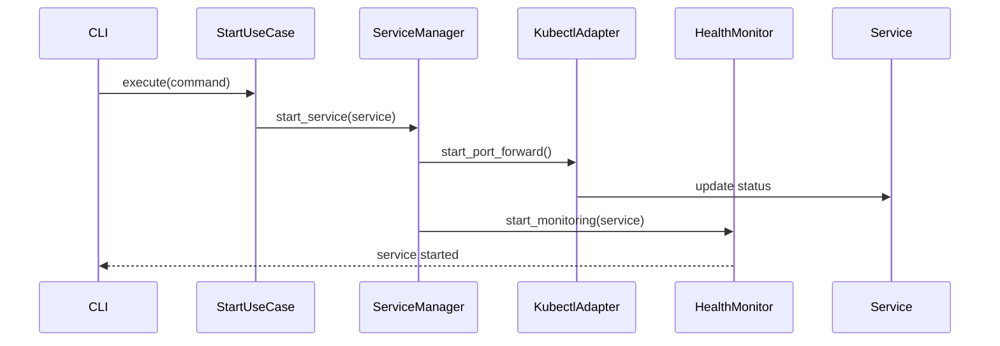

### Health Monitoring Flow

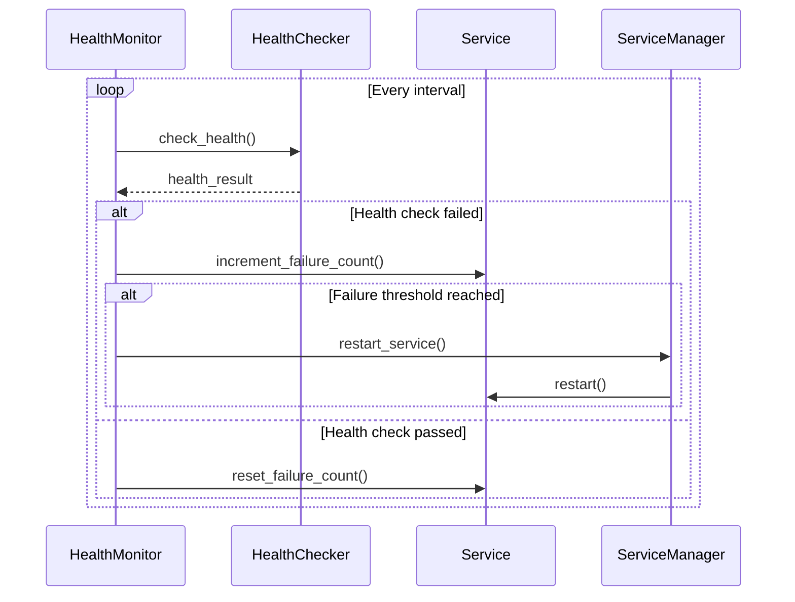

### Configuration Hot Reload Flow

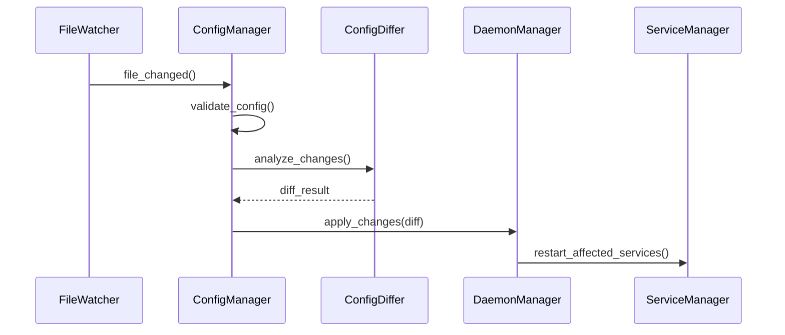

## Design Patterns

### 1. Repository Pattern
Abstracts data access and provides a uniform interface for data operations.

```python
class ServiceRepository(ABC):
    @abstractmethod
    async def save(self, service: Service) -> None: ...
    
    @abstractmethod
    async def find_by_id(self, service_id: UUID) -> Optional[Service]: ...
```

### 2. Factory Pattern
Creates objects without specifying their concrete classes.

```python
class AdapterFactory:
    def create_adapter(self, technology: ForwardingTechnology) -> BaseAdapter:
        return self._adapters[technology]()
```

### 3. Strategy Pattern
Defines a family of algorithms and makes them interchangeable.

```python
class HealthCheckFactory:
    def create_health_checker(self, check_type: str) -> HealthChecker:
        return self._health_checkers[check_type]()
```

### 4. Observer Pattern
Allows objects to notify other objects about changes in their state.

```python
class HealthMonitor:
    async def _notify_health_change(self, service: Service, status: HealthStatus):
        for observer in self._observers:
            await observer.on_health_change(service, status)
```

### 5. Command Pattern
Encapsulates requests as objects, allowing parameterization and queuing.

```python
@dataclass
class StartServicesCommand:
    service_names: Optional[List[str]] = None
    tags: Optional[List[str]] = None
    all_services: bool = False
```

## Technology Stack

### Core Dependencies
- **Python 3.13+**: Latest Python with modern features
- **Typer**: Modern CLI framework with Rich integration
- **Rich**: Beautiful terminal output and formatting
- **Pydantic**: Data validation and settings management
- **PyYAML**: YAML configuration parsing
- **asyncio**: Asynchronous programming support

### Optional Dependencies
- **kafka-python**: Kafka health check support
- **psycopg**: PostgreSQL health check support
- **aiohttp**: HTTP health check support
- **watchdog**: File system monitoring for hot reload

### Development Dependencies
- **pytest**: Testing framework with async support
- **black**: Code formatting
- **ruff**: Fast Python linter
- **mypy**: Static type checking
- **pre-commit**: Git hooks for code quality

## Extension Points

### 1. Adding New Adapters

To add support for a new port forwarding technology:

1. **Create Adapter Class**:
```python
class NewTechnologyAdapter(BaseAdapter):
    async def start_port_forward(self, local_port: int, remote_port: int, 
                                connection_info: Dict[str, Any]) -> int:
        # Implementation
        pass
```

2. **Register in Factory**:
```python
# In adapter_factory.py
self._adapters[ForwardingTechnology.NEW_TECH] = NewTechnologyAdapter
```

3. **Update Configuration Schema**:
```python
# In domain/entities/service.py
class ForwardingTechnology(Enum):
    NEW_TECH = "new_tech"
```

### 2. Adding New Health Checks

To add a new health check type:

1. **Create Health Checker**:
```python
class CustomHealthCheck:
    async def check(self, **kwargs) -> bool:
        # Implementation
        pass
```

2. **Register in Factory**:
```python
# In health_check_factory.py
self._health_checkers['custom'] = CustomHealthCheck
```

### 3. Adding New Output Formatters

To add a new output format:

1. **Create Formatter**:
```python
class XMLFormatter:
    def format_services(self, services: List[Service]) -> str:
        # Implementation
        pass
```

2. **Register in Router**:
```python
# In format_router.py
self._formatters[OutputFormat.XML] = XMLFormatter()
```

## Error Handling Strategy

### 1. Domain Layer
- Raises domain-specific exceptions
- Pure business rule violations
- No external system dependencies

### 2. Application Layer
- Catches and translates domain exceptions
- Handles use case orchestration errors
- Provides meaningful error context

### 3. Infrastructure Layer
- Handles external system failures
- Implements retry logic and circuit breakers
- Logs technical details for debugging

### 4. CLI Layer
- Presents user-friendly error messages
- Provides actionable guidance
- Maintains consistent error formatting

## Logging and Observability

### Structured Logging
LocalPort uses structured logging with consistent fields:

```python
logger.info("Service started", 
           service_name=service.name,
           local_port=service.local_port,
           technology=service.technology.value,
           process_id=process_id)
```

### Log Levels
- **DEBUG**: Detailed debugging information
- **INFO**: General operational information
- **WARN**: Warning conditions that should be noted
- **ERROR**: Error conditions that need attention

### Metrics and Monitoring
- Service health status tracking
- Restart count monitoring
- Performance metrics collection
- Configuration change auditing

## Security Considerations

### 1. Credential Management
- No credentials stored in plain text
- Environment variable substitution for secrets
- Secure key file handling for SSH

### 2. Process Isolation
- Port forwards run in separate processes
- Proper process cleanup on termination
- Resource limit enforcement

### 3. Input Validation
- All external inputs validated using Pydantic
- Configuration schema enforcement
- Port range and permission validation

### 4. Network Security
- Local-only port binding by default
- Configurable bind addresses
- Connection timeout enforcement

## Performance Considerations

### 1. Asynchronous Operations
- Non-blocking I/O for all network operations
- Concurrent health checking
- Parallel service startup/shutdown

### 2. Resource Management
- Efficient process management
- Memory-conscious data structures
- Configurable resource limits

### 3. Caching and Optimization
- Configuration caching
- Health check result caching
- Efficient file watching

## Testing Strategy

### 1. Unit Tests
- Domain logic testing with no external dependencies
- Mock external systems for isolation
- High coverage of business rules

### 2. Integration Tests
- Test adapter implementations with real systems
- End-to-end workflow testing
- Configuration validation testing

### 3. Contract Tests
- Repository interface compliance
- Adapter interface compliance
- Health checker interface compliance

## Shutdown Infrastructure Architecture (v0.3.7)

LocalPort v0.3.7 introduces enterprise-grade shutdown infrastructure that eliminates race conditions and provides graceful shutdown capabilities. This section details the shutdown architecture that resolves Mac service stability issues.

### Shutdown Infrastructure Overview

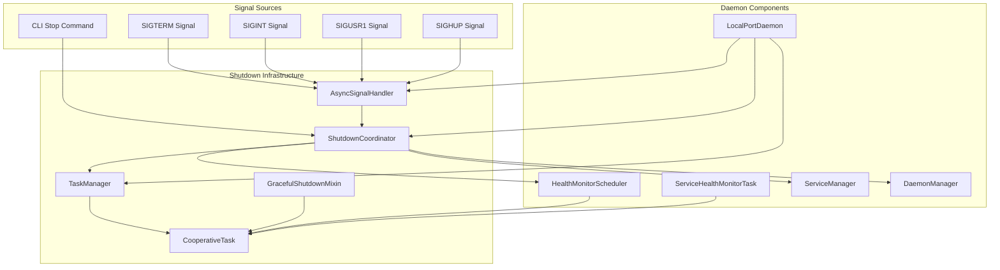

### Multi-Phase Shutdown Process

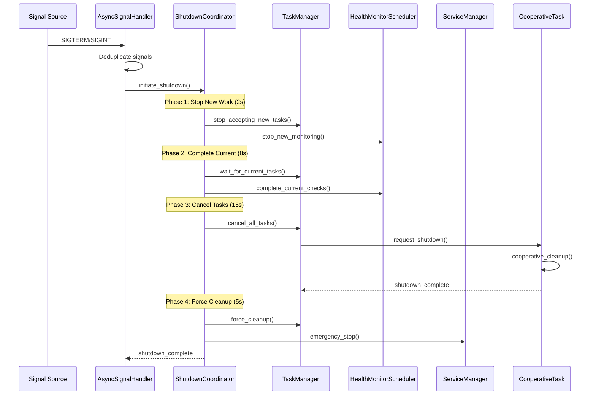

### Thread-Safe Signal Handling

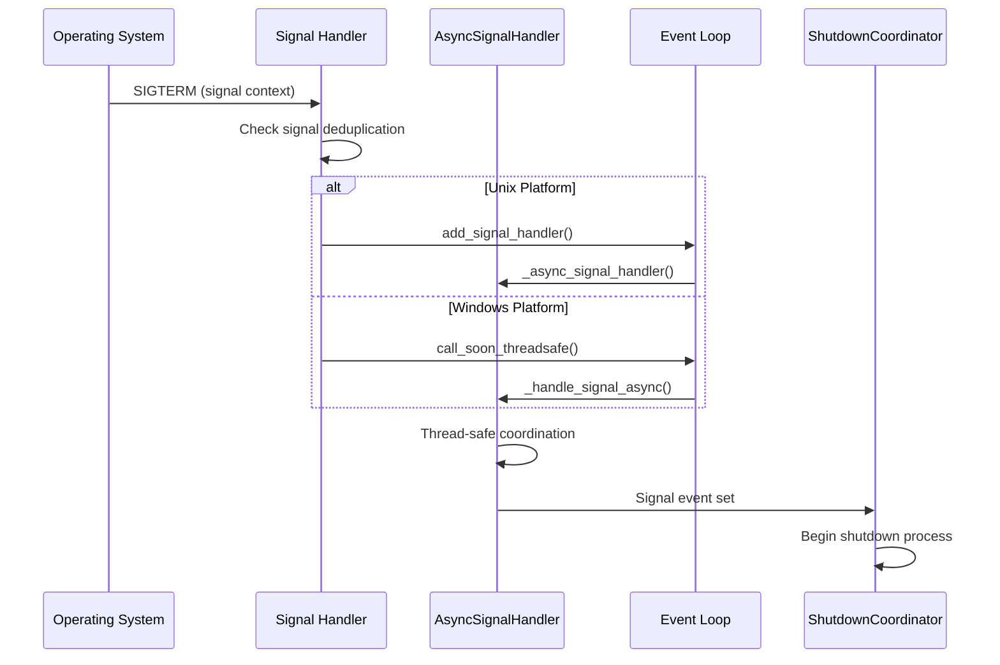

### Cooperative Task Architecture

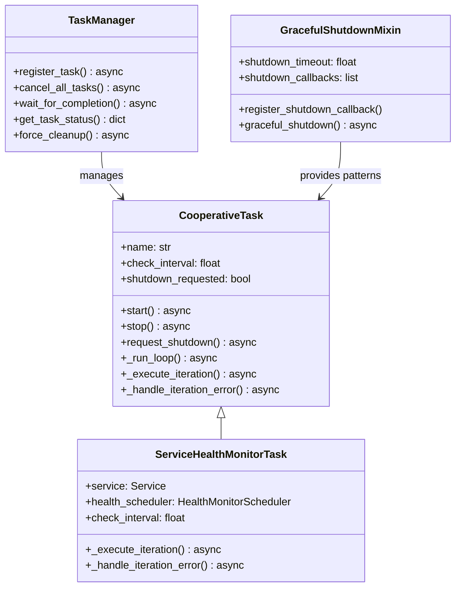

### Health Monitor Shutdown Integration

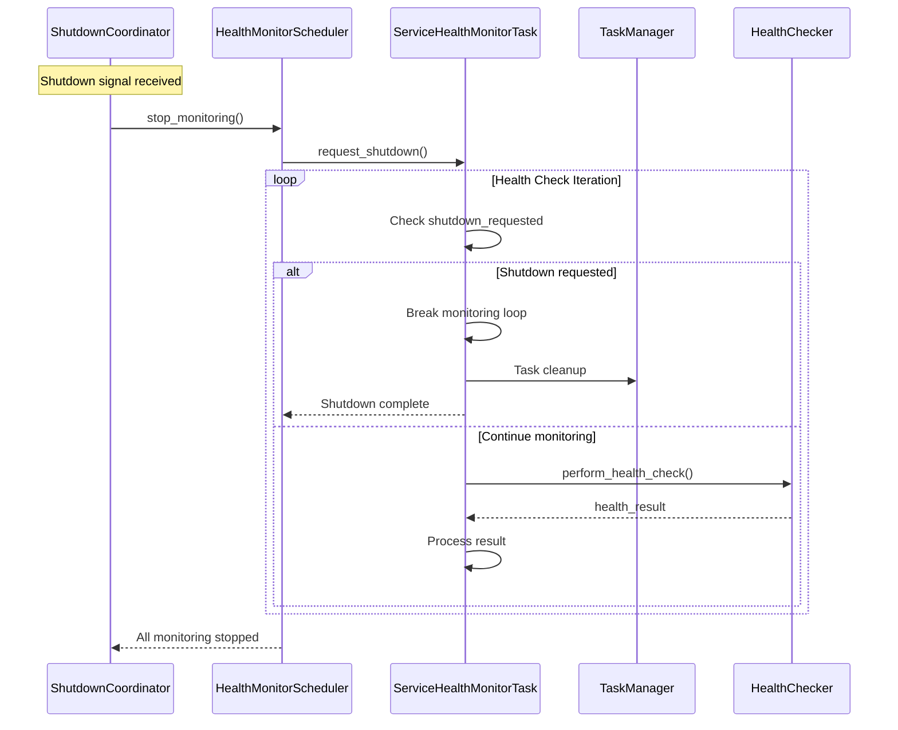

### Task Manager Lifecycle

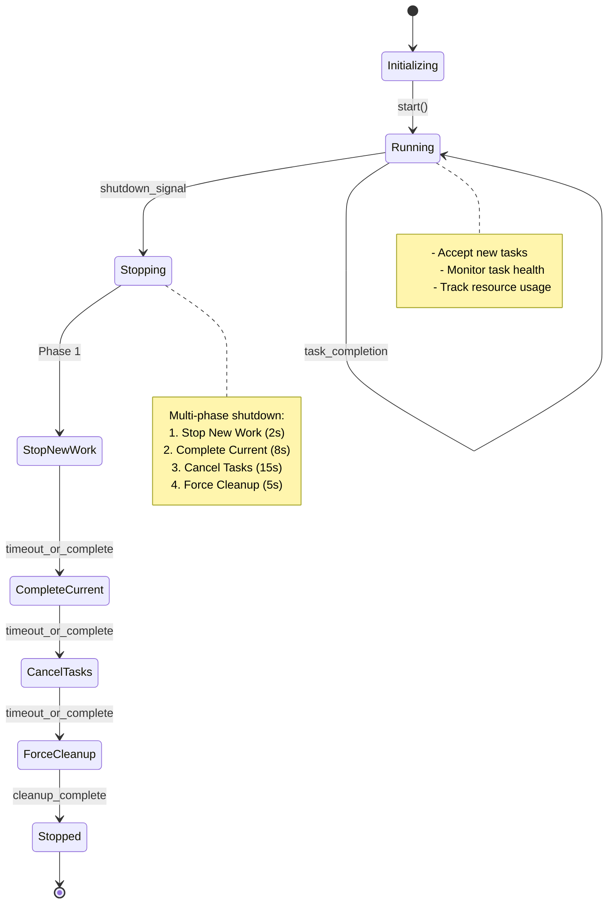

### Signal Handler State Machine

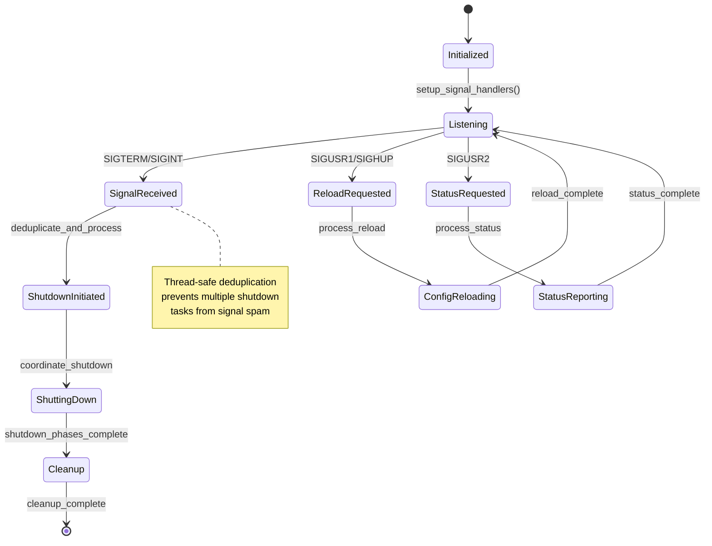

### Resource Cleanup Flow

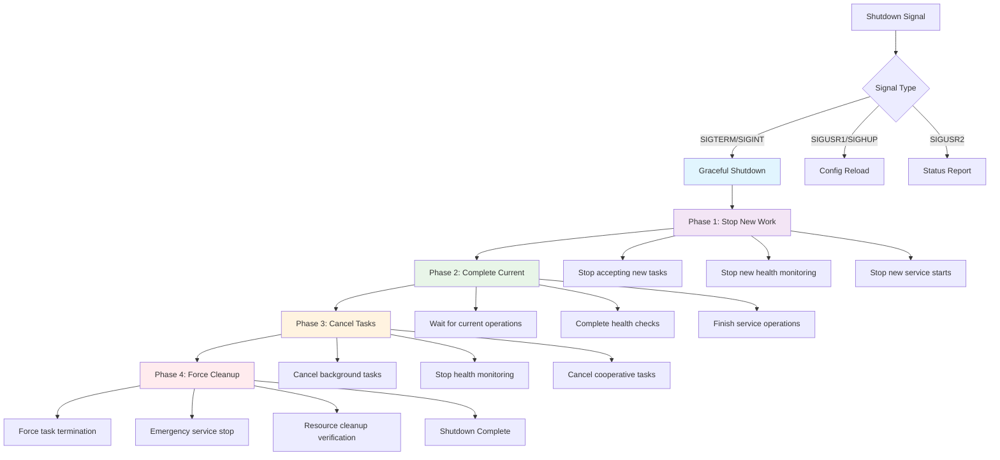

### Performance Characteristics

The shutdown infrastructure provides the following performance characteristics:

| Phase | Timeout | Purpose | Performance Target |
|-------|---------|---------|-------------------|
| **Stop New Work** | 2 seconds | Prevent new operations | <100ms typical |
| **Complete Current** | 8 seconds | Finish ongoing work | <2s typical |
| **Cancel Tasks** | 15 seconds | Cooperative cancellation | <1s typical |
| **Force Cleanup** | 5 seconds | Emergency cleanup | <500ms typical |
| **Total Shutdown** | <30 seconds | Complete process | **2.84s achieved** |

### Error Handling and Recovery

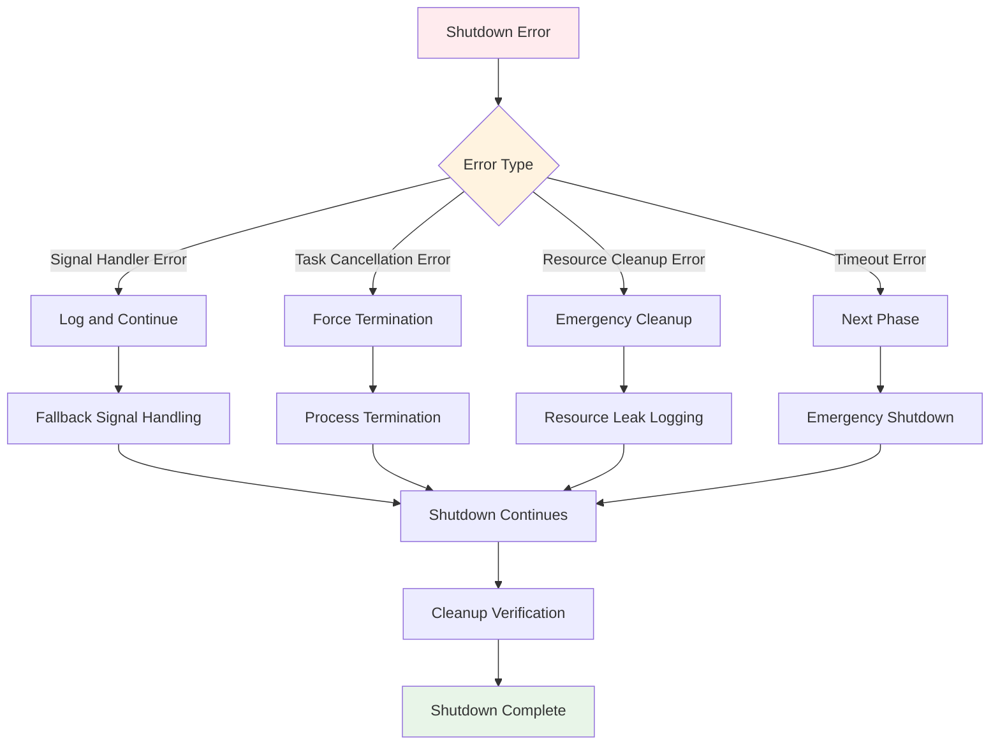

## Future Architecture Considerations

### 1. Plugin System
- Dynamic adapter loading
- Third-party health check plugins
- Custom output formatter plugins

### 2. Distributed Deployment
- Multi-node daemon coordination
- Shared configuration management
- Load balancing and failover

### 3. API Integration
- REST API for programmatic access
- WebSocket for real-time updates
- GraphQL for flexible querying

### 4. Enhanced Shutdown Features
- Custom shutdown phases
- Pluggable shutdown strategies
- Distributed shutdown coordination
- Shutdown metrics and monitoring

This architecture provides a solid foundation for LocalPort's current functionality while maintaining flexibility for future enhancements and community contributions. The v0.3.7 shutdown infrastructure specifically addresses Mac service stability issues through enterprise-grade lifecycle management.
