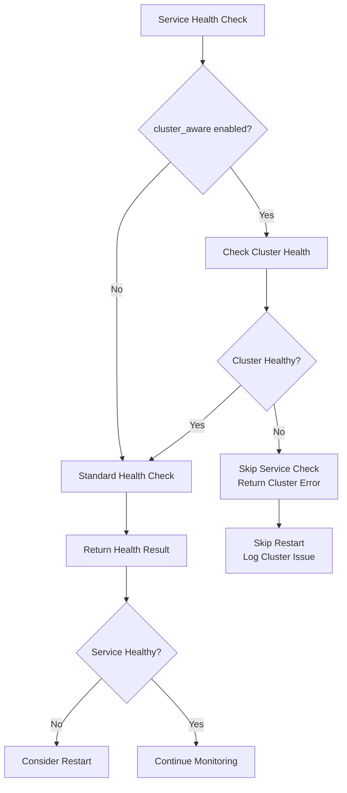

# Cluster Health Monitoring

LocalPort v0.3.6 introduces intelligent cluster health monitoring that prevents unnecessary service restarts when cluster connectivity issues are detected. This feature is particularly beneficial for Mac users experiencing idle-state connection drops.

## Overview

The cluster health monitoring system continuously monitors the health of your Kubernetes clusters and integrates this information into service health decisions. When a cluster becomes unreachable, LocalPort will avoid restarting services unnecessarily, reducing noise and preventing restart loops during temporary connectivity issues.

## Key Benefits

### 🍎 **Mac Idle-State Solution**
- **4-minute keepalive intervals** prevent connection drops during lunch breaks and overnight periods
- **Intelligent restart prevention** when cluster issues are detected
- **Reduced service churn** during temporary network connectivity issues

### 🔍 **Better Diagnostics**
- **Clear distinction** between service failures and cluster connectivity issues
- **Rich health information** in status reports and logs
- **Cluster-aware error messages** for better troubleshooting

### ⚡ **Performance & Reliability**
- **Scalable monitoring** - one monitor per cluster context, not per service
- **Intelligent caching** reduces kubectl command overhead
- **Graceful degradation** when cluster monitoring fails

## Configuration

### Basic Configuration

Add cluster health monitoring to your `localport.yaml`:

```yaml
version: '1.0'

defaults:
  # Enable cluster-aware health checking for services
  health_check:
    type: tcp
    interval: 30
    cluster_aware: true  # NEW: Consider cluster health in decisions
  
  # Configure cluster health monitoring
  cluster_health:
    enabled: true
    interval: 240        # 4 minutes - prevents Mac idle issues
    timeout: 30          # 30 seconds per kubectl command
    retry_attempts: 2    # Retry failed commands
    failure_threshold: 3 # Consecutive failures before marking unhealthy
    
    # Commands to execute for health checking
    commands:
      cluster_info: true           # kubectl cluster-info
      pod_status: true            # kubectl get pods
      node_status: true           # kubectl get nodes
      events_on_failure: true     # kubectl get events (only on failures)

services:
  - name: my-service
    technology: kubectl
    local_port: 8080
    remote_port: 80
    connection:
      resource_name: my-service
      namespace: default
      context: my-cluster  # This cluster will be monitored
```

### Advanced Configuration

#### Per-Cluster Context Overrides

You can customize monitoring settings for specific cluster contexts:

```yaml
defaults:
  cluster_health:
    enabled: true
    interval: 240
    timeout: 30

# Override settings for specific clusters
cluster_contexts:
  production-cluster:
    cluster_health:
      interval: 120      # More frequent monitoring for production
      timeout: 60        # Longer timeout for production
      failure_threshold: 5
  
  development-cluster:
    cluster_health:
      interval: 600      # Less frequent for development
      commands:
        events_on_failure: false  # Disable events for dev
```

#### Selective Command Configuration

Fine-tune which kubectl commands are executed:

```yaml
defaults:
  cluster_health:
    commands:
      cluster_info:
        enabled: true
      pod_status:
        enabled: true
      node_status:
        enabled: false     # Disable node checking
      events_on_failure:
        enabled: true
```

### Configuration Reference

| Setting | Default | Description |
|---------|---------|-------------|
| `enabled` | `true` | Enable/disable cluster health monitoring |
| `interval` | `240` | Monitoring interval in seconds (4 minutes) |
| `timeout` | `30` | Timeout for kubectl commands in seconds |
| `retry_attempts` | `2` | Number of retries for failed commands |
| `failure_threshold` | `3` | Consecutive failures before marking cluster unhealthy |
| `commands.cluster_info` | `true` | Execute `kubectl cluster-info` |
| `commands.pod_status` | `true` | Execute `kubectl get pods` |
| `commands.node_status` | `true` | Execute `kubectl get nodes` |
| `commands.events_on_failure` | `true` | Execute `kubectl get events` on failures |

## How It Works

### Cluster Health Monitoring

1. **Automatic Discovery**: LocalPort automatically discovers cluster contexts from your kubectl services
2. **Periodic Health Checks**: Each cluster is monitored every 4 minutes by default
3. **Multiple Health Indicators**: Combines cluster-info, pod status, and node status
4. **Intelligent Caching**: Results are cached to reduce kubectl command overhead

### Service Health Integration

When `cluster_aware: true` is enabled for a service:

1. **Cluster Check First**: Before checking service health, LocalPort verifies cluster health
2. **Skip on Cluster Issues**: If cluster is unhealthy, service health check is skipped
3. **Prevent Unnecessary Restarts**: Services won't restart when cluster connectivity is the issue
4. **Rich Error Context**: Health results include cluster health information

### Health Check Flow



## Monitoring and Observability

### Log Messages

Cluster health monitoring provides detailed logging:

```
INFO  Cluster health monitoring started contexts=['prod-cluster', 'dev-cluster'] context_count=2
DEBUG Cluster is healthy, proceeding with service health check service_name=my-service cluster_context=prod-cluster
WARN  Skipping service health check due to cluster issues service_name=my-service cluster_context=prod-cluster cluster_error="Cluster unhealthy: connection_failed"
INFO  Skipping service restart due to cluster health issues service_name=my-service cluster_context=prod-cluster reason="cluster_unhealthy"
```

### Health Check Results

Enhanced health check results include cluster information:

```json
{
  "service_id": "uuid",
  "service_name": "my-service",
  "is_healthy": false,
  "cluster_context": "prod-cluster",
  "cluster_healthy": false,
  "skip_restart_due_to_cluster": true,
  "error": "Cluster unhealthy: connection timeout"
}
```

## Troubleshooting

### Common Issues

#### Cluster Health Monitoring Not Starting

**Symptoms**: No cluster health logs, services restart unnecessarily

**Causes & Solutions**:
1. **No kubectl services configured**
   - Ensure you have services with `technology: kubectl`
   - Verify cluster contexts are specified in connection info

2. **Cluster health disabled**
   - Check `defaults.cluster_health.enabled: true` in configuration
   - Verify configuration validation passes

3. **kubectl not available**
   - Ensure `kubectl` is installed and in PATH
   - Test manually: `kubectl cluster-info`

#### Services Still Restarting During Cluster Issues

**Symptoms**: Services restart even when cluster is unreachable

**Causes & Solutions**:
1. **cluster_aware not enabled**
   - Add `cluster_aware: true` to service health_check configuration
   - Restart daemon to apply configuration changes

2. **Cluster health monitoring failed to start**
   - Check daemon logs for cluster health startup errors
   - Verify kubectl permissions and cluster access

#### High kubectl Command Frequency

**Symptoms**: Too many kubectl commands in logs/monitoring

**Causes & Solutions**:
1. **Monitoring interval too low**
   - Increase `interval` setting (default 240 seconds is recommended)
   - Consider per-cluster overrides for different environments

2. **Multiple cluster contexts**
   - Each context is monitored separately
   - Use selective monitoring for less critical clusters

### Debug Mode

Enable debug logging to troubleshoot cluster health issues:

```bash
# Set debug logging level
export LOCALPORT_LOG_LEVEL=DEBUG

# Start daemon with debug output
localport daemon start --log-level debug
```

### Manual Testing

Test cluster connectivity manually:

```bash
# Test cluster-info command
kubectl cluster-info --context=your-cluster

# Test pod listing
kubectl get pods --all-namespaces --context=your-cluster

# Test node status
kubectl get nodes --context=your-cluster
```

## Performance Considerations

### Resource Usage

- **Memory**: ~1-2MB per monitored cluster context
- **CPU**: Minimal - kubectl commands run every 4 minutes
- **Network**: Low - only kubectl API calls, no continuous connections

### Scaling Guidelines

| Cluster Count | Recommended Settings |
|---------------|---------------------|
| 1-3 clusters | Default settings (240s interval) |
| 4-10 clusters | Consider 300s interval |
| 10+ clusters | Use selective monitoring, 600s+ intervals |

### Optimization Tips

1. **Adjust intervals** based on cluster criticality
2. **Disable unnecessary commands** for development clusters
3. **Use cluster context overrides** for different environments
4. **Monitor kubectl command performance** in your environment

## Migration Guide

### From Previous Versions

Cluster health monitoring is **opt-in** and backward compatible:

1. **Existing configurations** continue to work unchanged
2. **Add cluster_aware: true** to enable cluster-aware health checking
3. **Configure cluster_health** section for monitoring settings

### Enabling for Existing Services

```yaml
# Before (v0.3.5 and earlier)
defaults:
  health_check:
    type: tcp
    interval: 30

# After (v0.3.6+)
defaults:
  health_check:
    type: tcp
    interval: 30
    cluster_aware: true  # Add this line

  cluster_health:        # Add this section
    enabled: true
    interval: 240
```

## Best Practices

### Configuration

1. **Start with defaults** - the 4-minute interval works well for most use cases
2. **Enable cluster_aware gradually** - test with a few services first
3. **Use per-cluster overrides** for different environments
4. **Monitor logs initially** to verify proper operation

### Monitoring

1. **Watch for cluster health logs** during daemon startup
2. **Monitor service restart patterns** - should see fewer unnecessary restarts
3. **Check kubectl command performance** in your environment
4. **Use debug logging** for troubleshooting

### Production Deployment

1. **Test in development first** with similar cluster configurations
2. **Monitor resource usage** with your cluster count and configuration
3. **Set up alerting** for cluster health monitoring failures
4. **Document cluster contexts** and their monitoring requirements

## API Reference

### Configuration Schema

```yaml
# Cluster health monitoring configuration
cluster_health:
  enabled: boolean              # Enable cluster health monitoring
  interval: integer            # Monitoring interval in seconds (60-3600)
  timeout: integer             # Command timeout in seconds (5-300)
  retry_attempts: integer      # Retry attempts (0-10)
  failure_threshold: integer   # Failure threshold (1-100)
  
  commands:
    cluster_info: boolean | object
    pod_status: boolean | object
    node_status: boolean | object
    events_on_failure: boolean | object

# Service health check configuration
health_check:
  type: string                 # Health check type
  interval: integer           # Check interval in seconds
  timeout: number             # Check timeout in seconds
  cluster_aware: boolean      # Enable cluster-aware health checking
```

### Health Check Result Schema

```typescript
interface HealthCheckResult {
  service_id: string
  service_name: string
  check_type: string
  is_healthy: boolean
  checked_at: string
  response_time: number
  error?: string
  cluster_context?: string
  cluster_healthy?: boolean
  skip_restart_due_to_cluster: boolean
}
```

## Examples

### Mac Development Setup

Perfect for Mac users experiencing idle-state connection drops:

```yaml
version: '1.0'

defaults:
  health_check:
    type: tcp
    interval: 30
    cluster_aware: true
    failure_threshold: 2  # Faster failure detection
  
  cluster_health:
    enabled: true
    interval: 240         # 4-minute keepalive
    timeout: 30
    failure_threshold: 3
    
    commands:
      cluster_info: true
      pod_status: true
      node_status: false  # Skip nodes for faster checks
      events_on_failure: true

services:
  - name: api-gateway
    technology: kubectl
    local_port: 8080
    remote_port: 80
    connection:
      resource_name: api-gateway
      namespace: default
      context: minikube
```

### Multi-Environment Setup

Different monitoring for different environments:

```yaml
version: '1.0'

defaults:
  health_check:
    cluster_aware: true
  
  cluster_health:
    enabled: true
    interval: 240

cluster_contexts:
  production:
    cluster_health:
      interval: 120       # More frequent for production
      timeout: 60
      failure_threshold: 5
  
  staging:
    cluster_health:
      interval: 300       # Less frequent for staging
  
  development:
    cluster_health:
      interval: 600       # Least frequent for development
      commands:
        node_status: false
        events_on_failure: false

services:
  - name: prod-api
    technology: kubectl
    local_port: 8080
    remote_port: 80
    connection:
      context: production
      # ... other settings
  
  - name: staging-api
    technology: kubectl
    local_port: 8081
    remote_port: 80
    connection:
      context: staging
      # ... other settings
```

This comprehensive cluster health monitoring system ensures your LocalPort services remain stable and responsive, especially on Mac systems prone to idle-state connection issues.
