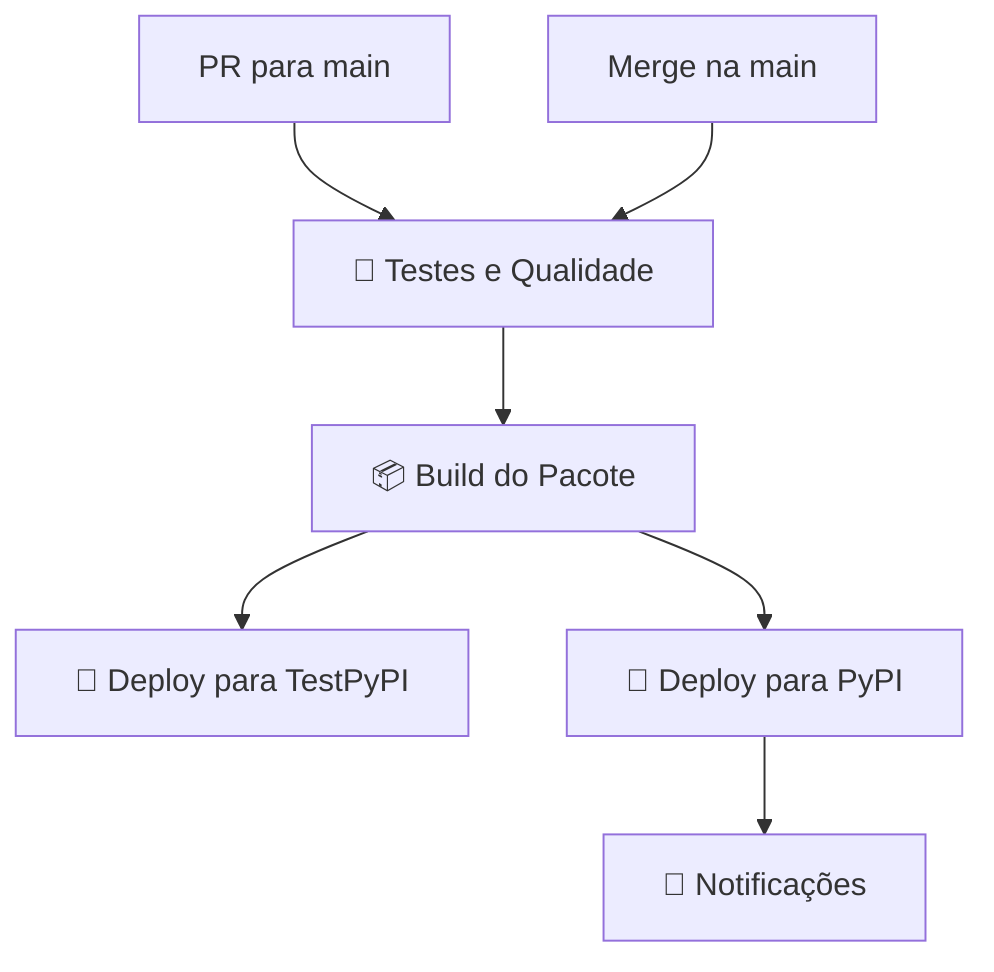

# 🔐 Configuração de Secrets

## Secrets Necessários no GitHub

Para o funcionamento completo da pipeline de CI/CD, configure os seguintes secrets no repositório:

⚠️ **IMPORTANTE**: Ao usar tokens API, o username é sempre `__token__` (já configurado na pipeline). Você só precisa configurar os tokens abaixo:

### 🚀 **Deploy para PyPI (Produção)**
- **Nome:** `PYPI_TOKEN`
- **Valor:** Token API do PyPI (formato: `pypi-AgE...`)
- **Como obter:**
  1. Acesse: https://pypi.org/manage/account/token/
  2. Crie um token com escopo "Entire account" ou específico para o projeto
  3. Copie o token (começa com `pypi-`)

### 🧪 **Deploy para TestPyPI (Testes)**
- **Nome:** `PYPI_TEST_TOKEN`
- **Valor:** Token API do TestPyPI (formato: `pypi-AgE...`)
- **Como obter:**
  1. Acesse: https://test.pypi.org/manage/account/token/
  2. Crie um token com escopo "Entire account"
  3. Copie o token (começa com `pypi-`)

## 🛠️ Como Configurar no GitHub

1. Vá para **Settings** > **Secrets and variables** > **Actions**
2. Clique em **New repository secret**
3. Adicione cada secret:
   - Nome: `PYPI_TOKEN`
   - Valor: seu token do PyPI
   - Clique em **Add secret**
4. Repita para `PYPI_TEST_TOKEN`

ℹ️ **NÃO configure** `PYPI_USERNAME` - não é necessário com tokens API!

## 🔒 Ambientes de Deploy

A pipeline usa **environments** para maior segurança:

### **Environment: production**
- Usado para deploy no PyPI oficial
- Requer aprovação manual (configurável)
- Triggers:
  - Push direto na branch `main`
  - PR fechado e merged na `main`

### **Environment: test**
- Usado para deploy no TestPyPI
- Deploy automático
- Triggers:
  - PR aberto para a branch `main`
  - Push em PR para `main`

## 🚦 Fluxo da Pipeline

## ✅ Verificação

Para verificar se os secrets estão configurados corretamente:

1. Faça um PR de teste para a branch `main`
2. Verifique se a pipeline executa sem erros
3. Confirme se o deploy para TestPyPI funcionou
4. Após merge, confirme se o deploy para PyPI funcionou

## 🆘 Resolução de Problemas

### ❌ "Invalid or non-existent authentication information"
- Verifique se o token está correto
- Confirme se o secret tem o nome exato: `PYPI_TOKEN` ou `PYPI_TEST_TOKEN`
- Verifique se o token não expirou

### ❌ "Package already exists"
- Incremente a versão em `mentorstec/__init__.py`
- O PyPI não permite sobrescrever versões existentes

### ❌ "Environment protection rules"
- Configure as regras de proteção do environment se necessário
- Ou remova a seção `environment:` do job se não precisar de proteção