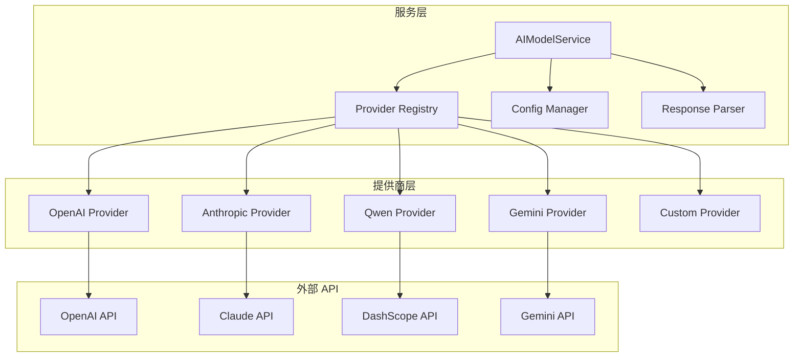

# AI模型服务抽象层

AI模型服务抽象层是 Midscene Python 的统一 AI 接口，支持多种 AI 提供商，让开发者可以轻松切换和配置不同的 AI 模型。

## 🎯 设计理念

### 统一抽象接口
不同的 AI 提供商有着不同的 API 接口和调用方式，AIModelService 提供统一的抽象层：

```python
# 无论使用哪个提供商，调用方式都相同
result = await ai_service.call_ai(
    messages=messages,
    response_schema=schema,
    model_config=config
)
```

### 可插拔的提供商架构
新的 AI 提供商可以通过实现 AIProvider 接口轻松集成：

```python
class CustomAIProvider(AIProvider):
    async def call(self, messages, config, **kwargs):
        # 实现自定义提供商逻辑
        pass

# 注册自定义提供商
ai_service.register_provider("custom", CustomAIProvider())
```

## 🏗️ 架构设计

### 核心组件



### 类结构设计

```python
class AIModelService:
    """Unified AI model service interface"""
    
    def __init__(self):
        self.providers: Dict[str, AIProvider] = {}
        self._register_providers()
    
    async def call_ai(
        self,
        messages: List[Dict[str, Any]], 
        response_schema: Optional[Type[BaseModel]] = None,
        model_config: Optional[AIModelConfig] = None,
        **kwargs
    ) -> Dict[str, Any]:
        """统一的 AI 调用接口"""
```

## ⚙️ 配置管理

### AIModelConfig 配置类

```python
class AIModelConfig(BaseModel):
    """AI model configuration"""
    provider: str                    # 提供商名称
    model: str                      # 模型名称
    api_key: str                    # API 密钥
    base_url: Optional[str] = None  # 自定义 API 地址
    max_tokens: int = 4000          # 最大 token 数
    temperature: float = 0.1        # 随机性控制
    timeout: int = 60               # 请求超时
```

### 配置方式

#### 1. 环境变量配置
```bash
# .env 文件
MIDSCENE_AI_PROVIDER=openai
MIDSCENE_AI_MODEL=gpt-4-vision-preview
MIDSCENE_AI_API_KEY=your_api_key_here
MIDSCENE_AI_BASE_URL=https://api.openai.com/v1
```

#### 2. 代码配置
```python
from midscene.core.ai_model import AIModelConfig, AIModelService

# 创建配置
config = AIModelConfig(
    provider="openai",
    model="gpt-4-vision-preview", 
    api_key="your_api_key",
    temperature=0.1,
    max_tokens=2000
)

# 创建服务实例
ai_service = AIModelService()

# 使用配置调用
result = await ai_service.call_ai(
    messages=messages,
    model_config=config
)
```

#### 3. 多配置管理
```python
# 为不同任务配置不同的模型
configs = {
    "locate": AIModelConfig(
        provider="openai",
        model="gpt-4-vision-preview",
        temperature=0.0,  # 定位需要确定性
        max_tokens=500
    ),
    "extract": AIModelConfig(
        provider="claude", 
        model="claude-3-sonnet-20240229",
        temperature=0.2,  # 提取允许创造性
        max_tokens=2000
    ),
    "assert": AIModelConfig(
        provider="qwen",
        model="qwen-vl-max",
        temperature=0.1,
        max_tokens=1000
    )
}

# 根据任务选择配置
result = await ai_service.call_ai(
    messages=messages,
    model_config=configs["locate"]
)
```

## 🤖 支持的AI提供商

### 1. OpenAI
```python
# GPT-4V 配置
openai_config = AIModelConfig(
    provider="openai",
    model="gpt-4-vision-preview",  # 或 "gpt-4o"
    api_key="sk-...",
    base_url="https://api.openai.com/v1",  # 可选
    temperature=0.1
)
```

**支持的模型**:
- `gpt-4-vision-preview`: GPT-4 视觉模型
- `gpt-4o`: 最新的 GPT-4 优化模型
- `gpt-4-turbo`: GPT-4 Turbo 模型

### 2. Anthropic (Claude)
```python
# Claude 配置
claude_config = AIModelConfig(
    provider="anthropic",
    model="claude-3-sonnet-20240229",
    api_key="sk-ant-...",
    max_tokens=4000
)
```

**支持的模型**:
- `claude-3-opus-20240229`: 最强能力模型
- `claude-3-sonnet-20240229`: 平衡性能模型
- `claude-3-haiku-20240307`: 快速响应模型

### 3. 通义千问 (Qwen)
```python
# Qwen 配置
qwen_config = AIModelConfig(
    provider="qwen",
    model="qwen-vl-max",
    api_key="sk-...",  # DashScope API Key
    temperature=0.1
)
```

**支持的模型**:
- `qwen-vl-max`: 通义千问视觉理解模型
- `qwen-vl-plus`: 增强版视觉模型
- `qwen2.5-vl`: 最新版本模型

### 4. Google Gemini
```python
# Gemini 配置
gemini_config = AIModelConfig(
    provider="gemini",
    model="gemini-1.5-pro-vision",
    api_key="AIza...",
    temperature=0.2
)
```

**支持的模型**:
- `gemini-1.5-pro-vision`: Gemini 1.5 Pro 视觉模型
- `gemini-pro-vision`: Gemini Pro 视觉模型

## 🔌 提供商接口

### AIProvider 抽象基类

```python
class AIProvider(ABC):
    """Abstract base class for AI service providers"""
    
    @abstractmethod
    async def call(
        self,
        messages: List[Dict[str, Any]],
        config: AIModelConfig,
        response_schema: Optional[Type[BaseModel]] = None,
        **kwargs
    ) -> Dict[str, Any]:
        """Call AI service"""
        pass
```

### 自定义提供商实现

```python
class CustomAIProvider(AIProvider):
    """自定义 AI 提供商示例"""
    
    async def call(
        self,
        messages: List[Dict[str, Any]],
        config: AIModelConfig,
        response_schema: Optional[Type[BaseModel]] = None,
        **kwargs
    ) -> Dict[str, Any]:
        
        # 1. 构建请求
        request_data = self._build_request(messages, config)
        
        # 2. 调用 API
        async with httpx.AsyncClient() as client:
            response = await client.post(
                config.base_url,
                headers={"Authorization": f"Bearer {config.api_key}"},
                json=request_data,
                timeout=config.timeout
            )
            response.raise_for_status()
        
        # 3. 解析响应
        result = response.json()
        content = self._extract_content(result)
        
        # 4. 处理结构化响应
        if response_schema:
            parsed_content = parse_json_response(content)
            validated_content = response_schema(**parsed_content)
            content = validated_content.dict()
        
        # 5. 返回统一格式
        return {
            "content": content,
            "usage": self._extract_usage(result)
        }
    
    def _build_request(self, messages, config):
        """构建 API 请求"""
        return {
            "model": config.model,
            "messages": messages,
            "max_tokens": config.max_tokens,
            "temperature": config.temperature
        }
    
    def _extract_content(self, response):
        """提取响应内容"""
        return response["choices"][0]["message"]["content"]
    
    def _extract_usage(self, response):
        """提取使用统计"""
        usage = response.get("usage", {})
        return {
            "prompt_tokens": usage.get("prompt_tokens", 0),
            "completion_tokens": usage.get("completion_tokens", 0),
            "total_tokens": usage.get("total_tokens", 0)
        }

# 注册自定义提供商
ai_service = AIModelService()
ai_service.register_provider("custom", CustomAIProvider())
```

## 📝 消息格式

### 统一消息格式
```python
messages = [
    {
        "role": "system",
        "content": "你是一个UI自动化助手..."
    },
    {
        "role": "user",
        "content": [
            {
                "type": "text", 
                "text": "请在页面中找到登录按钮"
            },
            {
                "type": "image_url",
                "image_url": {
                    "url": "data:image/png;base64,iVBORw0KGgoAAAANSUhEUgAA..."
                }
            }
        ]
    }
]
```

### 多模态消息支持
```python
# 文本 + 图像
multimodal_message = {
    "role": "user",
    "content": [
        {"type": "text", "text": "分析这个页面的布局"},
        {"type": "image_url", "image_url": {"url": f"data:image/png;base64,{image_b64}"}}
    ]
}

# 纯文本
text_message = {
    "role": "user", 
    "content": "解释自动化测试的概念"
}

# 系统提示
system_message = {
    "role": "system",
    "content": "你是一个专业的UI自动化专家"
}
```

## 🔄 响应处理

### 结构化响应
```python
from pydantic import BaseModel

class LocateResponse(BaseModel):
    elements: List[Dict[str, Any]]
    reasoning: str
    confidence: float

# 请求结构化响应
result = await ai_service.call_ai(
    messages=messages,
    response_schema=LocateResponse,
    model_config=config
)

# 自动验证和解析
locate_data = result["content"]  # 已经是 LocateResponse 字典格式
```

### 错误处理
```python
try:
    result = await ai_service.call_ai(messages, config)
except ValueError as e:
    # 配置错误
    logger.error(f"Configuration error: {e}")
except httpx.TimeoutException as e:
    # 请求超时
    logger.error(f"Request timeout: {e}")
except httpx.HTTPStatusError as e:
    # HTTP 错误
    logger.error(f"HTTP error: {e.response.status_code}")
except Exception as e:
    # 其他错误
    logger.error(f"Unexpected error: {e}")
```

## 📊 使用统计

### AIUsageInfo 类
```python
class AIUsageInfo(BaseModel):
    """AI 使用统计信息"""
    prompt_tokens: int       # 输入 token 数
    completion_tokens: int   # 输出 token 数  
    total_tokens: int        # 总 token 数
    cost: Optional[float]    # 费用（如果可计算）
```

### 使用统计收集
```python
# 调用后获取使用统计
result = await ai_service.call_ai(messages, config)
usage = result.get("usage", {})

print(f"输入 tokens: {usage['prompt_tokens']}")
print(f"输出 tokens: {usage['completion_tokens']}")
print(f"总计 tokens: {usage['total_tokens']}")

# 累积统计
class UsageTracker:
    def __init__(self):
        self.total_tokens = 0
        self.total_calls = 0
        self.total_cost = 0.0
    
    def record_usage(self, usage: Dict[str, Any]):
        self.total_tokens += usage.get("total_tokens", 0)
        self.total_calls += 1
        self.total_cost += usage.get("cost", 0.0)

tracker = UsageTracker()
```

## 🚀 性能优化

### 连接池配置
```python
class OptimizedAIProvider(AIProvider):
    def __init__(self):
        # 配置连接池
        self.client = httpx.AsyncClient(
            limits=httpx.Limits(
                max_keepalive_connections=10,
                max_connections=20
            ),
            timeout=httpx.Timeout(60.0)
        )
    
    async def call(self, messages, config, **kwargs):
        # 复用连接
        response = await self.client.post(...)
        return response.json()
```

### 请求重试
```python
import asyncio
from tenacity import retry, stop_after_attempt, wait_exponential

class ReliableAIProvider(AIProvider):
    @retry(
        stop=stop_after_attempt(3),
        wait=wait_exponential(multiplier=1, min=4, max=10)
    )
    async def call(self, messages, config, **kwargs):
        # 带重试的 API 调用
        return await self._make_request(messages, config)
```

### 批量请求
```python
async def batch_call_ai(
    ai_service: AIModelService,
    requests: List[Dict[str, Any]],
    config: AIModelConfig,
    concurrency: int = 3
) -> List[Dict[str, Any]]:
    """批量调用 AI 服务"""
    
    semaphore = asyncio.Semaphore(concurrency)
    
    async def single_call(request):
        async with semaphore:
            return await ai_service.call_ai(
                messages=request["messages"],
                response_schema=request.get("schema"),
                model_config=config
            )
    
    tasks = [single_call(req) for req in requests]
    results = await asyncio.gather(*tasks, return_exceptions=True)
    
    return results
```

## 🔧 调试和监控

### 请求日志
```python
import logging

# 启用详细日志
logging.getLogger("httpx").setLevel(logging.DEBUG)

# 自定义日志中间件
class LoggingAIProvider(AIProvider):
    async def call(self, messages, config, **kwargs):
        logger.info(f"Calling {config.provider} with model {config.model}")
        logger.debug(f"Messages: {messages}")
        
        start_time = time.time()
        try:
            result = await self._make_request(messages, config)
            duration = time.time() - start_time
            logger.info(f"Request completed in {duration:.2f}s")
            return result
        except Exception as e:
            duration = time.time() - start_time
            logger.error(f"Request failed after {duration:.2f}s: {e}")
            raise
```

### 性能监控
```python
class PerformanceMonitor:
    def __init__(self):
        self.metrics = {}
    
    def record_call(self, provider: str, duration: float, tokens: int, success: bool):
        if provider not in self.metrics:
            self.metrics[provider] = {
                "total_calls": 0,
                "total_duration": 0,
                "total_tokens": 0,
                "success_count": 0
            }
        
        metrics = self.metrics[provider]
        metrics["total_calls"] += 1
        metrics["total_duration"] += duration
        metrics["total_tokens"] += tokens
        if success:
            metrics["success_count"] += 1
    
    def get_stats(self, provider: str) -> Dict[str, float]:
        metrics = self.metrics.get(provider, {})
        total_calls = metrics.get("total_calls", 0)
        
        if total_calls == 0:
            return {}
        
        return {
            "avg_duration": metrics["total_duration"] / total_calls,
            "avg_tokens": metrics["total_tokens"] / total_calls,
            "success_rate": metrics["success_count"] / total_calls,
            "total_calls": total_calls
        }

# 使用监控
monitor = PerformanceMonitor()
ai_service.set_monitor(monitor)
```

## 🎯 最佳实践

### 1. 模型选择策略
```python
def choose_model(task_type: str, complexity: str) -> AIModelConfig:
    """根据任务类型和复杂度选择合适的模型"""
    
    if task_type == "locate":
        # 定位任务需要高精度
        return AIModelConfig(
            provider="openai",
            model="gpt-4-vision-preview",
            temperature=0.0
        )
    elif task_type == "extract" and complexity == "high":
        # 复杂提取使用最强模型
        return AIModelConfig(
            provider="anthropic", 
            model="claude-3-opus-20240229",
            temperature=0.1
        )
    else:
        # 一般任务使用平衡模型
        return AIModelConfig(
            provider="qwen",
            model="qwen-vl-max",
            temperature=0.1
        )
```

### 2. 错误重试策略
```python
async def robust_ai_call(
    ai_service: AIModelService,
    messages: List[Dict],
    config: AIModelConfig,
    max_retries: int = 3
) -> Dict[str, Any]:
    """带重试的 AI 调用"""
    
    for attempt in range(max_retries):
        try:
            return await ai_service.call_ai(messages, config)
        except httpx.TimeoutException:
            if attempt < max_retries - 1:
                await asyncio.sleep(2 ** attempt)  # 指数退避
                continue
            raise
        except httpx.HTTPStatusError as e:
            if e.response.status_code >= 500 and attempt < max_retries - 1:
                await asyncio.sleep(2 ** attempt)
                continue
            raise
```

### 3. 成本控制
```python
class CostController:
    def __init__(self, daily_limit: float = 10.0):
        self.daily_limit = daily_limit
        self.daily_usage = 0.0
        self.last_reset = datetime.now().date()
    
    def check_limit(self, estimated_cost: float) -> bool:
        """检查是否超出每日限额"""
        today = datetime.now().date()
        if today != self.last_reset:
            self.daily_usage = 0.0
            self.last_reset = today
        
        return (self.daily_usage + estimated_cost) <= self.daily_limit
    
    def record_usage(self, cost: float):
        """记录使用费用"""
        self.daily_usage += cost

# 在调用前检查
cost_controller = CostController(daily_limit=20.0)
if cost_controller.check_limit(estimated_cost):
    result = await ai_service.call_ai(messages, config)
    cost_controller.record_usage(actual_cost)
```

## 🔗 相关文档

- **配置指南**: [AI模型配置](../AI模型配置/配置方法.md)
- **提供商配置**: [支持的AI提供商](../AI模型配置/支持的AI提供商/README.md)
- **集成使用**: [Agent 核心控制器](Agent核心控制器.md)
- **高级特性**: [缓存策略](../AI模型配置/高级选项/缓存策略.md)

---

AI模型服务抽象层为 Midscene Python 提供了强大而灵活的 AI 集成能力。通过统一的接口，你可以轻松切换不同的 AI 提供商，并根据具体需求优化模型配置！