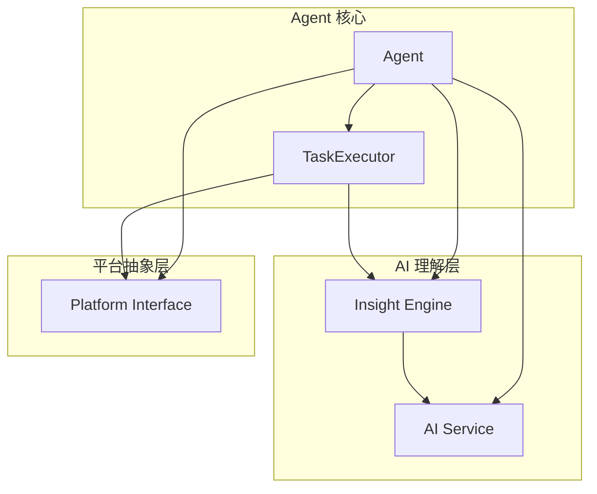

# Agent 核心控制器

Agent 是 Midscene Python 的核心控制器，为用户提供统一的自动化操作接口。它充当用户代码与底层平台之间的桥梁，通过 AI 理解用户意图并执行相应的操作。

## 🎯 设计理念

### 统一接口设计
Agent 为不同平台（Web、Android）提供完全一致的编程接口，用户无需学习不同平台的特定 API：

```python
# Web 和 Android 使用相同的接口
web_agent = Agent(selenium_page)
android_agent = Agent(android_device)

# 相同的操作方法
await web_agent.ai_action("点击登录按钮")
await android_agent.ai_action("点击登录按钮")
```

### AI 驱动的智能操作
Agent 将自然语言指令转换为具体的操作步骤，让自动化变得更加直观：

```python
# 传统方式需要精确的选择器
element = driver.find_element(By.CSS_SELECTOR, "#login-form button[type='submit']")
element.click()

# Agent 方式使用自然语言
await agent.ai_action("点击登录表单的提交按钮")
```

## 🏗️ 架构设计

### 核心组件



### Agent 类结构

```python
class Agent:
    """Core Agent class that orchestrates AI model and device interactions"""
    
    def __init__(
        self,
        interface: AbstractInterface,
        options: Optional[AgentOptions] = None
    ):
        self.interface = interface              # 平台接口
        self.options = options or AgentOptions() # 配置选项
        self.ai_service = AIModelService()      # AI 服务
        self.insight = Insight(...)             # UI 理解引擎
        self.task_executor = TaskExecutor(...)  # 任务执行器
```

## 🎮 主要功能

### 1. AI 驱动的操作 (ai_action)

`ai_action` 是 Agent 最核心的方法，支持各种自然语言驱动的操作：

```python
# 基础交互
await agent.ai_action("点击登录按钮")
await agent.ai_action("在用户名框输入 'admin'")
await agent.ai_action("选择下拉菜单中的第二个选项")

# 复杂操作
await agent.ai_action("滚动到页面底部并点击加载更多按钮")
await agent.ai_action("在搜索框输入'Python'并按回车搜索")

# 条件操作
await agent.ai_action("如果页面显示错误信息，点击确定按钮")
```

#### 工作流程

1. **指令解析**: 将自然语言转换为操作意图
2. **页面分析**: 获取当前页面的截图和上下文信息
3. **计划生成**: AI 生成详细的执行计划
4. **步骤执行**: 逐步执行计划中的每个操作
5. **结果验证**: 验证操作是否成功完成

```python
async def ai_action(self, prompt: TUserPrompt, **kwargs) -> None:
    """Execute AI-driven action"""
    self._ensure_not_destroyed()
    
    # 委托给任务执行器
    result = await self.task_executor.execute_ai_action(prompt, **kwargs)
    
    if not result.success:
        raise Exception(f"Action failed: {result.error}")
```

### 2. 智能元素定位 (ai_locate)

精确定位页面元素，支持各种描述方式：

```python
# 基础定位
login_btn = await agent.ai_locate("登录按钮")
search_box = await agent.ai_locate("搜索输入框")

# 描述性定位
submit_btn = await agent.ai_locate("蓝色的提交按钮")
user_avatar = await agent.ai_locate("页面右上角的用户头像")

# 相对定位
next_btn = await agent.ai_locate("位于分页控件中的下一页按钮")
```

#### 定位策略

Agent 使用多种策略进行元素定位：

1. **视觉识别**: 基于截图进行 AI 视觉识别
2. **语义理解**: 理解元素的功能和上下文
3. **多重验证**: 结合多种信息确保定位准确性
4. **容错机制**: 支持页面变化和布局调整

### 3. 数据提取 (ai_extract)

从页面提取结构化数据：

```python
# 提取单个对象
user_info = await agent.ai_extract({
    "name": "用户姓名",
    "email": "邮箱地址",
    "role": "用户角色"
})

# 提取列表数据
products = await agent.ai_extract({
    "products": [
        {
            "name": "商品名称",
            "price": "价格",
            "rating": "评分",
            "in_stock": "是否有货"
        }
    ]
})

# 复杂嵌套结构
order_data = await agent.ai_extract({
    "order_id": "订单号",
    "customer": {
        "name": "客户姓名",
        "address": "送货地址"
    },
    "items": [
        {
            "product": "商品名称",
            "quantity": "数量",
            "price": "单价"
        }
    ],
    "total": "总金额"
})
```

### 4. 智能断言 (ai_assert)

验证页面状态和内容：

```python
# 状态验证
await agent.ai_assert("用户已成功登录")
await agent.ai_assert("页面显示错误信息")
await agent.ai_assert("表单验证通过")

# 内容验证
await agent.ai_assert("搜索结果包含'Python 教程'")
await agent.ai_assert("购物车中有 3 件商品")
await agent.ai_assert("订单状态为已发货")

# 条件验证
await agent.ai_assert("如果是新用户，显示欢迎向导")
```

## ⚙️ 配置选项

### AgentOptions 配置

```python
from midscene.core import AgentOptions

options = AgentOptions(
    # 超时设置
    timeout=30,                    # 操作超时时间（秒）
    
    # 重试机制
    retry_count=3,                 # 失败重试次数
    retry_delay=1.0,               # 重试间隔（秒）
    
    # 调试选项
    screenshot_on_error=True,      # 错误时自动截图
    save_execution_logs=True,      # 保存执行日志
    
    # 性能优化
    cache_enabled=True,            # 启用智能缓存
    parallel_execution=False,      # 并行执行（实验性）
    
    # AI 模型设置
    model_temperature=0.1,         # AI 响应随机性
    max_tokens=1000,              # 最大 token 数
)

agent = Agent(page, options=options)
```

### 运行时配置

```python
# 临时修改超时时间
await agent.ai_action("点击按钮", timeout=60)

# 禁用缓存的单次操作
await agent.ai_extract(schema, use_cache=False)

# 自定义重试策略
await agent.ai_action("提交表单", retry_count=5, retry_delay=2.0)
```

## 🔄 生命周期管理

### 初始化和销毁

```python
# 方式1: 手动管理
agent = Agent(page)
try:
    await agent.ai_action("执行操作")
finally:
    await agent.destroy()

# 方式2: 上下文管理器（推荐）
async with Agent(page) as agent:
    await agent.ai_action("执行操作")
    # 自动调用 destroy()
```

### 状态冻结

```python
# 冻结当前页面状态（用于调试）
await agent.freeze()

# 在冻结状态下进行多次操作
await agent.ai_extract(schema1)
await agent.ai_extract(schema2)

# 解除冻结
await agent.unfreeze()
```

## 🔧 高级特性

### 1. 自定义 AI 模型

```python
from midscene.core.ai_model import AIModelConfig

# 自定义模型配置
ai_config = AIModelConfig(
    provider="openai",
    model="gpt-4-vision-preview",
    temperature=0.0,
    max_tokens=2000,
    api_key="your_api_key"
)

agent = Agent(page, ai_config=ai_config)
```

### 2. 操作链式调用

```python
# 链式操作
await (agent
       .ai_action("点击登录")
       .ai_action("输入用户名")
       .ai_action("输入密码")
       .ai_action("点击提交"))
```

### 3. 事件监听

```python
# 操作前后的钩子函数
@agent.on_before_action
async def before_action(prompt: str, context: UIContext):
    print(f"即将执行: {prompt}")

@agent.on_after_action  
async def after_action(prompt: str, result: ExecutionResult):
    print(f"执行完成: {prompt}, 结果: {result.success}")
```

### 4. 批量操作

```python
# 批量执行多个操作
actions = [
    "点击菜单按钮",
    "选择设置选项",
    "修改用户信息",
    "保存更改"
]

results = await agent.batch_execute(actions)
```

## 📊 性能优化

### 智能缓存

Agent 内置智能缓存机制，避免重复的 AI 调用：

```python
# 首次调用会请求 AI 模型
result1 = await agent.ai_extract(schema)

# 相同 schema 和页面状态会使用缓存
result2 = await agent.ai_extract(schema)  # 使用缓存，更快

# 强制禁用缓存
result3 = await agent.ai_extract(schema, use_cache=False)
```

### 并发控制

```python
# 控制并发数量，避免过多 AI 请求
agent.set_concurrency_limit(3)

# 异步执行多个独立操作
import asyncio

tasks = [
    agent.ai_extract(schema1),
    agent.ai_extract(schema2),
    agent.ai_extract(schema3)
]

results = await asyncio.gather(*tasks)
```

## 🚨 错误处理

### 异常类型

```python
from midscene.core.exceptions import (
    AgentError,
    ElementNotFoundError,
    OperationTimeoutError,
    AIServiceError
)

try:
    await agent.ai_action("点击不存在的按钮")
except ElementNotFoundError as e:
    print(f"元素未找到: {e}")
except OperationTimeoutError as e:
    print(f"操作超时: {e}")
except AIServiceError as e:
    print(f"AI 服务错误: {e}")
```

### 重试机制

```python
# 自动重试配置
options = AgentOptions(
    retry_count=3,
    retry_delay=1.0,
    retry_on_errors=[ElementNotFoundError, OperationTimeoutError]
)

# 手动重试
from midscene.shared.retry import retry_async

@retry_async(max_attempts=3, delay=1.0)
async def robust_action():
    await agent.ai_action("点击可能不稳定的元素")
```

## 🔍 调试和诊断

### 详细日志

```python
import logging
from midscene.shared.logger import setup_logger

# 启用详细日志
setup_logger(level=logging.DEBUG)

# 操作执行时会输出详细信息
await agent.ai_action("点击按钮")
```

### 执行报告

```python
# 生成详细的执行报告
report = await agent.generate_report()
print(f"总操作数: {report.total_actions}")
print(f"成功率: {report.success_rate}")
print(f"平均执行时间: {report.avg_execution_time}")

# 保存报告到文件
await report.save_to_file("execution_report.html")
```

### 手动调试

```python
# 获取当前页面状态
context = await agent.get_current_context()
print(f"页面标题: {context.page_title}")
print(f"页面 URL: {context.url}")

# 手动截图
screenshot = await agent.screenshot()
with open("debug.png", "wb") as f:
    f.write(screenshot)

# 获取页面元素信息
elements = await agent.get_all_elements()
for element in elements:
    print(f"元素: {element.tag_name}, 文本: {element.text}")
```

## 🎯 最佳实践

### 1. 清晰的操作描述
```python
# ❌ 模糊的描述
await agent.ai_action("点击按钮")

# ✅ 具体的描述
await agent.ai_action("点击页面右上角的蓝色登录按钮")
```

### 2. 合理的超时设置
```python
# 根据操作复杂度设置超时
await agent.ai_action("点击按钮", timeout=10)          # 简单操作
await agent.ai_action("等待页面加载完成", timeout=30)    # 复杂操作
```

### 3. 错误处理
```python
# 优雅的错误处理
try:
    await agent.ai_action("尝试点击可能不存在的按钮")
except ElementNotFoundError:
    # 执行备选方案
    await agent.ai_action("点击替代按钮")
```

### 4. 资源管理
```python
# 使用上下文管理器确保资源释放
async with Agent(page) as agent:
    await agent.ai_action("执行操作")
    # 自动清理资源
```

## 🔗 相关文档

- **API 参考**: [Agent API 完整文档](../API参考/Agent-API.md)
- **UI 理解**: [Insight UI理解引擎](Insight-UI理解引擎.md)
- **平台集成**: [Web自动化](../平台集成/Web自动化/README.md) | [Android自动化](../平台集成/Android自动化.md)
- **示例代码**: [基础示例](../示例和教程/基础示例.md)

---

Agent 是 Midscene Python 的核心，掌握了 Agent 的使用就掌握了框架的精髓。继续探索其他核心概念来深入理解整个框架的工作原理！