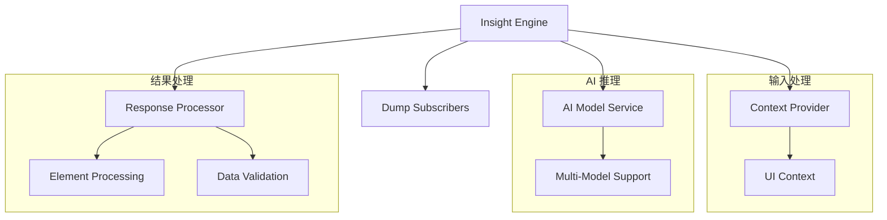

# Insight UI理解引擎

Insight 是 Midscene Python 的 AI 驱动的 UI 理解引擎，负责页面分析、元素定位和操作决策。它是连接 AI 模型与实际操作的核心组件。

## 🧠 设计理念

### AI 驱动的视觉理解
Insight 利用先进的视觉语言模型（VLM）来理解页面内容：

```python
# Insight 不依赖传统的选择器
# 而是通过 AI 视觉理解来定位元素
element = await insight.locate("蓝色的登录按钮")
element = await insight.locate("位于页面右上角的搜索图标")
```

### 上下文感知决策
Insight 结合页面状态、用户意图和历史操作来做出智能决策：

```python
# 同样的描述在不同上下文下可能指向不同元素
await insight.locate("确定按钮")  # 对话框中的确定按钮
await insight.locate("确定按钮")  # 表单中的确定按钮
```

## 🏗️ 架构设计

### 核心组件



### Insight 类结构

```python
class Insight:
    """AI-powered UI understanding and reasoning engine"""
    
    def __init__(
        self,
        context_provider: Union[UIContext, Callable],
        ai_service: Optional[AIModelService] = None,
        model_config: Optional[AIModelConfig] = None
    ):
        self.context_provider = context_provider  # 上下文提供者
        self.ai_service = ai_service              # AI 模型服务
        self.model_config = model_config          # 模型配置
        self._dump_subscribers = []               # 调试订阅者
```

## 🎯 核心功能

### 1. 智能元素定位 (locate)

Insight 的核心能力是通过自然语言精确定位页面元素：

```python
# 基础定位
login_btn = await insight.locate("登录按钮")
search_box = await insight.locate("搜索输入框")

# 描述性定位
submit_btn = await insight.locate("绿色的提交按钮")
close_icon = await insight.locate("模态对话框右上角的关闭图标")

# 相对定位
next_page = await insight.locate("分页器中的下一页按钮")
first_item = await insight.locate("列表中的第一个商品")

# 条件定位
error_msg = await insight.locate("如果存在错误信息的提示框")
```

#### 定位策略

Insight 使用多层次的定位策略：

1. **视觉识别**: 分析截图中的视觉元素
2. **语义理解**: 理解元素的功能和语义
3. **布局分析**: 考虑元素的位置关系
4. **上下文感知**: 结合页面状态和操作历史

```python
class LocateResponse(BaseModel):
    """AI locate response schema"""
    elements: List[Dict[str, Any]]  # 找到的元素列表
    reasoning: str                  # AI 推理过程
    confidence: float              # 置信度
    errors: List[str] = []         # 错误信息
```

#### 定位选项

```python
from midscene.core.types import LocateOption

options = LocateOption(
    multiple=True,           # 查找多个匹配的元素
    timeout=10,             # 定位超时时间
    wait_for_visible=True,  # 等待元素可见
    confidence_threshold=0.8 # 最小置信度阈值
)

elements = await insight.locate("商品卡片", options)
```

### 2. 数据提取 (extract)

从页面提取结构化数据：

```python
# 简单数据提取
user_info = await insight.extract({
    "name": "用户姓名",
    "email": "邮箱地址",
    "role": "用户角色"
})

# 复杂列表数据
products = await insight.extract({
    "products": [
        {
            "name": "商品名称",
            "price": "价格",
            "rating": "评分",
            "description": "商品描述",
            "in_stock": "是否有库存"
        }
    ]
})

# 嵌套结构数据
page_data = await insight.extract({
    "header": {
        "title": "页面标题",
        "user": "当前用户名"
    },
    "content": {
        "articles": [
            {
                "title": "文章标题",
                "author": "作者",
                "date": "发布日期"
            }
        ]
    },
    "footer": {
        "copyright": "版权信息"
    }
})
```

#### 提取选项

```python
from midscene.core.types import ExtractOption

options = ExtractOption(
    return_thought=True,     # 返回 AI 的思考过程
    schema_validation=True,  # 启用数据结构验证
    timeout=30              # 提取超时时间
)

result = await insight.extract(schema, options)
print(result["thought"])  # AI 的推理过程
print(result["data"])     # 提取的数据
```

### 3. 智能断言 (assert_condition)

验证页面状态和条件：

```python
# 状态断言
result = await insight.assert_condition("用户已成功登录")
assert result.passed, result.message

# 内容断言
result = await insight.assert_condition("页面显示了 5 个搜索结果")
assert result.passed

# 复杂条件断言
result = await insight.assert_condition(
    "如果是新用户，页面应该显示欢迎指引"
)

# 否定断言
result = await insight.assert_condition("页面没有显示错误信息")
```

#### 断言结果

```python
class AssertResult:
    passed: bool      # 断言是否通过
    reasoning: str    # AI 推理过程
    confidence: float # 置信度
    message: str      # 详细消息
```

## 🔧 上下文管理

### 上下文提供者

Insight 通过上下文提供者获取页面信息：

```python
# 静态上下文
context = UIContext(
    screenshot_base64="...",
    page_title="登录页面",
    url="https://example.com/login"
)
insight = Insight(context)

# 动态上下文
async def get_context(action: InsightAction) -> UIContext:
    # 根据操作类型获取不同的上下文信息
    if action == InsightAction.LOCATE:
        return await page.get_locate_context()
    elif action == InsightAction.EXTRACT:
        return await page.get_extract_context()
    else:
        return await page.get_default_context()

insight = Insight(get_context)
```

### 上下文类型

```python
class UIContext(BaseModel):
    """UI context information"""
    screenshot_base64: str      # 页面截图（Base64 编码）
    page_title: str            # 页面标题
    url: str                   # 页面 URL
    viewport_size: tuple       # 视口大小
    device_pixel_ratio: float  # 设备像素比
    elements: List[BaseElement] # 页面元素信息
    timestamp: float           # 时间戳
```

## 🎨 AI 消息构建

### 定位消息

Insight 为不同操作构建专门的 AI 消息：

```python
def _build_locate_messages(
    self, 
    prompt: str, 
    context: UIContext, 
    options: LocateOption
) -> List[Dict]:
    """构建元素定位的 AI 消息"""
    return [
        {
            "role": "system",
            "content": self._get_locate_system_prompt()
        },
        {
            "role": "user", 
            "content": [
                {
                    "type": "text",
                    "text": f"请在页面中定位：{prompt}"
                },
                {
                    "type": "image_url",
                    "image_url": {
                        "url": f"data:image/png;base64,{context.screenshot_base64}"
                    }
                }
            ]
        }
    ]
```

### 系统提示词

```python
def _get_locate_system_prompt(self) -> str:
    """获取元素定位的系统提示词"""
    return """
你是一个专业的UI元素定位专家。请分析页面截图，根据用户描述精确定位目标元素。

定位原则：
1. 优先考虑功能语义而非视觉外观
2. 结合上下文理解元素关系
3. 对于模糊描述，选择最可能的候选元素
4. 提供详细的定位推理过程

返回格式：
{
    "elements": [
        {
            "rect": {"x": 0, "y": 0, "width": 100, "height": 30},
            "text": "元素文本",
            "tag": "元素标签",
            "attributes": {"id": "...", "class": "..."},
            "confidence": 0.95
        }
    ],
    "reasoning": "定位推理过程",
    "confidence": 0.9
}
    """.strip()
```

## 📊 响应处理

### 元素处理

```python
def _process_locate_response(
    self, 
    response: LocateResponse, 
    context: UIContext
) -> Optional[BaseElement]:
    """处理定位响应，返回最佳匹配元素"""
    
    if not response.elements:
        return None
    
    # 选择置信度最高的元素
    best_element = max(
        response.elements, 
        key=lambda e: e.get("confidence", 0)
    )
    
    # 创建元素对象
    element = BaseElement(
        rect=best_element["rect"],
        text=best_element.get("text", ""),
        tag_name=best_element.get("tag", ""),
        attributes=best_element.get("attributes", {})
    )
    
    return element
```

### 数据验证

```python
def _validate_extract_response(
    self, 
    response: ExtractResponse, 
    schema: Dict
) -> bool:
    """验证提取数据的结构是否符合预期"""
    
    try:
        # 使用 Pydantic 进行结构验证
        from pydantic import create_model
        
        # 动态创建验证模型
        validator = create_model("ExtractValidator", **schema)
        validator(**response.data)
        
        return True
    except Exception as e:
        logger.warning(f"Data validation failed: {e}")
        return False
```

## 🔍 调试和监控

### 调试订阅者

Insight 支持调试订阅者来监控执行过程：

```python
async def debug_subscriber(dump_data: Dict):
    """调试订阅者函数"""
    operation = dump_data["type"]
    prompt = dump_data.get("prompt", "")
    
    print(f"🔍 操作: {operation}")
    print(f"📝 提示: {prompt}")
    
    if "error" in dump_data:
        print(f"❌ 错误: {dump_data['error']}")
    else:
        print(f"✅ 成功")
    
    # 保存调试信息到文件
    with open(f"debug_{operation}.json", "w") as f:
        json.dump(dump_data, f, indent=2)

# 注册调试订阅者
insight.subscribe_to_dump(debug_subscriber)
```

### 执行统计

```python
class InsightMetrics:
    """Insight 执行统计"""
    
    def __init__(self):
        self.operation_count = 0
        self.total_time = 0
        self.success_count = 0
        self.ai_tokens_used = 0
    
    def record_operation(self, operation: str, duration: float, success: bool, tokens: int):
        self.operation_count += 1
        self.total_time += duration
        if success:
            self.success_count += 1
        self.ai_tokens_used += tokens
    
    @property
    def success_rate(self) -> float:
        return self.success_count / self.operation_count if self.operation_count > 0 else 0
    
    @property
    def avg_time(self) -> float:
        return self.total_time / self.operation_count if self.operation_count > 0 else 0

# 使用统计
metrics = InsightMetrics()
insight.set_metrics_collector(metrics)
```

## ⚙️ 高级配置

### 模型配置

```python
from midscene.core.ai_model import AIModelConfig

# 针对不同操作使用不同配置
locate_config = AIModelConfig(
    provider="openai",
    model="gpt-4-vision-preview",
    temperature=0.1,    # 定位需要更确定性
    max_tokens=500
)

extract_config = AIModelConfig(
    provider="claude",
    model="claude-3-sonnet-20240229",
    temperature=0.2,    # 提取允许更多创造性
    max_tokens=2000
)

# 创建专门的 Insight 实例
locate_insight = Insight(context_provider, model_config=locate_config)
extract_insight = Insight(context_provider, model_config=extract_config)
```

### 缓存配置

```python
# 启用智能缓存
insight.enable_cache(
    cache_size=1000,           # 缓存条目数
    ttl=3600,                 # 缓存过期时间（秒）
    hash_screenshot=True,      # 基于截图内容生成缓存键
    cache_ai_responses=True    # 缓存 AI 响应
)

# 缓存策略配置
insight.set_cache_strategy(
    locate_cache_enabled=True,     # 定位操作缓存
    extract_cache_enabled=True,    # 提取操作缓存
    assert_cache_enabled=False     # 断言操作不缓存（实时性要求高）
)
```

## 🚀 性能优化

### 批量操作

```python
# 批量定位多个元素
elements = await insight.batch_locate([
    "登录按钮",
    "注册链接", 
    "忘记密码链接"
])

# 批量提取多个数据块
data_blocks = await insight.batch_extract([
    {"user_info": {"name": "姓名", "email": "邮箱"}},
    {"product_list": [{"name": "商品名", "price": "价格"}]},
    {"navigation": {"items": ["导航项目"]}}
])
```

### 并发控制

```python
# 设置并发限制
insight.set_concurrency_limit(3)

# 异步并发执行
import asyncio

async def parallel_operations():
    tasks = [
        insight.locate("按钮1"),
        insight.locate("按钮2"),
        insight.extract(schema1),
        insight.extract(schema2)
    ]
    
    results = await asyncio.gather(*tasks, return_exceptions=True)
    return results
```

## 🎯 最佳实践

### 1. 清晰的描述
```python
# ❌ 模糊描述
await insight.locate("按钮")

# ✅ 具体描述
await insight.locate("页面右上角的蓝色登录按钮")
```

### 2. 合理的置信度阈值
```python
# 根据场景调整置信度要求
options = LocateOption(
    confidence_threshold=0.9  # 高要求场景
)
element = await insight.locate("重要操作按钮", options)
```

### 3. 错误处理和重试
```python
async def robust_locate(prompt: str, max_retries: int = 3):
    for attempt in range(max_retries):
        try:
            result = await insight.locate(prompt)
            if result.element:
                return result
        except Exception as e:
            if attempt == max_retries - 1:
                raise
            await asyncio.sleep(1)  # 等待后重试
    
    raise ElementNotFoundError(f"Element not found after {max_retries} attempts")
```

### 4. 上下文优化
```python
# 为不同操作提供优化的上下文
async def optimized_context_provider(action: InsightAction) -> UIContext:
    base_context = await page.get_context()
    
    if action == InsightAction.LOCATE:
        # 定位操作需要更详细的元素信息
        base_context.elements = await page.get_all_elements()
    elif action == InsightAction.EXTRACT:
        # 提取操作需要更完整的页面内容
        base_context.page_content = await page.get_page_content()
    
    return base_context
```

## 🔗 相关文档

- **Agent 集成**: [Agent 核心控制器](Agent核心控制器.md)
- **AI 模型**: [AI模型服务抽象层](AI模型服务抽象层.md)
- **数据类型**: [UI上下文与数据模型](UI上下文与数据模型.md)
- **API 参考**: [Insight API](../API参考/Insight-API.md)

---

Insight 是 Midscene Python 的智能核心，它让 AI 能够真正"看懂"和"理解"用户界面。掌握 Insight 的使用将大大提升你的自动化脚本的智能程度和稳定性！