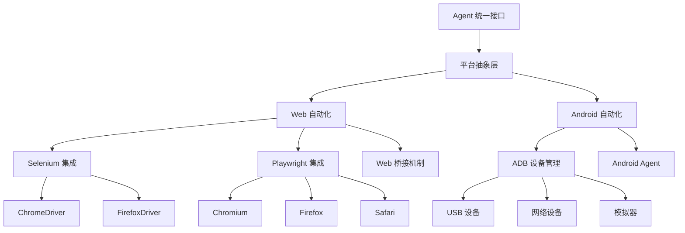

# 平台集成

Midscene Python 支持多个平台的 UI 自动化，提供统一的编程接口和一致的操作体验。

## 🏗️ 架构概览



## 📱 支持的平台

### Web 自动化
- **Selenium WebDriver**: 支持 Chrome、Firefox、Safari、Edge
- **Playwright**: 支持 Chromium、Firefox、WebKit
- **统一桥接**: 提供一致的 API 接口

### Android 自动化  
- **真实设备**: 通过 USB 或 WiFi 连接
- **Android 模拟器**: 支持各种 AVD 配置
- **云设备**: 支持云端设备服务

## 🌐 Web 自动化

### 快速开始
```python
import asyncio
from midscene import Agent
from midscene.web import SeleniumWebPage, PlaywrightPage

# Selenium 示例
async def selenium_example():
    with SeleniumWebPage.create() as page:
        agent = Agent(page)
        await page.goto("https://example.com")
        await agent.ai_action("点击登录按钮")

# Playwright 示例  
async def playwright_example():
    async with PlaywrightPage.create() as page:
        agent = Agent(page)
        await page.goto("https://example.com")
        await agent.ai_action("点击登录按钮")
```

### 高级配置
```python
from midscene.web import SeleniumWebPage
from selenium.webdriver.chrome.options import Options

# 自定义浏览器选项
chrome_options = Options()
chrome_options.add_argument("--headless")
chrome_options.add_argument("--no-sandbox")

page = SeleniumWebPage.create(
    browser="chrome",
    options=chrome_options,
    window_size=(1920, 1080)
)
```

### 详细文档
- [Selenium集成](Web自动化/Selenium集成.md) - Selenium WebDriver 完整指南
- [Playwright集成](Web自动化/Playwright集成.md) - Playwright 集成和配置
- [Web桥接机制](Web自动化/Web桥接机制.md) - 统一的 Web 操作抽象

## 📱 Android 自动化

### 快速开始
```python
import asyncio
from midscene import Agent
from midscene.android import AndroidDevice

async def android_example():
    # 连接设备
    device = AndroidDevice()
    await device.connect()
    
    # 创建 Agent
    agent = Agent(device)
    
    # 启动应用
    await device.start_app("com.example.app")
    
    # AI 操作
    await agent.ai_action("点击登录按钮")
    await agent.ai_action("输入用户名 'testuser'")
    await agent.ai_action("点击提交")
```

### 设备管理
```python
from midscene.android import AndroidDevice, DeviceManager

# 连接特定设备
device = AndroidDevice(device_id="emulator-5554")

# 设备管理器
manager = DeviceManager()
devices = await manager.list_devices()
for device in devices:
    print(f"设备: {device.id}, 状态: {device.status}")
```

### 详细文档
- [Android自动化](Android自动化.md) - Android 平台完整指南

## 🔄 统一操作接口

无论使用哪个平台，Midscene Python 都提供一致的操作接口：

### Agent 操作
```python
# Web 和 Android 使用相同的方法
await agent.ai_action("点击按钮")
await agent.ai_action("输入文本 'hello'")
await agent.ai_action("滚动到底部")

# 数据提取
data = await agent.ai_extract({
    "title": "页面标题",
    "items": ["列表项目"]
})

# 状态断言
await agent.ai_assert("页面显示成功消息")
```

### 页面操作
```python
# 统一的页面操作
await page.goto("https://example.com")  # Web
await device.start_app("com.app")       # Android

# 截图
screenshot = await page.screenshot()    # Web
screenshot = await device.screenshot()  # Android

# 获取上下文
context = await page.get_context()      # Web  
context = await device.get_context()    # Android
```

## 🔧 平台适配机制

### AbstractInterface 抽象基类
```python
from midscene.core.types import AbstractInterface, InterfaceType

class CustomPlatform(AbstractInterface):
    @property
    def interface_type(self) -> InterfaceType:
        return InterfaceType.WEB  # 或 InterfaceType.ANDROID
    
    async def get_context(self) -> UIContext:
        # 实现获取页面/屏幕上下文
        pass
    
    async def tap(self, x: float, y: float) -> None:
        # 实现点击操作
        pass
    
    async def input_text(self, text: str) -> None:
        # 实现文本输入
        pass
```

### 桥接模式实现
```python
# Web 桥接示例
class WebBridge:
    def __init__(self, driver_type: str):
        if driver_type == "selenium":
            self.driver = SeleniumWebDriver()
        elif driver_type == "playwright":
            self.driver = PlaywrightDriver()
    
    async def unified_action(self, action: str, **kwargs):
        # 统一的操作接口
        return await self.driver.execute_action(action, **kwargs)
```

## 🚀 平台选择指南

### Web 平台选择

#### Selenium
**适用场景**:
- 需要支持多种浏览器
- 与现有 Selenium 项目集成
- 需要特定的 WebDriver 功能

**优势**:
- 成熟稳定，社区支持好
- 支持的浏览器最多
- 与 Selenium Grid 集成

**劣势**:
- 性能相对较慢
- API 相对复杂

#### Playwright
**适用场景**:
- 需要高性能的自动化
- 现代 Web 应用测试
- 需要网络拦截等高级功能

**优势**:
- 性能优异
- 现代化的 API 设计
- 内置等待和重试机制

**劣势**:
- 相对较新，生态系统较小
- 学习成本稍高

### Android 平台特点

**适用场景**:
- 移动应用 UI 测试
- 移动端业务流程自动化
- 跨平台应用测试

**优势**:
- 直接操作原生 Android 界面
- 支持各种 Android 版本
- 可以测试真实设备体验

**注意事项**:
- 需要 ADB 环境配置
- 设备连接稳定性要求高
- 权限和安全限制较多

## 📊 性能对比

| 特性 | Selenium | Playwright | Android |
|------|----------|------------|---------|
| **启动速度** | 中等 | 快 | 较慢 |
| **执行速度** | 中等 | 快 | 取决于设备 |
| **资源占用** | 中等 | 低 | 高 |
| **稳定性** | 高 | 高 | 中等 |
| **调试难度** | 中等 | 低 | 高 |

## 🔗 跨平台最佳实践

### 1. 统一测试脚本
```python
async def universal_test(platform: str):
    """跨平台测试脚本"""
    
    if platform == "web":
        page = SeleniumWebPage.create()
        agent = Agent(page)
        await page.goto("https://app.example.com")
    
    elif platform == "android":
        device = AndroidDevice()
        await device.connect()
        agent = Agent(device)
        await device.start_app("com.example.app")
    
    # 统一的测试步骤
    await agent.ai_action("点击登录按钮")
    await agent.ai_action("输入用户名 'test'")
    await agent.ai_action("输入密码 'password'")
    await agent.ai_action("点击提交")
    
    # 统一的验证
    await agent.ai_assert("显示欢迎页面")
```

### 2. 配置管理
```python
# config.py
PLATFORM_CONFIGS = {
    "web": {
        "browser": "chrome",
        "headless": False,
        "window_size": (1920, 1080)
    },
    "android": {
        "device_id": None,  # 自动选择
        "app_package": "com.example.app",
        "timeout": 30
    }
}

def get_platform_config(platform: str) -> dict:
    return PLATFORM_CONFIGS.get(platform, {})
```

### 3. 错误处理
```python
async def robust_platform_operation(agent: Agent, action: str):
    """跨平台的健壮操作"""
    
    max_retries = 3
    for attempt in range(max_retries):
        try:
            await agent.ai_action(action)
            return
        except Exception as e:
            if attempt == max_retries - 1:
                raise
            
            # 根据平台类型进行特定的恢复操作
            platform_type = agent.interface.interface_type
            if platform_type == InterfaceType.WEB:
                await handle_web_error(agent, e)
            elif platform_type == InterfaceType.ANDROID:
                await handle_android_error(agent, e)
            
            await asyncio.sleep(1)  # 等待后重试
```

## 🔍 调试和诊断

### 统一调试接口
```python
async def debug_platform_info(agent: Agent):
    """获取平台调试信息"""
    
    interface = agent.interface
    platform_type = interface.interface_type
    
    print(f"平台类型: {platform_type}")
    
    if platform_type == InterfaceType.WEB:
        context = await interface.get_context()
        print(f"页面标题: {context.page_title}")
        print(f"页面 URL: {context.url}")
        print(f"视口大小: {context.size}")
    
    elif platform_type == InterfaceType.ANDROID:
        context = await interface.get_context()
        print(f"屏幕尺寸: {context.size}")
        print(f"当前活动: {context.current_activity}")
        print(f"设备信息: {context.device_info}")
```

### 跨平台截图
```python
async def take_debug_screenshot(agent: Agent, filename: str):
    """跨平台截图功能"""
    
    interface = agent.interface
    screenshot = await interface.screenshot()
    
    # 添加平台标识
    platform_type = interface.interface_type.value
    timestamped_filename = f"{platform_type}_{filename}_{int(time.time())}.png"
    
    with open(timestamped_filename, "wb") as f:
        f.write(screenshot)
    
    print(f"截图已保存: {timestamped_filename}")
```

---

通过 Midscene Python 的平台集成能力，你可以用统一的方式处理不同平台的自动化需求。选择适合你项目需求的平台，并利用统一的 API 来简化开发和维护工作！