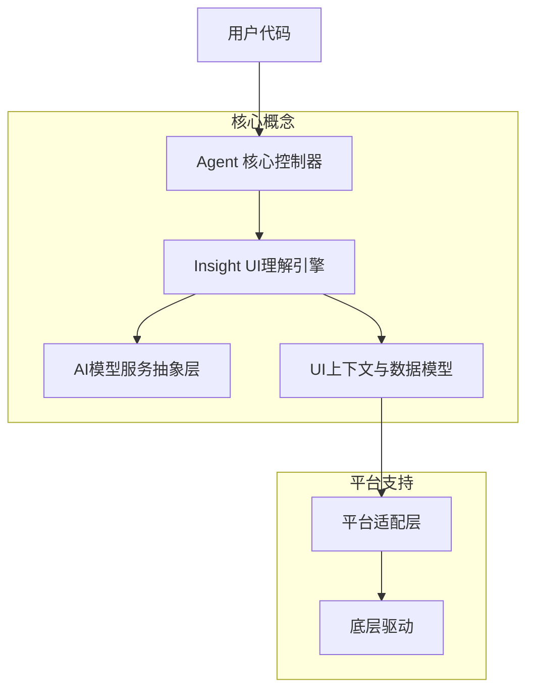

# 核心概念

Midscene Python 的核心概念文档，深入解析框架的关键组件和设计理念。

## 📖 目录概览

本章节包含以下核心概念文档：

### [Agent 核心控制器](Agent核心控制器.md)
Agent 是 Midscene Python 的核心控制器，提供统一的自动化操作接口。了解 Agent 的工作原理、生命周期管理和高级配置。

**主要内容**:
- Agent 架构设计
- 操作类型和方法
- 选项配置和自定义
- 生命周期管理

### [Insight UI理解引擎](Insight-UI理解引擎.md) 
Insight 是 AI 驱动的 UI 理解引擎，负责页面分析、元素定位和操作决策。深入理解 AI 如何理解和操作界面。

**主要内容**:
- UI 理解机制
- 智能元素定位
- 操作策略生成
- 上下文分析

### [AI模型服务抽象层](AI模型服务抽象层.md)
统一的 AI 模型服务接口，支持多种 AI 提供商。了解如何配置和切换不同的 AI 模型。

**主要内容**:
- 服务抽象设计
- 提供商适配
- 模型选择策略
- 性能优化

### [UI上下文与数据模型](UI上下文与数据模型.md)
理解 Midscene Python 中的数据流、上下文管理和类型系统。

**主要内容**:
- 数据模型定义
- 上下文传递机制
- 类型安全保证
- 序列化和反序列化

## 🏗️ 整体架构关系

## 🔄 数据流向

1. **用户请求** → Agent 接收自然语言指令
2. **指令解析** → Insight 分析指令意图和页面状态
3. **AI 推理** → AIModelService 调用 AI 模型进行决策
4. **上下文构建** → UIContext 封装页面信息和操作结果
5. **操作执行** → 通过平台适配层执行具体操作
6. **结果反馈** → 返回执行结果和状态信息

## 🎯 设计原则

### 1. 抽象化原则
- 隐藏复杂的底层实现细节
- 提供统一的高级接口
- 支持多平台一致性操作

### 2. 可扩展原则
- 模块化设计支持功能扩展
- 插件化架构支持第三方集成
- 开放的 API 设计

### 3. 智能化原则
- AI 驱动的决策制定
- 自适应的操作策略
- 智能的错误处理和恢复

### 4. 类型安全原则
- 完整的类型注解
- 运行时类型验证
- 强类型的数据模型

## 🧩 组件交互

### Agent ↔ Insight
- Agent 委托 Insight 进行 AI 推理
- Insight 返回操作计划和执行结果
- 双向的状态同步和错误处理

### Insight ↔ AIModelService
- Insight 构建 AI 模型请求
- AIModelService 管理模型调用和响应
- 支持多种模型的统一接口

### 所有组件 ↔ UIContext
- 统一的数据模型和上下文管理
- 类型安全的数据传递
- 序列化和持久化支持

## 📚 学习路径

### 初学者路径
1. 开始阅读 [Agent 核心控制器](Agent核心控制器.md)
2. 理解 [UI上下文与数据模型](UI上下文与数据模型.md)
3. 深入 [Insight UI理解引擎](Insight-UI理解引擎.md)
4. 最后学习 [AI模型服务抽象层](AI模型服务抽象层.md)

### 高级开发者路径
1. 快速浏览所有核心概念
2. 重点关注架构设计和扩展机制
3. 深入研究 AI 模型集成和优化
4. 探索自定义扩展和插件开发

## 🔗 相关文档链接

- **API 参考**: [Agent API](../API参考/Agent-API.md) | [Insight API](../API参考/Insight-API.md)
- **平台集成**: [Web自动化](../平台集成/Web自动化/README.md) | [Android自动化](../平台集成/Android自动化.md)
- **配置指南**: [AI模型配置](../AI模型配置/配置方法.md)
- **示例教程**: [基础示例](../示例和教程/基础示例.md)

---

选择你感兴趣的主题开始深入学习吧！