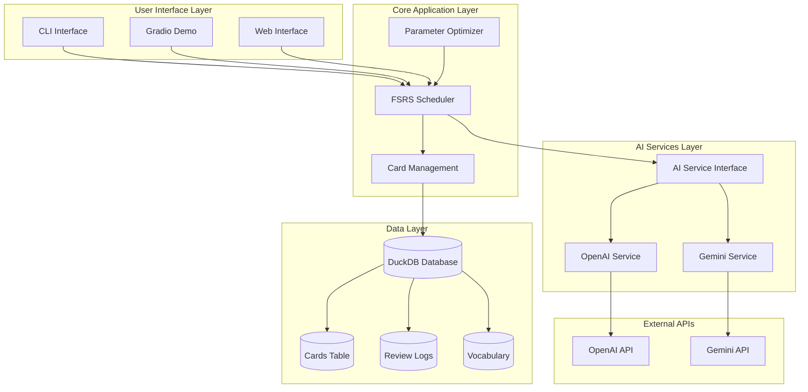
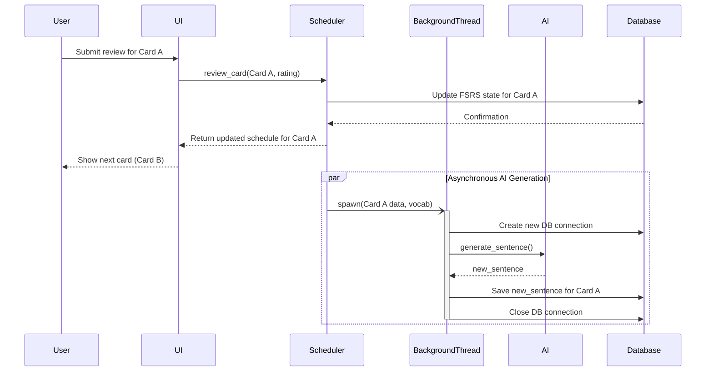
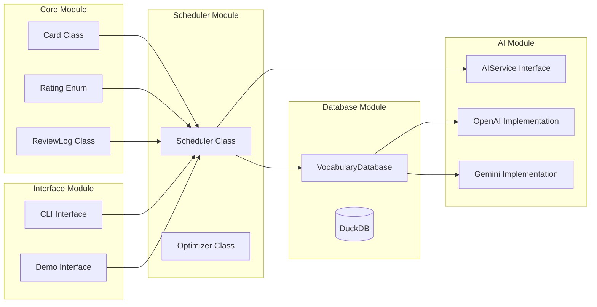
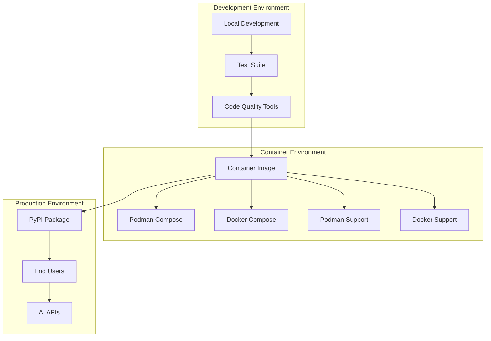

# MorphCards Architecture

This document provides a comprehensive overview of the MorphCards system architecture using Mermaid diagrams.

## System Overview



## Data Flow Architecture

The data flow for reviewing a card is designed to be highly responsive. When a user submits a review, the core scheduling logic is executed immediately, and the UI receives a quick confirmation. The generation of the *next* sentence variation, which is a slow network operation, is handled asynchronously in a background thread. This ensures the user is not blocked and can proceed to the next card without delay.



## Database Schema

```mermaid
erDiagram
    CARDS {
        string id PK
        string word
        string sentence
        string original_sentence
        float stability (nullable)
        float difficulty (nullable)
        datetime due_date
        datetime created_at
        datetime last_reviewed
        int review_count
    }
    
    REVIEW_LOGS {
        string id PK
        string card_id FK
        datetime review_time
        int rating
        float interval
        float stability (nullable)
        float difficulty (nullable)
    }
    
    VOCABULARY {
        string word PK
        datetime first_seen
        datetime last_reviewed
        int review_count
        int mastery_level
    }
    
    CARDS ||--o{ REVIEW_LOGS : "has reviews"
    CARDS ||--o| VOCABULARY : "contains word"
```

## Component Architecture



## Deployment Architecture



## Key Design Principles

1. **Separation of Concerns**: Each module has a single responsibility
2. **Interface Segregation**: AI services implement a common interface
3. **Dependency Inversion**: High-level modules don't depend on low-level modules
4. **Single Responsibility**: Each class has one reason to change
5. **Open/Closed Principle**: Open for extension, closed for modification
6. **Responsive UI**: Slow operations like API calls are handled in background threads to prevent blocking the user interface.

## Performance Characteristics

- **API Response Time**: < 1 second for AI sentence generation (asynchronous)
- **Database Operations**: In-memory DuckDB for fast access
- **Memory Usage**: Efficient storage with minimal overhead
- **Scalability**: Modular design allows for easy scaling

## Quick Demo Commands

### One-shot Demo with Podman

```bash
# Run demo immediately (no build required)
# Assumes you have a .env file with your API key
podman run --rm -p 7860:7860 \
  --env-file .env \
  docker.io/library/python:3.11-slim \
  bash -c "pip install morphcards[demo] && python -m morphcards.demo"
```

### Alternative Demo Commands

```bash
# With specific version
podman run --rm -p 7860:7860 \
  --env-file .env \
  docker.io/library/python:3.11-slim \
  bash -c "pip install 'morphcards[demo]>=0.1.0' && python -m morphcards.demo"

# With custom port
podman run --rm -p 8080:7860 \
  --env-file .env \
  docker.io/library/python:3.11-slim \
  bash -c "pip install morphcards[demo] && python -m morphcards.demo"
```

### Environment Setup

**Create a `.env` file in your project root:**
```bash
# For Gemini users (default)
GEMINI_API_KEY=your-gemini-api-key-here
GEMINI_MODEL_NAME=gemini-2.5-flash # Example: gemini-2.5-flash, gemini-1.5-pro, gemini-1.5-flash

# For OpenAI users
OPENAI_API_KEY=your-openai-api-key-here
OPENAI_MODEL_NAME=gpt-3.5-turbo # Example: gpt-4, gpt-3.5-turbo
```

**Note**: This documentation assumes Gemini is being used. For OpenAI users, use `OPENAI_API_KEY` instead of `GEMINI_API_KEY` in your `.env` file.

## Makefile Commands

For quick access to common commands, use the included Makefile:

```bash
make all        # Build, run demo, and show status
make build      # Build container image
make demo       # Run demo (one-shot)
make run        # Build and run
make clean      # Clean up containers
make help       # Show all available commands
```

The Makefile assumes podman is being used and automatically handles environment variables from your `.env` file.

## Security Considerations

- **API Key Management**: Environment variables for sensitive data
- **Input Validation**: Pydantic models for data validation
- **Error Handling**: Graceful fallbacks without exposing internals
- **Rate Limiting**: Built-in handling for API rate limits
