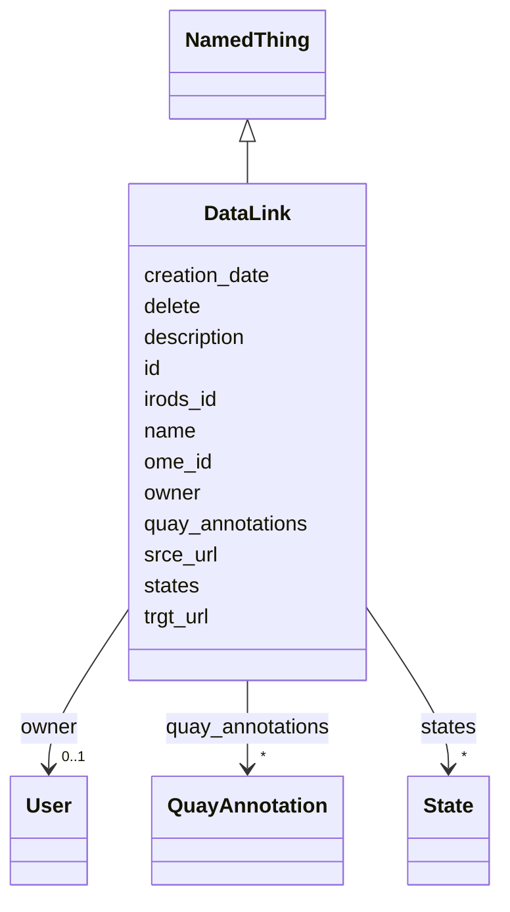

# Class: DataLink

URI:
[https://w3id.org/omero-quay/manifest/:DataLink](https://w3id.org/omero-quay/manifest/:DataLink)



## Inheritance

- [NamedThing](NamedThing.md)
  - **DataLink**

## Slots

| Name                                    | Cardinality and Range                                                                                                                                                                                                                                                      | Description                                      | Inheritance                 |
| --------------------------------------- | -------------------------------------------------------------------------------------------------------------------------------------------------------------------------------------------------------------------------------------------------------------------------- | ------------------------------------------------ | --------------------------- |
| [owner](owner.md)                       | 0..1 <br/> [User](User.md)                                                                                                                                                                                                                                                 |                                                  | direct                      |
| [srce_url](srce_url.md)                 | 0..1 <br/> [String](String.md)                                                                                                                                                                                                                                             | urls are intended to be parsed by python `urllib | direct                      |
| [trgt_url](trgt_url.md)                 | 0..1 <br/> [String](String.md)                                                                                                                                                                                                                                             | urls are intended to be parsed by python `urllib | direct                      |
| [id](id.md)                             | 1 <br/> [String](String.md)                                                                                                                                                                                                                                                |                                                  | [NamedThing](NamedThing.md) |
| [name](name.md)                         | 0..1 <br/> [String](String.md)                                                                                                                                                                                                                                             |                                                  | [NamedThing](NamedThing.md) |
| [description](description.md)           | 0..1 <br/> [String](String.md)                                                                                                                                                                                                                                             |                                                  | [NamedThing](NamedThing.md) |
| [creation_date](creation_date.md)       | 0..1 <br/> [String](String.md)                                                                                                                                                                                                                                             |                                                  | [NamedThing](NamedThing.md) |
| [quay_annotations](quay_annotations.md) | \* <br/> [QuayAnnotation](QuayAnnotation.md)&nbsp;or&nbsp;<br />[TagAnnotation](TagAnnotation.md)&nbsp;or&nbsp;<br />[MapAnnotation](MapAnnotation.md)&nbsp;or&nbsp;<br />[FileAnnotation](FileAnnotation.md)&nbsp;or&nbsp;<br />[CommentAnnotation](CommentAnnotation.md) |                                                  | [NamedThing](NamedThing.md) |
| [ome_id](ome_id.md)                     | 0..1 <br/> [Integer](Integer.md)                                                                                                                                                                                                                                           |                                                  | [NamedThing](NamedThing.md) |
| [irods_id](irods_id.md)                 | 0..1 <br/> [Integer](Integer.md)                                                                                                                                                                                                                                           |                                                  | [NamedThing](NamedThing.md) |
| [delete](delete.md)                     | 0..1 <br/> [Boolean](Boolean.md)                                                                                                                                                                                                                                           |                                                  | [NamedThing](NamedThing.md) |
| [states](states.md)                     | \* <br/> [State](State.md)                                                                                                                                                                                                                                                 |                                                  | [NamedThing](NamedThing.md) |

## Usages

| used by                           | used in                     | type  | used                    |
| --------------------------------- | --------------------------- | ----- | ----------------------- |
| [Collection](Collection.md)       | [datalinks](datalinks.md)   | range | [DataLink](DataLink.md) |
| [Collection](Collection.md)       | [importlink](importlink.md) | range | [DataLink](DataLink.md) |
| [Investigation](Investigation.md) | [datalinks](datalinks.md)   | range | [DataLink](DataLink.md) |
| [Investigation](Investigation.md) | [importlink](importlink.md) | range | [DataLink](DataLink.md) |
| [Study](Study.md)                 | [datalinks](datalinks.md)   | range | [DataLink](DataLink.md) |
| [Study](Study.md)                 | [importlink](importlink.md) | range | [DataLink](DataLink.md) |
| [Assay](Assay.md)                 | [datalinks](datalinks.md)   | range | [DataLink](DataLink.md) |
| [Assay](Assay.md)                 | [importlink](importlink.md) | range | [DataLink](DataLink.md) |

## Identifier and Mapping Information

### Schema Source

- from schema: https://w3id.org/omero-quay/manifest

## Mappings

| Mapping Type | Mapped Value                                   |
| ------------ | ---------------------------------------------- |
| self         | https://w3id.org/omero-quay/manifest/:DataLink |
| native       | https://w3id.org/omero-quay/manifest/:DataLink |

## LinkML Source

<!-- TODO: investigate https://stackoverflow.com/questions/37606292/how-to-create-tabbed-code-blocks-in-mkdocs-or-sphinx -->

### Direct

<details>
```yaml
name: DataLink
from_schema: https://w3id.org/omero-quay/manifest
is_a: NamedThing
slots:
- owner
- srce_url
- trgt_url

````
</details>

### Induced

<details>
```yaml
name: DataLink
from_schema: https://w3id.org/omero-quay/manifest
is_a: NamedThing
attributes:
  owner:
    name: owner
    from_schema: https://w3id.org/omero-quay/manifest
    rank: 1000
    alias: owner
    owner: DataLink
    domain_of:
    - DataLink
    - Collection
    - File
    range: User
    inlined: false
  srce_url:
    name: srce_url
    description: "urls are intended to be parsed by python `urllib.parse.urlparse`\
      \ method, and MUST be formatted accordingly, e.g:\n  - https://my.file.server/path/to/file\n\
      \  - ssh://user@my.file.server:path/to/file\n  - irods:///irodsZone/home/group/path/to/file\n\
      \  - file:///SHARE/data/group/path/to/file\nFile and irods paths MUST be absolute"
    from_schema: https://w3id.org/omero-quay/manifest
    rank: 1000
    alias: srce_url
    owner: DataLink
    domain_of:
    - DataLink
    range: string
  trgt_url:
    name: trgt_url
    description: "urls are intended to be parsed by python `urllib.parse.urlparse`\
      \ method, and MUST be formatted accordingly, e.g:\n  - https://my.file.server/path/to/file\n\
      \  - ssh://user@my.file.server:path/to/file\n  - irods:///irodsZone/home/group/path/to/file\n\
      \  - file:///SHARE/data/group/path/to/file\nFile and irods paths MUST be absolute"
    from_schema: https://w3id.org/omero-quay/manifest
    rank: 1000
    alias: trgt_url
    owner: DataLink
    domain_of:
    - DataLink
    range: string
  id:
    name: id
    from_schema: https://w3id.org/omero-quay/manifest
    rank: 1000
    slot_uri: schema:identifier
    identifier: true
    alias: id
    owner: DataLink
    domain_of:
    - NamedThing
    range: string
    required: true
  name:
    name: name
    from_schema: https://w3id.org/omero-quay/manifest
    aliases:
    - ome:name
    - madbot:id
    - irods:name
    rank: 1000
    alias: name
    owner: DataLink
    domain_of:
    - NamedThing
    range: string
  description:
    name: description
    from_schema: https://w3id.org/omero-quay/manifest
    aliases:
    - ome:description
    rank: 1000
    alias: description
    owner: DataLink
    domain_of:
    - NamedThing
    range: string
  creation_date:
    name: creation_date
    from_schema: https://w3id.org/omero-quay/manifest
    rank: 1000
    alias: creation_date
    owner: DataLink
    domain_of:
    - NamedThing
    range: string
  quay_annotations:
    name: quay_annotations
    from_schema: https://w3id.org/omero-quay/manifest
    mappings:
    - ome:annotation_ref
    rank: 1000
    alias: quay_annotations
    owner: DataLink
    domain_of:
    - NamedThing
    - Manifest
    - Image
    range: QuayAnnotation
    multivalued: true
    any_of:
    - range: TagAnnotation
    - range: MapAnnotation
    - range: FileAnnotation
    - range: CommentAnnotation
  ome_id:
    name: ome_id
    from_schema: https://w3id.org/omero-quay/manifest
    mappings:
    - ome:id
    rank: 1000
    slot_uri: schema:identifier
    alias: ome_id
    owner: DataLink
    domain_of:
    - NamedThing
    range: integer
  irods_id:
    name: irods_id
    from_schema: https://w3id.org/omero-quay/manifest
    mappings:
    - irods:id
    rank: 1000
    slot_uri: schema:identifier
    alias: irods_id
    owner: DataLink
    domain_of:
    - NamedThing
    range: integer
  delete:
    name: delete
    from_schema: https://w3id.org/omero-quay/manifest
    rank: 1000
    ifabsent: 'False'
    alias: delete
    owner: DataLink
    domain_of:
    - NamedThing
    - Collection
    range: boolean
  states:
    name: states
    from_schema: https://w3id.org/omero-quay/manifest
    rank: 1000
    alias: states
    owner: DataLink
    domain_of:
    - NamedThing
    - Manifest
    range: State
    multivalued: true
    inlined: true
    inlined_as_list: true

````

</details>
