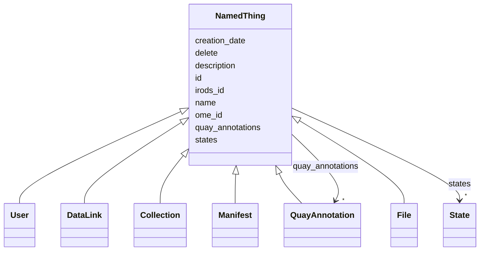

# Class: NamedThing

_A generic grouping for any identifiable entity_

- **NOTE**: this is an abstract class and should not be instantiated directly

URI: [schema:Thing](http://schema.org/Thing)



## Inheritance

- **NamedThing**
  - [User](User.md)
  - [DataLink](DataLink.md)
  - [Collection](Collection.md)
  - [Manifest](Manifest.md)
  - [QuayAnnotation](QuayAnnotation.md)
  - [File](File.md)

## Slots

| Name                                    | Cardinality and Range                                                                                                                                                                                                                                                      | Description | Inheritance |
| --------------------------------------- | -------------------------------------------------------------------------------------------------------------------------------------------------------------------------------------------------------------------------------------------------------------------------- | ----------- | ----------- |
| [id](id.md)                             | 1 <br/> [String](String.md)                                                                                                                                                                                                                                                |             | direct      |
| [name](name.md)                         | 0..1 <br/> [String](String.md)                                                                                                                                                                                                                                             |             | direct      |
| [description](description.md)           | 0..1 <br/> [String](String.md)                                                                                                                                                                                                                                             |             | direct      |
| [creation_date](creation_date.md)       | 0..1 <br/> [String](String.md)                                                                                                                                                                                                                                             |             | direct      |
| [quay_annotations](quay_annotations.md) | \* <br/> [QuayAnnotation](QuayAnnotation.md)&nbsp;or&nbsp;<br />[TagAnnotation](TagAnnotation.md)&nbsp;or&nbsp;<br />[MapAnnotation](MapAnnotation.md)&nbsp;or&nbsp;<br />[FileAnnotation](FileAnnotation.md)&nbsp;or&nbsp;<br />[CommentAnnotation](CommentAnnotation.md) |             | direct      |
| [ome_id](ome_id.md)                     | 0..1 <br/> [Integer](Integer.md)                                                                                                                                                                                                                                           |             | direct      |
| [irods_id](irods_id.md)                 | 0..1 <br/> [Integer](Integer.md)                                                                                                                                                                                                                                           |             | direct      |
| [delete](delete.md)                     | 0..1 <br/> [Boolean](Boolean.md)                                                                                                                                                                                                                                           |             | direct      |
| [states](states.md)                     | \* <br/> [State](State.md)                                                                                                                                                                                                                                                 |             | direct      |

## Identifier and Mapping Information

### Schema Source

- from schema: https://w3id.org/omero-quay/manifest

## Mappings

| Mapping Type | Mapped Value                                     |
| ------------ | ------------------------------------------------ |
| self         | schema:Thing                                     |
| native       | https://w3id.org/omero-quay/manifest/:NamedThing |

## LinkML Source

<!-- TODO: investigate https://stackoverflow.com/questions/37606292/how-to-create-tabbed-code-blocks-in-mkdocs-or-sphinx -->

### Direct

<details>
```yaml
name: NamedThing
description: A generic grouping for any identifiable entity
from_schema: https://w3id.org/omero-quay/manifest
abstract: true
slots:
- id
- name
- description
- creation_date
- quay_annotations
- ome_id
- irods_id
- delete
- states
class_uri: schema:Thing

````
</details>

### Induced

<details>
```yaml
name: NamedThing
description: A generic grouping for any identifiable entity
from_schema: https://w3id.org/omero-quay/manifest
abstract: true
attributes:
  id:
    name: id
    from_schema: https://w3id.org/omero-quay/manifest
    rank: 1000
    slot_uri: schema:identifier
    identifier: true
    alias: id
    owner: NamedThing
    domain_of:
    - NamedThing
    range: string
  name:
    name: name
    from_schema: https://w3id.org/omero-quay/manifest
    aliases:
    - ome:name
    - madbot:id
    - irods:name
    rank: 1000
    alias: name
    owner: NamedThing
    domain_of:
    - NamedThing
    range: string
  description:
    name: description
    from_schema: https://w3id.org/omero-quay/manifest
    aliases:
    - ome:description
    rank: 1000
    alias: description
    owner: NamedThing
    domain_of:
    - NamedThing
    range: string
  creation_date:
    name: creation_date
    from_schema: https://w3id.org/omero-quay/manifest
    rank: 1000
    alias: creation_date
    owner: NamedThing
    domain_of:
    - NamedThing
    range: string
  quay_annotations:
    name: quay_annotations
    from_schema: https://w3id.org/omero-quay/manifest
    mappings:
    - ome:annotation_ref
    rank: 1000
    alias: quay_annotations
    owner: NamedThing
    domain_of:
    - NamedThing
    - Manifest
    - Image
    range: QuayAnnotation
    multivalued: true
    any_of:
    - range: TagAnnotation
    - range: MapAnnotation
    - range: FileAnnotation
    - range: CommentAnnotation
  ome_id:
    name: ome_id
    from_schema: https://w3id.org/omero-quay/manifest
    mappings:
    - ome:id
    rank: 1000
    slot_uri: schema:identifier
    alias: ome_id
    owner: NamedThing
    domain_of:
    - NamedThing
    range: integer
  irods_id:
    name: irods_id
    from_schema: https://w3id.org/omero-quay/manifest
    mappings:
    - irods:id
    rank: 1000
    slot_uri: schema:identifier
    alias: irods_id
    owner: NamedThing
    domain_of:
    - NamedThing
    range: integer
  delete:
    name: delete
    from_schema: https://w3id.org/omero-quay/manifest
    rank: 1000
    ifabsent: 'False'
    alias: delete
    owner: NamedThing
    domain_of:
    - NamedThing
    - Collection
    range: boolean
  states:
    name: states
    from_schema: https://w3id.org/omero-quay/manifest
    rank: 1000
    alias: states
    owner: NamedThing
    domain_of:
    - NamedThing
    - Manifest
    range: State
    multivalued: true
    inlined_as_list: true
class_uri: schema:Thing

````

</details>
