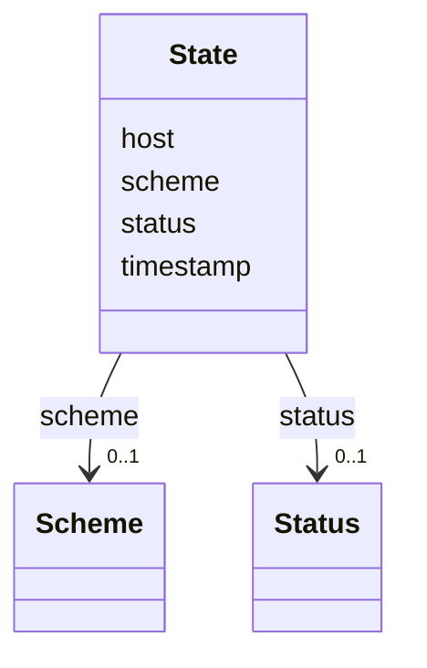

# Class: State

URI:
[https://w3id.org/omero-quay/manifest/:State](https://w3id.org/omero-quay/manifest/:State)



<!-- no inheritance hierarchy -->

## Slots

| Name                      | Cardinality and Range          | Description | Inheritance |
| ------------------------- | ------------------------------ | ----------- | ----------- |
| [scheme](scheme.md)       | 0..1 <br/> [Scheme](Scheme.md) |             | direct      |
| [status](status.md)       | 0..1 <br/> [Status](Status.md) |             | direct      |
| [timestamp](timestamp.md) | 0..1 <br/> [String](String.md) |             | direct      |
| [host](host.md)           | 0..1 <br/> [String](String.md) |             | direct      |

## Usages

| used by                                   | used in             | type  | used              |
| ----------------------------------------- | ------------------- | ----- | ----------------- |
| [NamedThing](NamedThing.md)               | [states](states.md) | range | [State](State.md) |
| [User](User.md)                           | [states](states.md) | range | [State](State.md) |
| [DataLink](DataLink.md)                   | [states](states.md) | range | [State](State.md) |
| [Collection](Collection.md)               | [states](states.md) | range | [State](State.md) |
| [Manifest](Manifest.md)                   | [states](states.md) | range | [State](State.md) |
| [Investigation](Investigation.md)         | [states](states.md) | range | [State](State.md) |
| [Study](Study.md)                         | [states](states.md) | range | [State](State.md) |
| [Assay](Assay.md)                         | [states](states.md) | range | [State](State.md) |
| [Image](Image.md)                         | [states](states.md) | range | [State](State.md) |
| [QuayAnnotation](QuayAnnotation.md)       | [states](states.md) | range | [State](State.md) |
| [FileAnnotation](FileAnnotation.md)       | [states](states.md) | range | [State](State.md) |
| [MapAnnotation](MapAnnotation.md)         | [states](states.md) | range | [State](State.md) |
| [TagAnnotation](TagAnnotation.md)         | [states](states.md) | range | [State](State.md) |
| [CommentAnnotation](CommentAnnotation.md) | [states](states.md) | range | [State](State.md) |
| [File](File.md)                           | [states](states.md) | range | [State](State.md) |

## Identifier and Mapping Information

### Schema Source

- from schema: https://w3id.org/omero-quay/manifest

## Mappings

| Mapping Type | Mapped Value                                |
| ------------ | ------------------------------------------- |
| self         | https://w3id.org/omero-quay/manifest/:State |
| native       | https://w3id.org/omero-quay/manifest/:State |

## LinkML Source

<!-- TODO: investigate https://stackoverflow.com/questions/37606292/how-to-create-tabbed-code-blocks-in-mkdocs-or-sphinx -->

### Direct

<details>
```yaml
name: State
from_schema: https://w3id.org/omero-quay/manifest
slots:
- scheme
- status
- timestamp
- host

````
</details>

### Induced

<details>
```yaml
name: State
from_schema: https://w3id.org/omero-quay/manifest
attributes:
  scheme:
    name: scheme
    from_schema: https://w3id.org/omero-quay/manifest
    rank: 1000
    alias: scheme
    owner: State
    domain_of:
    - State
    range: Scheme
  status:
    name: status
    from_schema: https://w3id.org/omero-quay/manifest
    rank: 1000
    alias: status
    owner: State
    domain_of:
    - State
    range: Status
  timestamp:
    name: timestamp
    from_schema: https://w3id.org/omero-quay/manifest
    rank: 1000
    alias: timestamp
    owner: State
    domain_of:
    - State
    range: string
  host:
    name: host
    from_schema: https://w3id.org/omero-quay/manifest
    rank: 1000
    alias: host
    owner: State
    domain_of:
    - State
    range: string

````

</details>
