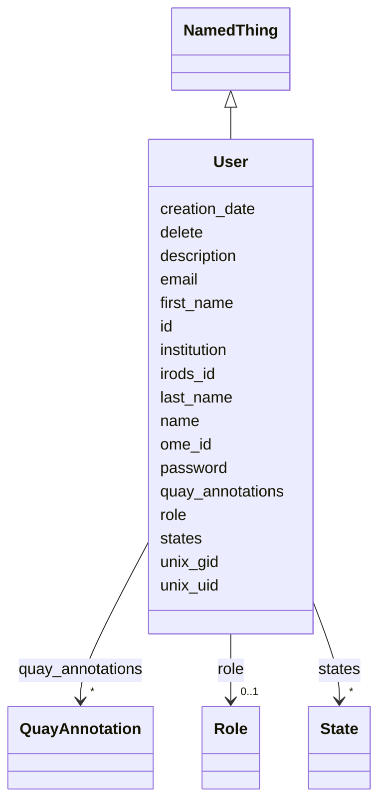

# Class: User

_Represents a user in the system - this user can log into iRODS and omero and
samnba_

URI:
[ome:Experimenter](https://www.openmicroscopy.org/Schemas/Documentation/Generated/OME-2016-06/ome.html#Experimenter)



## Inheritance

- [NamedThing](NamedThing.md)
  - **User**

## Slots

| Name                                    | Cardinality and Range                                                                                                                                                                                                                                                      | Description                                | Inheritance                 |
| --------------------------------------- | -------------------------------------------------------------------------------------------------------------------------------------------------------------------------------------------------------------------------------------------------------------------------- | ------------------------------------------ | --------------------------- |
| [email](email.md)                       | 1 <br/> [String](String.md)                                                                                                                                                                                                                                                |                                            | direct                      |
| [first_name](first_name.md)             | 1 <br/> [String](String.md)                                                                                                                                                                                                                                                |                                            | direct                      |
| [last_name](last_name.md)               | 1 <br/> [String](String.md)                                                                                                                                                                                                                                                |                                            | direct                      |
| [role](role.md)                         | 0..1 <br/> [Role](Role.md)                                                                                                                                                                                                                                                 |                                            | direct                      |
| [institution](institution.md)           | 0..1 <br/> [String](String.md)                                                                                                                                                                                                                                             |                                            | direct                      |
| [password](password.md)                 | 0..1 <br/> [String](String.md)                                                                                                                                                                                                                                             |                                            | direct                      |
| [unix_uid](unix_uid.md)                 | 0..1 <br/> [Integer](Integer.md)                                                                                                                                                                                                                                           | user id that can be used in a unix system  | direct                      |
| [unix_gid](unix_gid.md)                 | 0..1 <br/> [Integer](Integer.md)                                                                                                                                                                                                                                           | group id that can be used in a unix system | direct                      |
| [id](id.md)                             | 1 <br/> [String](String.md)                                                                                                                                                                                                                                                |                                            | [NamedThing](NamedThing.md) |
| [name](name.md)                         | 1 <br/> [String](String.md)                                                                                                                                                                                                                                                |                                            | [NamedThing](NamedThing.md) |
| [description](description.md)           | 0..1 <br/> [String](String.md)                                                                                                                                                                                                                                             |                                            | [NamedThing](NamedThing.md) |
| [creation_date](creation_date.md)       | 0..1 <br/> [String](String.md)                                                                                                                                                                                                                                             |                                            | [NamedThing](NamedThing.md) |
| [quay_annotations](quay_annotations.md) | \* <br/> [QuayAnnotation](QuayAnnotation.md)&nbsp;or&nbsp;<br />[TagAnnotation](TagAnnotation.md)&nbsp;or&nbsp;<br />[MapAnnotation](MapAnnotation.md)&nbsp;or&nbsp;<br />[FileAnnotation](FileAnnotation.md)&nbsp;or&nbsp;<br />[CommentAnnotation](CommentAnnotation.md) |                                            | [NamedThing](NamedThing.md) |
| [ome_id](ome_id.md)                     | 0..1 <br/> [Integer](Integer.md)                                                                                                                                                                                                                                           |                                            | [NamedThing](NamedThing.md) |
| [irods_id](irods_id.md)                 | 0..1 <br/> [Integer](Integer.md)                                                                                                                                                                                                                                           |                                            | [NamedThing](NamedThing.md) |
| [delete](delete.md)                     | 0..1 <br/> [Boolean](Boolean.md)                                                                                                                                                                                                                                           |                                            | [NamedThing](NamedThing.md) |
| [states](states.md)                     | \* <br/> [State](State.md)                                                                                                                                                                                                                                                 |                                            | [NamedThing](NamedThing.md) |

## Usages

| used by                           | used in               | type  | used            |
| --------------------------------- | --------------------- | ----- | --------------- |
| [DataLink](DataLink.md)           | [owner](owner.md)     | range | [User](User.md) |
| [Collection](Collection.md)       | [owner](owner.md)     | range | [User](User.md) |
| [Manifest](Manifest.md)           | [manager](manager.md) | range | [User](User.md) |
| [Investigation](Investigation.md) | [members](members.md) | range | [User](User.md) |
| [Investigation](Investigation.md) | [owner](owner.md)     | range | [User](User.md) |
| [Study](Study.md)                 | [owner](owner.md)     | range | [User](User.md) |
| [Assay](Assay.md)                 | [owner](owner.md)     | range | [User](User.md) |
| [Image](Image.md)                 | [owner](owner.md)     | range | [User](User.md) |
| [File](File.md)                   | [owner](owner.md)     | range | [User](User.md) |

## Identifier and Mapping Information

### Schema Source

- from schema: https://w3id.org/omero-quay/manifest

## Mappings

| Mapping Type | Mapped Value                               |
| ------------ | ------------------------------------------ |
| self         | ome:Experimenter                           |
| native       | https://w3id.org/omero-quay/manifest/:User |
| narrow       | schema:Person, irods:user-name             |

## LinkML Source

<!-- TODO: investigate https://stackoverflow.com/questions/37606292/how-to-create-tabbed-code-blocks-in-mkdocs-or-sphinx -->

### Direct

<details>
```yaml
name: User
description: Represents a user in the system - this user can log into iRODS and omero
  and samnba
from_schema: https://w3id.org/omero-quay/manifest
narrow_mappings:
- schema:Person
- irods:user-name
is_a: NamedThing
slots:
- email
- first_name
- last_name
- role
- institution
- password
- unix_uid
- unix_gid
slot_usage:
  name:
    name: name
    domain_of:
    - NamedThing
    required: true
  email:
    name: email
    domain_of:
    - User
    required: true
    pattern: ^\S+@[\S+\.]+\S+
  first_name:
    name: first_name
    domain_of:
    - User
    required: true
  last_name:
    name: last_name
    domain_of:
    - User
    required: true
class_uri: ome:Experimenter

````
</details>

### Induced

<details>
```yaml
name: User
description: Represents a user in the system - this user can log into iRODS and omero
  and samnba
from_schema: https://w3id.org/omero-quay/manifest
narrow_mappings:
- schema:Person
- irods:user-name
is_a: NamedThing
slot_usage:
  name:
    name: name
    domain_of:
    - NamedThing
    required: true
  email:
    name: email
    domain_of:
    - User
    required: true
    pattern: ^\S+@[\S+\.]+\S+
  first_name:
    name: first_name
    domain_of:
    - User
    required: true
  last_name:
    name: last_name
    domain_of:
    - User
    required: true
attributes:
  email:
    name: email
    from_schema: https://w3id.org/omero-quay/manifest
    rank: 1000
    alias: email
    owner: User
    domain_of:
    - User
    range: string
    required: true
    pattern: ^\S+@[\S+\.]+\S+
  first_name:
    name: first_name
    from_schema: https://w3id.org/omero-quay/manifest
    rank: 1000
    alias: first_name
    owner: User
    domain_of:
    - User
    range: string
    required: true
  last_name:
    name: last_name
    from_schema: https://w3id.org/omero-quay/manifest
    rank: 1000
    alias: last_name
    owner: User
    domain_of:
    - User
    range: string
    required: true
  role:
    name: role
    from_schema: https://w3id.org/omero-quay/manifest
    rank: 1000
    alias: role
    owner: User
    domain_of:
    - User
    range: Role
  institution:
    name: institution
    from_schema: https://w3id.org/omero-quay/manifest
    rank: 1000
    alias: institution
    owner: User
    domain_of:
    - User
    range: string
  password:
    name: password
    from_schema: https://w3id.org/omero-quay/manifest
    rank: 1000
    alias: password
    owner: User
    domain_of:
    - User
    range: string
  unix_uid:
    name: unix_uid
    description: user id that can be used in a unix system
    from_schema: https://w3id.org/omero-quay/manifest
    rank: 1000
    slot_uri: schema:identifier
    alias: unix_uid
    owner: User
    domain_of:
    - User
    range: integer
  unix_gid:
    name: unix_gid
    description: group id that can be used in a unix system
    from_schema: https://w3id.org/omero-quay/manifest
    rank: 1000
    slot_uri: schema:identifier
    alias: unix_gid
    owner: User
    domain_of:
    - User
    range: integer
  id:
    name: id
    from_schema: https://w3id.org/omero-quay/manifest
    rank: 1000
    slot_uri: schema:identifier
    identifier: true
    alias: id
    owner: User
    domain_of:
    - NamedThing
    range: string
    required: true
  name:
    name: name
    from_schema: https://w3id.org/omero-quay/manifest
    rank: 1000
    alias: name
    owner: User
    domain_of:
    - NamedThing
    range: string
    required: true
  description:
    name: description
    from_schema: https://w3id.org/omero-quay/manifest
    aliases:
    - ome:description
    rank: 1000
    alias: description
    owner: User
    domain_of:
    - NamedThing
    range: string
  creation_date:
    name: creation_date
    from_schema: https://w3id.org/omero-quay/manifest
    rank: 1000
    alias: creation_date
    owner: User
    domain_of:
    - NamedThing
    range: string
  quay_annotations:
    name: quay_annotations
    from_schema: https://w3id.org/omero-quay/manifest
    mappings:
    - ome:annotation_ref
    rank: 1000
    alias: quay_annotations
    owner: User
    domain_of:
    - NamedThing
    - Manifest
    - Image
    range: QuayAnnotation
    multivalued: true
    any_of:
    - range: TagAnnotation
    - range: MapAnnotation
    - range: FileAnnotation
    - range: CommentAnnotation
  ome_id:
    name: ome_id
    from_schema: https://w3id.org/omero-quay/manifest
    mappings:
    - ome:id
    rank: 1000
    slot_uri: schema:identifier
    alias: ome_id
    owner: User
    domain_of:
    - NamedThing
    range: integer
  irods_id:
    name: irods_id
    from_schema: https://w3id.org/omero-quay/manifest
    mappings:
    - irods:id
    rank: 1000
    slot_uri: schema:identifier
    alias: irods_id
    owner: User
    domain_of:
    - NamedThing
    range: integer
  delete:
    name: delete
    from_schema: https://w3id.org/omero-quay/manifest
    rank: 1000
    ifabsent: 'False'
    alias: delete
    owner: User
    domain_of:
    - NamedThing
    - Collection
    range: boolean
  states:
    name: states
    from_schema: https://w3id.org/omero-quay/manifest
    rank: 1000
    alias: states
    owner: User
    domain_of:
    - NamedThing
    - Manifest
    range: State
    multivalued: true
    inlined: true
    inlined_as_list: true
class_uri: ome:Experimenter

````

</details>
