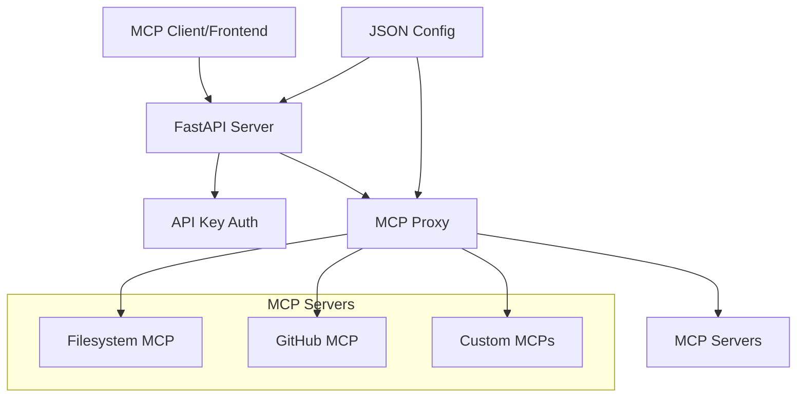
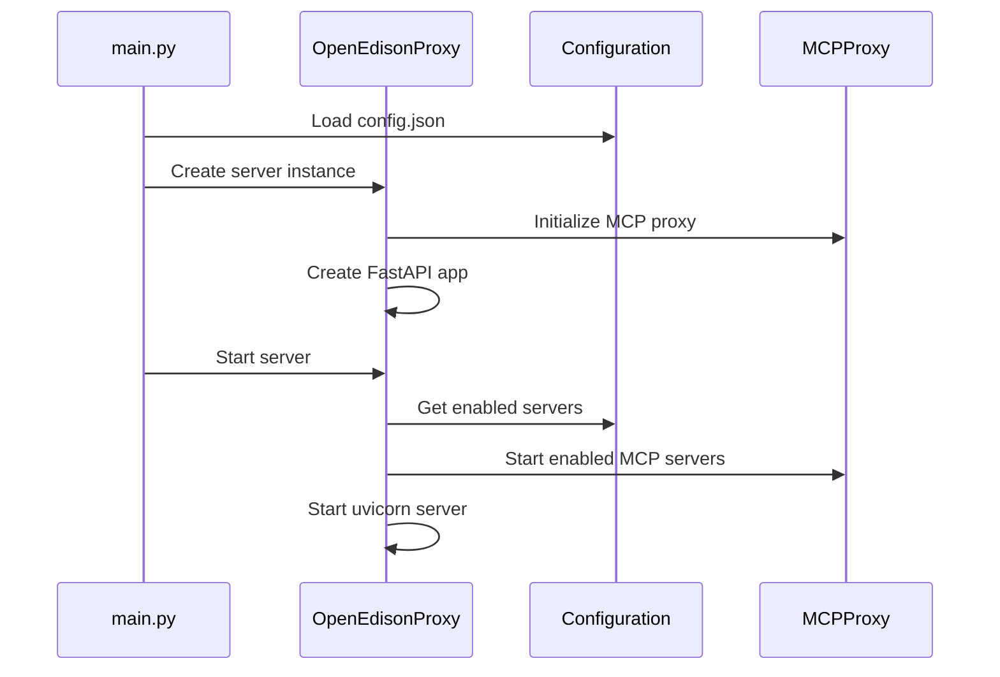
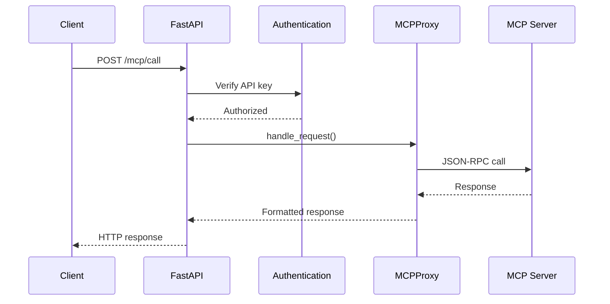

# Open Edison Development Guide

This document provides a comprehensive overview of Open Edison's architecture, design decisions, and development patterns for contributors and maintainers.

## Table of Contents

- [Architecture Overview](#architecture-overview)
- [Core Components](#core-components)
- [Data Flow](#data-flow)
- [Configuration System](#configuration-system)
- [API Design](#api-design)
- [Development Workflow](#development-workflow)
- [Testing Strategy](#testing-strategy)
- [Extension Points](#extension-points)
- [Code Organization](#code-organization)
- [Design Decisions](#design-decisions)

## Architecture Overview

Open Edison is a single-user MCP (Model Context Protocol) proxy server designed for simplicity and ease of use. Unlike its commercial counterpart edison.watch, it focuses on local deployment without multi-user complexity.



### Key Design Principles

1. **Simplicity First** - No database, no complex auth, just JSON config
2. **Single User** - No multi-tenancy concerns
3. **Local Deployment** - Designed for self-hosting
4. **Extensible** - Easy to add new MCP servers and features
5. **Development Friendly** - Clear separation of concerns

## Core Components

### 1. FastAPI Server (`src/server.py`)

The main HTTP server that provides the REST API interface.

**Responsibilities:**

- HTTP request handling
- API key authentication
- Route management
- Error handling and logging
- Server lifecycle management

**Key Classes:**

- `OpenEdisonProxy` - Main server class

### 2. MCP Proxy (`src/proxy.py`)

Manages MCP server processes and handles communication.

**Responsibilities:**

- MCP server process management (start/stop)
- Process health monitoring
- Request routing to appropriate MCP servers
- JSON-RPC communication (future implementation)

**Key Classes:**

- `MCPProxy` - Core proxy logic

### 3. Configuration System (`src/config.py`)

JSON-based configuration management with dataclasses.

**Responsibilities:**

- Configuration loading and validation
- Default configuration generation
- Type-safe configuration access
- Configuration persistence

**Key Classes:**

- `Config` - Main configuration container
- `ServerConfig` - Server-specific settings
- `LoggingConfig` - Logging configuration
- `MCPServerConfig` - Individual MCP server configuration

## Data Flow

### Server Startup Flow



### MCP Request Flow



## Configuration System

### Configuration Structure

```json
{
  "server": {
    "host": "localhost",
    "port": 3000,
    "api_key": "your-secure-key"
  },
  "logging": {
    "level": "INFO",
    "database_path": "sessions.db"
  },
  "mcp_servers": [
    {
      "name": "filesystem",
      "command": "uvx",
      "args": ["mcp-server-filesystem", "/path/to/dir"],
      "env": {"CUSTOM_VAR": "value"},
      "enabled": true
    }
  ]
}
```

### Configuration Loading

1. **Default Location**: `config.json` in project root
2. **Auto-generation**: Creates default config if missing
3. **Type Safety**: Uses dataclasses for validation
4. **Environment Support**: Per-server environment variables

### Adding New Configuration Options

```python
@dataclass
class ServerConfig:
    host: str = "localhost"
    port: int = 3000
    api_key: str = "dev-api-key-change-me"
    # Add new options here
    max_connections: int = 100
    timeout: int = 30
```

## API Design

### REST Endpoints

| Method | Endpoint | Description | Auth Required |
|--------|----------|-------------|---------------|
| GET | `/health` | Health check | No |
| GET | `/mcp/status` | Server status | Yes |
| POST | `/mcp/{name}/start` | Start server | Yes |
| POST | `/mcp/{name}/stop` | Stop server | Yes |
| POST | `/mcp/call` | Proxy MCP request | Yes |
| GET | `/sessions` | Get session logs | Yes |

### Authentication

- **Method**: Bearer token authentication
- **Header**: `Authorization: Bearer <api_key>`
- **Storage**: API key stored in configuration
- **Scope**: Global (single-user system)

### Error Handling

```python
# Standard error response format
{
    "detail": "Error message",
    "status_code": 500
}
```

### Response Formats

```python
# Health check
{
    "status": "healthy",
    "version": "0.1.0",
    "mcp_servers": 2
}

# Server status
{
    "servers": [
        {
            "name": "filesystem",
            "enabled": true,
            "running": true
        }
    ]
}
```

## Development Workflow

### Setup

```bash
# Install dependencies
make sync

# Create default configuration
make setup

# Run in development mode
make dev
```

### Code Quality

```bash
# Lint code
make lint

# Format code
make format

# Run tests
make test

# Full CI check
make ci
```

### Development Server

- **Auto-reload**: Use `make dev` for development
- **Logging**: Structured logging with loguru
- **Configuration**: Edit `config.json` and restart

## Testing Strategy

### Test Organization

```
tests/
├── test_config.py      # Configuration tests
├── test_server.py      # API endpoint tests
└── test_proxy.py       # MCP proxy tests (future)
```

### Test Categories

1. **Unit Tests** - Individual component testing
2. **Integration Tests** - API endpoint testing
3. **Configuration Tests** - Config loading/saving
4. **Future: MCP Tests** - End-to-end MCP communication

### Running Tests

```bash
# All tests
make test

# Specific test file
pytest tests/test_config.py

# With coverage
pytest --cov=src tests/
```

## Extension Points

### 1. Adding New MCP Servers

Update `config.json`:

```json
{
  "mcp_servers": [
    {
      "name": "my-custom-mcp",
      "command": "python",
      "args": ["-m", "my_mcp_package"],
      "env": {"API_KEY": "secret"},
      "enabled": true
    }
  ]
}
```

### 2. Adding New API Endpoints

In `src/server.py`:

```python
@app.get("/my/endpoint", dependencies=[Depends(verify_api_key)])
async def my_endpoint():
    """Custom endpoint"""
    return {"message": "Custom response"}
```

### 3. Custom Authentication

Extend the `verify_api_key` function:

```python
def verify_api_key(credentials: HTTPAuthorizationCredentials = Depends(security)):
    # Custom auth logic here
    if not custom_auth_check(credentials.credentials):
        raise HTTPException(status_code=401, detail="Custom auth failed")
    return credentials.credentials
```

## Code Organization

### Directory Structure

```
src/
├── __init__.py         # Package initialization
├── config.py          # Configuration management
├── server.py          # FastAPI server
├── proxy.py           # MCP proxy logic
└── utils/             # Future utilities
    ├── logging.py     # Session logging (future)
    └── helpers.py     # Common utilities (future)
```

### Import Conventions

```python
# Standard library
import json
from pathlib import Path

# Third party
from fastapi import FastAPI
from loguru import logger as log

# Local imports
from src.config import config
from src.proxy import MCPProxy
```

## Design Decisions

### Why JSON Configuration?

1. **Simplicity** - Easy to edit and understand
2. **No Database** - Reduces complexity for single-user deployment
3. **Version Control Friendly** - Can be committed to git
4. **Portable** - Easy migration between environments

### Why FastAPI?

1. **Type Safety** - Built-in request/response validation
2. **Documentation** - Automatic OpenAPI docs
3. **Performance** - Async support and high performance
4. **Developer Experience** - Excellent tooling and IDE support

### Why Subprocess Management?

1. **Isolation** - Each MCP server runs in its own process
2. **Reliability** - Server crashes don't affect the proxy
3. **Resource Management** - Easy to monitor and restart servers
4. **Compatibility** - Works with any MCP server implementation

### Authentication Strategy

- **Bearer Tokens** - Simple and widely supported
- **Single Key** - Appropriate for single-user deployment
- **Configurable** - Easy to change via config file

## Contributing Guidelines

### Code Style

- Use uv for formatting (`make format`) and Ruff for linting (`make lint`)
- Type hints for all function signatures
- Docstrings for all public functions/classes

### Commit Messages

```
feat: add new MCP server configuration
fix: resolve authentication issue
docs: update development guide
test: add proxy integration tests
```

### Pull Request Process

1. Create feature branch from main
2. Implement changes with tests
3. Run full CI check (`make ci`) and tests (`make test`)
4. Update documentation if needed
5. Submit PR with clear description

---

This development guide should be updated as the project evolves. For questions or clarifications, please refer to the source code or open an issue on GitHub.
