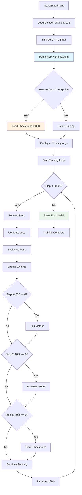

# paGating Training Pipeline Flow

```mermaid
flowchart TD
    A[Start Experiment] --> B[Load Dataset: WikiText-103]
    B --> C[Initialize GPT-2 Small]
    C --> D[Patch MLP with paGating]
    D --> E{Resume from Checkpoint?}
    E -->|Yes| F[Load Checkpoint-10000]
    E -->|No| G[Fresh Training]
    F --> H[Configure Training Args]
    G --> H
    H --> I[Start Training Loop]
    I --> J{Step < 20000?}
    J -->|Yes| K[Forward Pass]
    K --> L[Compute Loss]
    L --> M[Backward Pass]
    M --> N[Update Weights]
    N --> O{Step % 200 == 0?}
    O -->|Yes| P[Log Metrics]
    O -->|No| Q{Step % 1000 == 0?}
    P --> Q
    Q -->|Yes| R[Evaluate Model]
    Q -->|No| S{Step % 5000 == 0?}
    R --> S
    S -->|Yes| T[Save Checkpoint]
    S -->|No| U[Continue Training]
    T --> U
    U --> V[Increment Step]
    V --> J
    J -->|No| W[Save Final Model]
    W --> X[Training Complete]
    
    style D fill:#e1f5fe
    style F fill:#fff3e0
    style W fill:#e8f5e8
``` 