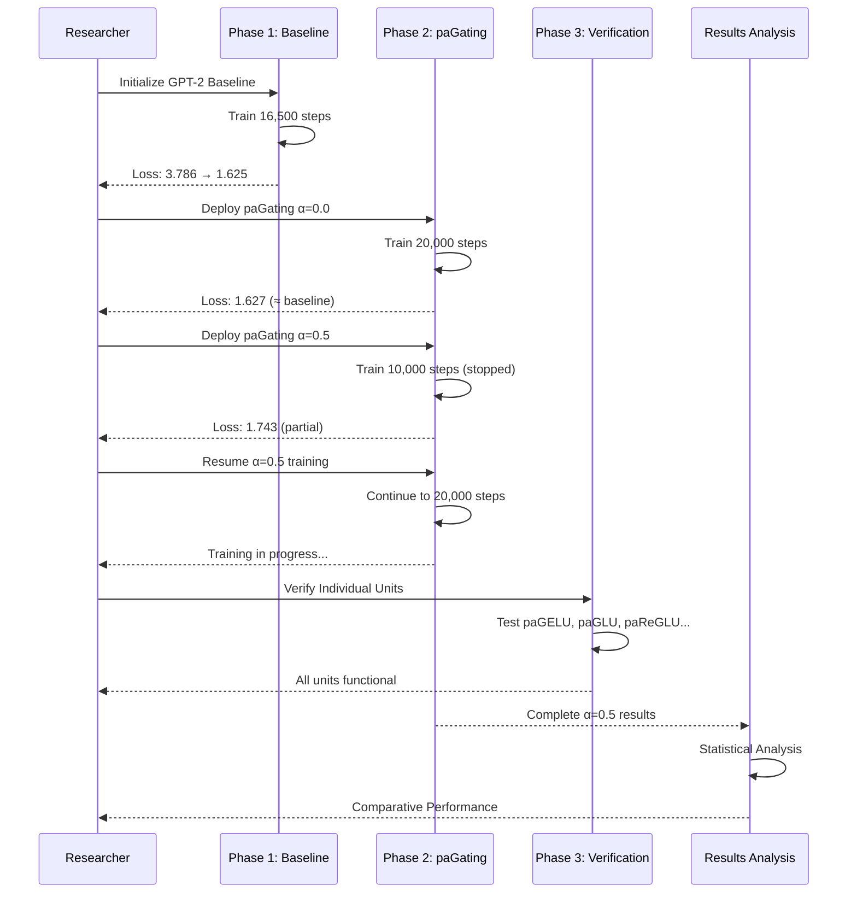

# Experimental Phase Sequence

```mermaid
sequenceDiagram
    participant User as Researcher
    participant Phase1 as Phase 1: Baseline
    participant Phase2 as Phase 2: paGating
    participant Phase3 as Phase 3: Verification
    participant Results as Results Analysis
    
    User->>Phase1: Initialize GPT-2 Baseline
    Phase1->>Phase1: Train 16,500 steps
    Phase1-->>User: Loss: 3.786 → 1.625
    
    User->>Phase2: Deploy paGating α=0.0
    Phase2->>Phase2: Train 20,000 steps
    Phase2-->>User: Loss: 1.627 (≈ baseline)
    
    User->>Phase2: Deploy paGating α=0.5
    Phase2->>Phase2: Train 10,000 steps (stopped)
    Phase2-->>User: Loss: 1.743 (partial)
    
    User->>Phase2: Resume α=0.5 training
    Phase2->>Phase2: Continue to 20,000 steps
    Phase2-->>User: Training in progress...
    
    User->>Phase3: Verify Individual Units
    Phase3->>Phase3: Test paGELU, paGLU, paReGLU...
    Phase3-->>User: All units functional
    
    Phase2-->>Results: Complete α=0.5 results
    Results->>Results: Statistical Analysis
    Results-->>User: Comparative Performance
``` 