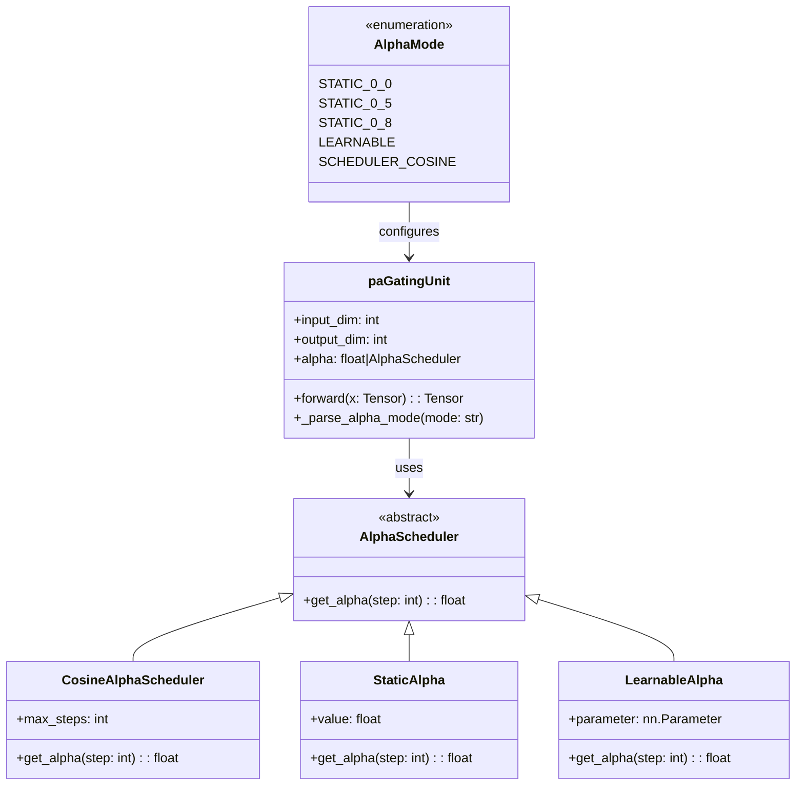

# paGating Alpha Parameter Control System

```mermaid
classDiagram
    class AlphaMode {
        <<enumeration>>
        STATIC_0_0
        STATIC_0_5
        STATIC_0_8
        LEARNABLE
        SCHEDULER_COSINE
    }
    
    class paGatingUnit {
        +input_dim: int
        +output_dim: int
        +alpha: float|AlphaScheduler
        +forward(x: Tensor): Tensor
        +_parse_alpha_mode(mode: str)
    }
    
    class AlphaScheduler {
        <<abstract>>
        +get_alpha(step: int): float
    }
    
    class CosineAlphaScheduler {
        +max_steps: int
        +get_alpha(step: int): float
    }
    
    class StaticAlpha {
        +value: float
        +get_alpha(step: int): float
    }
    
    class LearnableAlpha {
        +parameter: nn.Parameter
        +get_alpha(step: int): float
    }
    
    AlphaMode --> paGatingUnit : configures
    paGatingUnit --> AlphaScheduler : uses
    AlphaScheduler <|-- CosineAlphaScheduler
    AlphaScheduler <|-- StaticAlpha
    AlphaScheduler <|-- LearnableAlpha
``` 