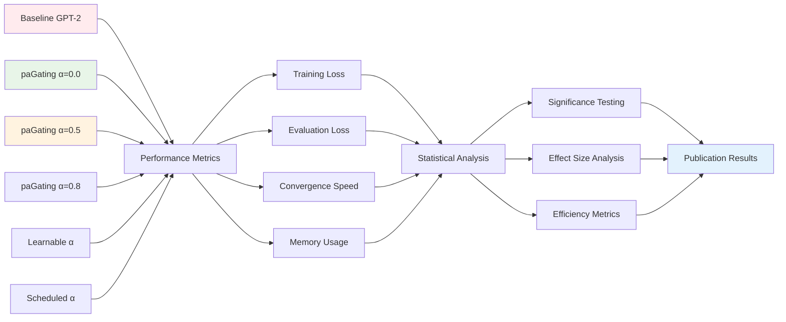

# Experimental Results Comparison Structure

```mermaid
flowchart LR
    A[Baseline GPT-2] --> D[Performance Metrics]
    B[paGating α=0.0] --> D
    C[paGating α=0.5] --> D
    E[paGating α=0.8] --> D
    F[Learnable α] --> D
    G[Scheduled α] --> D
    
    D --> H[Training Loss]
    D --> I[Evaluation Loss]
    D --> J[Convergence Speed]
    D --> K[Memory Usage]
    
    H --> L[Statistical Analysis]
    I --> L
    J --> L
    K --> L
    
    L --> M[Significance Testing]
    L --> N[Effect Size Analysis]
    L --> O[Efficiency Metrics]
    
    M --> P[Publication Results]
    N --> P
    O --> P
    
    style A fill:#ffebee
    style B fill:#e8f5e8
    style C fill:#fff3e0
    style P fill:#e3f2fd
``` 