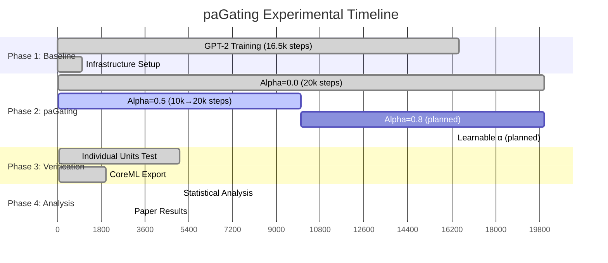

# Current Training Status Timeline

```mermaid
gantt
    title paGating Experimental Timeline
    dateFormat X
    axisFormat %s
    
    section Phase 1: Baseline
    GPT-2 Training (16.5k steps) :done, baseline, 0, 16500
    Infrastructure Setup :done, infra, 0, 1000
    
    section Phase 2: paGating
    Alpha=0.0 (20k steps) :done, alpha0, 16500, 20000
    Alpha=0.5 (10k→20k steps) :active, alpha5, 36500, 10000
    Alpha=0.8 (planned) :alpha8, after alpha5, 20000
    Learnable α (planned) :learn, after alpha8, 20000
    
    section Phase 3: Verification
    Individual Units Test :done, units, 56500, 5000
    CoreML Export :done, export, 61500, 2000
    
    section Phase 4: Analysis
    Statistical Analysis :stats, after learn, 5000
    Paper Results :paper, after stats, 3000
``` 