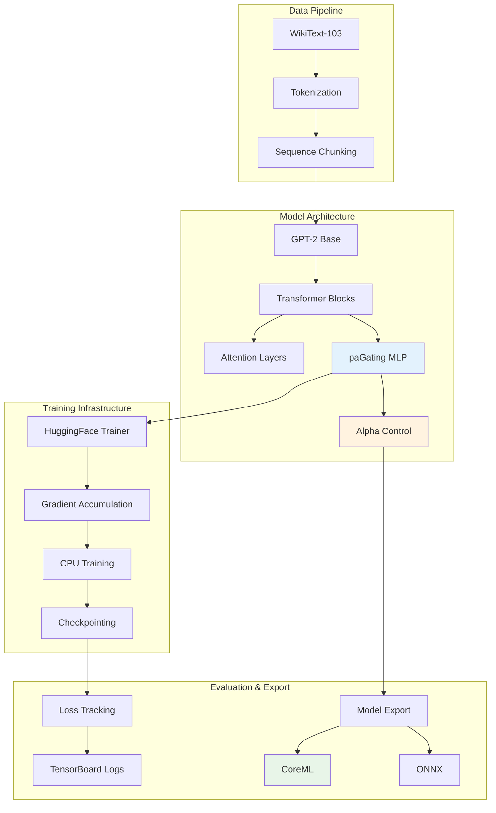

# System Architecture Overview

```mermaid
graph TB
    subgraph "Data Pipeline"
        A[WikiText-103] --> B[Tokenization]
        B --> C[Sequence Chunking]
    end
    
    subgraph "Model Architecture"
        D[GPT-2 Base] --> E[Transformer Blocks]
        E --> F[Attention Layers]
        E --> G[paGating MLP]
        G --> H[Alpha Control]
    end
    
    subgraph "Training Infrastructure"
        I[HuggingFace Trainer] --> J[Gradient Accumulation]
        J --> K[CPU Training]
        K --> L[Checkpointing]
    end
    
    subgraph "Evaluation & Export"
        M[Loss Tracking] --> N[TensorBoard Logs]
        O[Model Export] --> P[CoreML]
        O --> Q[ONNX]
    end
    
    C --> D
    G --> I
    L --> M
    H --> O
    
    style G fill:#e3f2fd
    style H fill:#fff3e0
    style P fill:#e8f5e8
``` 