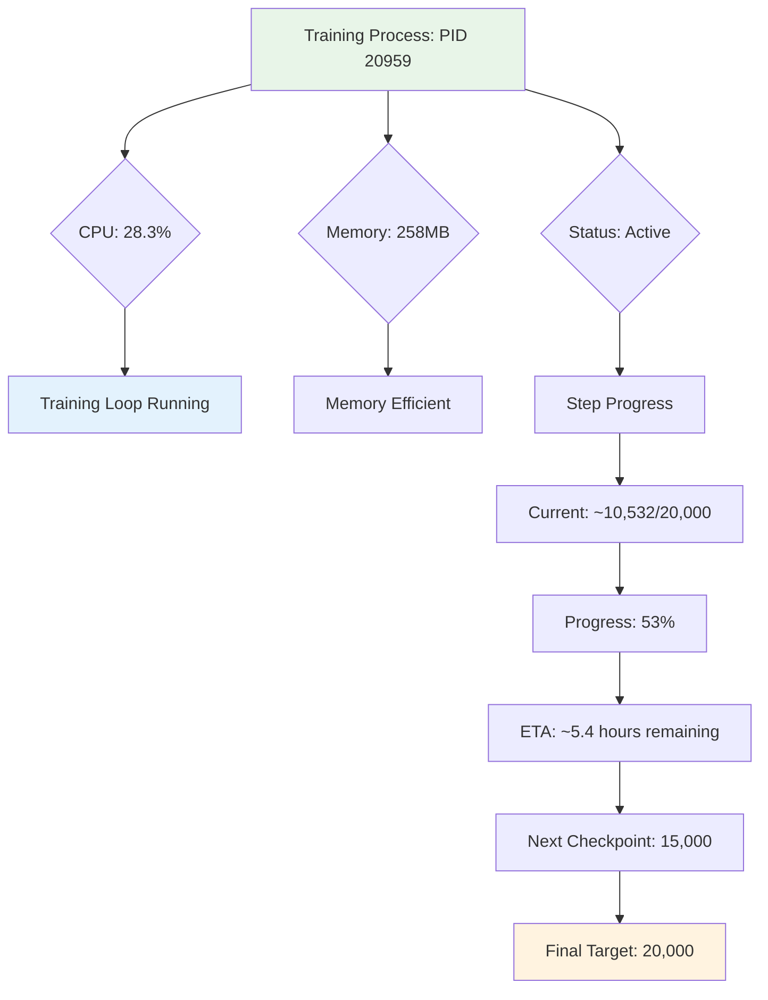

# Performance Monitoring Dashboard

```mermaid
flowchart TD
    A[Training Process: PID 20959] --> B{CPU: 28.3%}
    A --> C{Memory: 258MB}
    A --> D{Status: Active}
    
    B --> E[Training Loop Running]
    C --> F[Memory Efficient]
    D --> G[Step Progress]
    
    G --> H[Current: ~10,532/20,000]
    H --> I[Progress: 53%]
    I --> J[ETA: ~5.4 hours remaining]
    
    J --> K[Next Checkpoint: 15,000]
    K --> L[Final Target: 20,000]
    
    style A fill:#e8f5e8
    style E fill:#e3f2fd
    style L fill:#fff3e0
``` 