# paGating Framework: Architecture & Experimental Diagrams

This document provides comprehensive visual documentation of the paGating framework implementation, experimental setup, and current status.

## Table of Contents

1. [Training Pipeline Flow](#1-training-pipeline-flow)
2. [paGating Architecture Data Flow](#2-pagating-architecture-data-flow)  
3. [Experimental Phase Sequence](#3-experimental-phase-sequence)
4. [Alpha Parameter Control System](#4-alpha-parameter-control-system)
5. [Results Comparison Structure](#5-results-comparison-structure)
6. [Training Timeline](#6-training-timeline)
7. [System Architecture Overview](#7-system-architecture-overview)
8. [Performance Monitoring Dashboard](#8-performance-monitoring-dashboard)

---

## 1. Training Pipeline Flow

Shows the complete training workflow from experiment start to completion, including checkpoint resumption logic.


---

## 2. paGating Architecture Data Flow

Illustrates how data flows through the paGating unit and the alpha-controlled gating mechanism.

```mermaid
graph TD
    A[Input Tokens: x] --> B[GPT-2 Transformer Blocks]
    B --> C[MLP Layer]
    C --> D[Linear: fc_in]
    D --> E[paGating Unit]
    E --> F[Gate Branch: Linear → Sigmoid]
    E --> G[Value Branch: Activation Function]
    F --> H[Alpha Parameter: α]
    G --> I[Element-wise Multiply]
    H --> I
    I --> J[Linear: fc_out]
    J --> K[Next Block/Output]
    
    subgraph "paGating Unit Detail"
        L[Input: h] --> M[gate = σ(W_g × h)]
        L --> N[value = activation(W_v × h)]
        M --> O[α × gate]
        N --> P[(1-α) × value]
        O --> Q[Gated Output]
        P --> Q
        Q --> R[α × gate + (1-α) × value]
    end
    
    style E fill:#e3f2fd
    style H fill:#fff3e0
    style I fill:#e8f5e8
```

---

## 3. Experimental Phase Sequence

Timeline of experimental phases showing interaction between researcher and different experimental components.

```mermaid
sequenceDiagram
    participant User as Researcher
    participant Phase1 as Phase 1: Baseline
    participant Phase2 as Phase 2: paGating
    participant Phase3 as Phase 3: Verification
    participant Results as Results Analysis
    
    User->>Phase1: Initialize GPT-2 Baseline
    Phase1->>Phase1: Train 16,500 steps
    Phase1-->>User: Loss: 3.786 → 1.625
    
    User->>Phase2: Deploy paGating α=0.0
    Phase2->>Phase2: Train 20,000 steps
    Phase2-->>User: Loss: 1.627 (≈ baseline)
    
    User->>Phase2: Deploy paGating α=0.5
    Phase2->>Phase2: Train 10,000 steps (stopped)
    Phase2-->>User: Loss: 1.743 (partial)
    
    User->>Phase2: Resume α=0.5 training
    Phase2->>Phase2: Continue to 20,000 steps
    Phase2-->>User: Training in progress...
    
    User->>Phase3: Verify Individual Units
    Phase3->>Phase3: Test paGELU, paGLU, paReGLU...
    Phase3-->>User: All units functional
    
    Phase2-->>Results: Complete α=0.5 results
    Results->>Results: Statistical Analysis
    Results-->>User: Comparative Performance
```



---

## 4. Alpha Parameter Control System

Class diagram showing the architecture of the alpha parameter control system with different modes.


---

## 5. Results Comparison Structure

Framework for comparing different paGating configurations and analyzing experimental results.

```mermaid
flowchart LR
    A[Baseline GPT-2] --> D[Performance Metrics]
    B[paGating α=0.0] --> D
    C[paGating α=0.5] --> D
    E[paGating α=0.8] --> D
    F[Learnable α] --> D
    G[Scheduled α] --> D
    
    D --> H[Training Loss]
    D --> I[Evaluation Loss]
    D --> J[Convergence Speed]
    D --> K[Memory Usage]
    
    H --> L[Statistical Analysis]
    I --> L
    J --> L
    K --> L
    
    L --> M[Significance Testing]
    L --> N[Effect Size Analysis]
    L --> O[Efficiency Metrics]
    
    M --> P[Publication Results]
    N --> P
    O --> P
    
    style A fill:#ffebee
    style B fill:#e8f5e8
    style C fill:#fff3e0
    style P fill:#e3f2fd
```



---

## 6. Training Timeline

Gantt chart showing the experimental timeline with completed, active, and planned phases.


---

## 7. System Architecture Overview

High-level view of the complete paGating system showing data pipeline, model architecture, training infrastructure, and export capabilities.


---

## 8. Performance Monitoring Dashboard

Real-time view of current training status and system performance metrics.


---

## Current Experimental Status

- **✅ Phase 1**: Baseline GPT-2 training completed (16,500 steps)
- **✅ Phase 2a**: paGating α=0.0 training completed (20,000 steps)  
- **🔄 Phase 2b**: paGating α=0.5 training in progress (53% complete)
- **📋 Phase 2c**: paGating α=0.8 planned
- **✅ Phase 3**: Individual unit verification completed
- **📋 Phase 4**: Statistical analysis pending completion of Phase 2

## Key Findings

1. **Framework Validation**: α=0.0 performs identically to baseline (1.627 vs 1.625 loss)
2. **Active Training**: α=0.5 experiment successfully resumed and running  
3. **Infrastructure**: Complete experimental pipeline operational
4. **Export Ready**: CoreML export capabilities validated

---

*Generated for paGating Framework Research Project* 