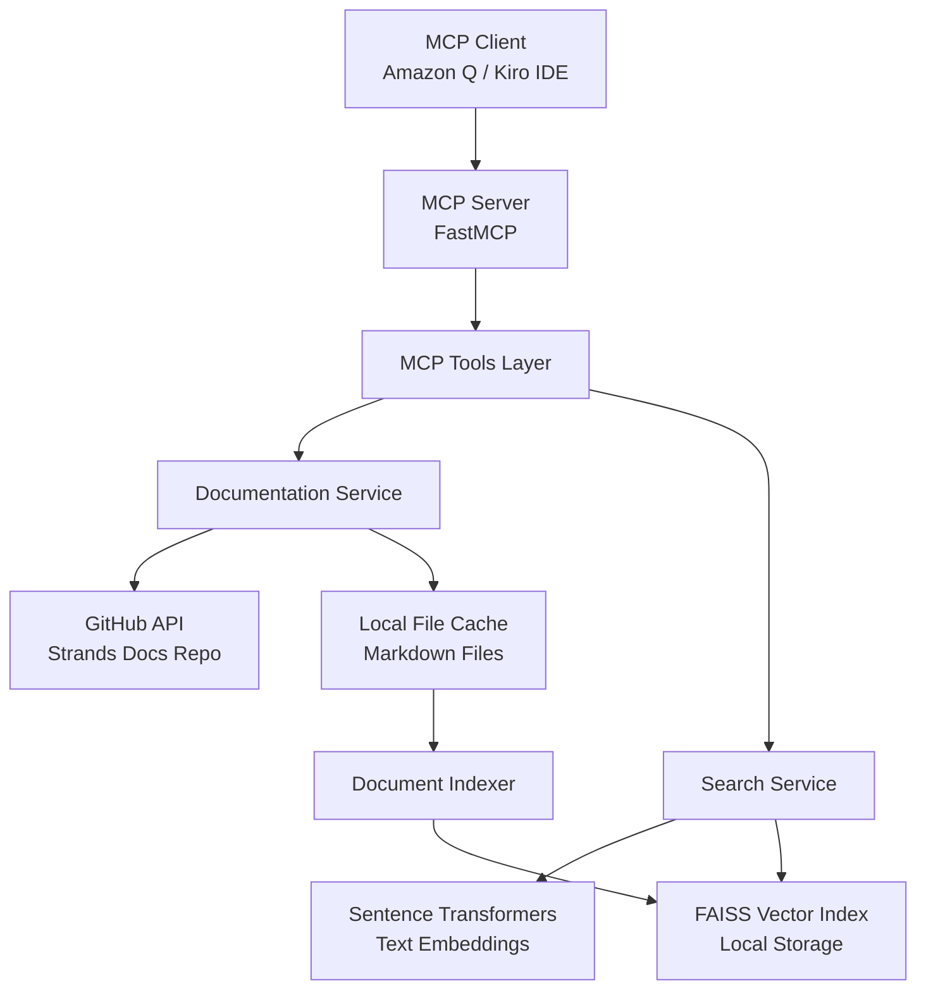

# Design Document

## Overview

The Strands Documentation Search MCP Server is a Python-based service that implements the Model Context Protocol to provide semantic search capabilities over Strands Agent SDK documentation. The server uses the FastMCP framework for rapid development and integrates with vector search technology to enable intelligent documentation retrieval.

The system follows a layered architecture with clear separation between MCP protocol handling, business logic, and data persistence. It leverages GitHub's API to fetch documentation content and uses local caching with periodic updates to balance freshness with performance.

## Architecture



## Components and Interfaces

### MCP Server Layer
- **FastMCP Server**: Main entry point implementing MCP protocol
- **Tool Registry**: Registers and manages available MCP tools
- **Error Handler**: Centralized error handling and logging

### Tools Layer
- **SearchDocumentationTool**: Primary search interface
  - Input: search query string, optional filters
  - Output: ranked list of documentation snippets with metadata
- **ListDocumentationTool**: Browse available documentation sections
  - Input: optional category filter
  - Output: structured list of available documents

### Services Layer
- **DocumentationService**: Manages documentation lifecycle
  - `fetch_latest_docs()`: Downloads from GitHub
  - `check_for_updates()`: Compares local vs remote versions
  - `get_cached_docs()`: Retrieves local documentation
- **SearchService**: Handles search operations
  - `semantic_search(query, limit)`: Performs vector similarity search
  - `build_index()`: Creates/updates vector embeddings
  - `rank_results()`: Applies relevance scoring

### Data Models
- **DocumentChunk**: Represents indexed content pieces
  - `content`: Text content
  - `title`: Document title
  - `source_url`: GitHub source URL
  - `section`: Document section
  - `embedding`: Vector representation
- **SearchResult**: Search response structure
  - `title`: Document title
  - `snippet`: Relevant content excerpt
  - `source_url`: Link to full document
  - `relevance_score`: Similarity score

## Data Models

### Document Storage
```python
@dataclass
class DocumentChunk:
    id: str
    title: str
    content: str
    source_url: str
    section: str
    file_path: str
    last_modified: datetime
    embedding: Optional[List[float]] = None

@dataclass
class DocumentIndex:
    version: str
    last_updated: datetime
    chunks: List[DocumentChunk]
    embedding_model: str
```

### Search Interface
```python
@dataclass
class SearchQuery:
    query: str
    limit: int = 10
    min_score: float = 0.5

@dataclass
class SearchResult:
    title: str
    snippet: str
    source_url: str
    relevance_score: float
    section: str
```

## Error Handling

### Network Errors
- Implement exponential backoff for GitHub API calls
- Fallback to cached documentation when remote fetch fails
- Graceful degradation with appropriate user messaging

### Search Errors
- Validate search queries for length and content
- Handle empty result sets with helpful suggestions
- Manage vector index corruption with automatic rebuilding

### System Errors
- Comprehensive logging with structured format
- Clear error messages for MCP protocol violations
- Graceful shutdown on critical failures

## Testing Strategy

### Unit Tests
- Mock GitHub API responses for documentation service
- Test vector search accuracy with known document sets
- Validate MCP tool input/output schemas
- Test error handling scenarios

### Integration Tests
- End-to-end MCP protocol communication
- Real GitHub API integration with rate limiting
- Vector index persistence and retrieval
- Search result quality validation

### Performance Tests
- Search response time benchmarks
- Memory usage during large document indexing
- Concurrent search request handling
- Index rebuild performance metrics