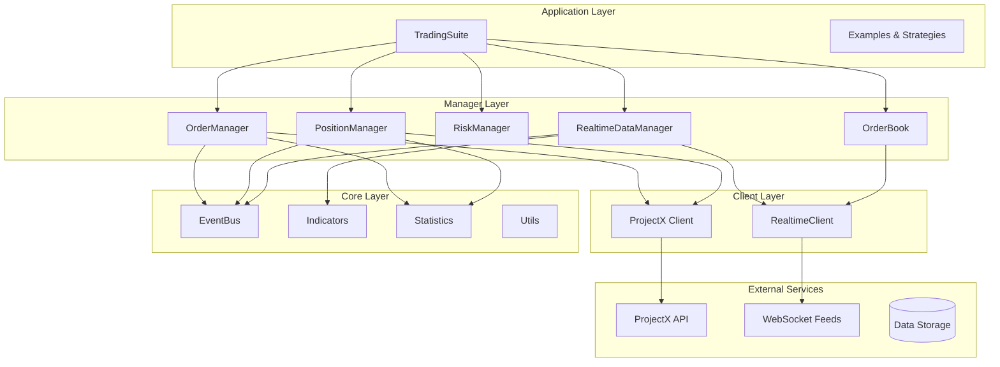
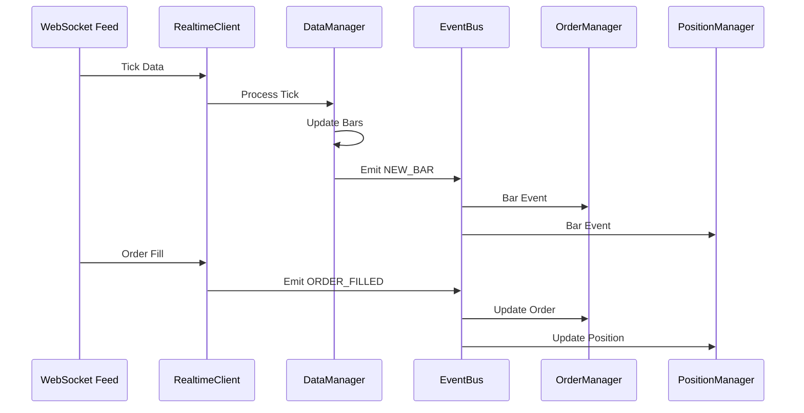
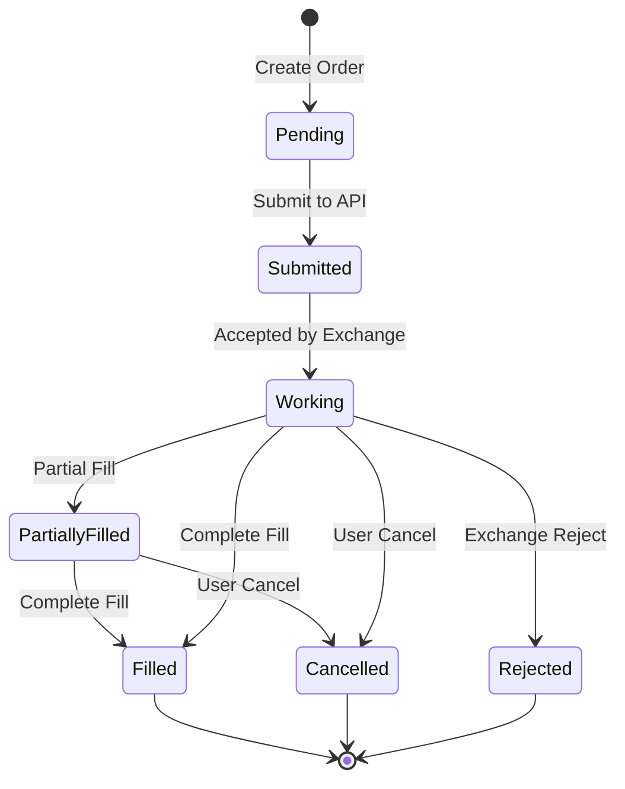

# Architecture Guide

This guide explains the architecture and design patterns of the ProjectX Python SDK v3.3.4. Learn about the async-first design, component interactions, and architectural decisions that enable high-performance futures trading.

## Architecture Overview

The ProjectX SDK is built with a modern, async-first architecture optimized for high-frequency trading and real-time data processing.

### Key Architectural Principles

1. **100% Async Architecture**: All operations use async/await for maximum concurrency
2. **Event-Driven Design**: Components communicate through a unified event system
3. **Dependency Injection**: Components receive dependencies rather than creating them
4. **Protocol-Based Interfaces**: Type-safe contracts between components
5. **Memory Efficiency**: Sliding windows and automatic cleanup prevent memory leaks
6. **Performance Optimization**: Polars DataFrames and efficient data structures

### High-Level Architecture



## Core Components

### TradingSuite (Application Layer)

The `TradingSuite` is the primary entry point that orchestrates all components:

```python
class TradingSuite:
    """Unified trading suite with integrated components."""

    def __init__(
        self,
        client: ProjectXClientProtocol,
        realtime_client: ProjectXRealtimeClient,
        instrument_info: InstrumentInfo,
        timeframes: List[str],
        features: List[Features]
    ):
        self.client = client
        self.realtime_client = realtime_client
        self.instrument_info = instrument_info

        # Core managers (always present)
        self.data = RealtimeDataManager(...)
        self.orders = OrderManager(...)
        self.positions = PositionManager(...)

        # Optional features
        if Features.ORDERBOOK in features:
            self.orderbook = OrderBook(...)
        if Features.RISK_MANAGER in features:
            self.risk_manager = RiskManager(...)

    @classmethod
    async def create(
        cls,
        symbol: str,
        timeframes: List[str] = None,
        features: List[Features] = None,
        **kwargs
    ) -> "TradingSuite":
        """Factory method for proper async initialization."""
        # Initialize all components with proper dependencies
        client = await ProjectX.from_env()
        realtime_client = await ProjectXRealtimeClient.create(...)

        # Create suite with all components
        return cls(client, realtime_client, ...)
```

**Key Responsibilities**:
- Component orchestration and lifecycle management
- Unified API surface for trading operations
- Event coordination between components
- Resource cleanup and connection management

### Client Layer

#### ProjectX Client (HTTP API)

The `ProjectX` client handles all HTTP-based API operations:

```python
class ProjectX(
    AuthMixin,
    HttpMixin,
    MarketDataMixin,
    TradingMixin,
    CacheMixin
):
    """Main HTTP client with modular mixins."""

    def __init__(self, config: ProjectXConfig):
        self._session: Optional[aiohttp.ClientSession] = None
        self._auth_token: Optional[str] = None
        self._config = config

        # Initialize mixins
        self._setup_mixins()

    async def __aenter__(self) -> "ProjectX":
        """Async context manager entry."""
        await self._initialize_session()
        return self

    async def __aexit__(self, *args):
        """Async context manager exit."""
        await self.cleanup()
```

**Modular Mixin Architecture**:

- **AuthMixin**: JWT authentication and token refresh
- **HttpMixin**: HTTP client with retry logic and rate limiting
- **MarketDataMixin**: Historical data retrieval and caching
- **TradingMixin**: Order placement and management
- **CacheMixin**: Intelligent caching for instruments and static data

#### Realtime Client (WebSocket)

The realtime client manages WebSocket connections for live data:

```python
class ProjectXRealtimeClient:
    """WebSocket client for real-time data."""

    def __init__(self, jwt_token: str, base_url: str):
        self._jwt_token = jwt_token
        self._base_url = base_url
        self._event_bus = EventBus()

        # Connection management
        self._market_connection: Optional[HubConnection] = None
        self._user_connection: Optional[HubConnection] = None

        # Circuit breaker for resilience
        self._circuit_breaker = CircuitBreaker()

    async def connect(self) -> None:
        """Establish WebSocket connections."""
        await self._connect_market_data()
        await self._connect_user_data()

    async def subscribe_to_ticks(self, symbol: str) -> None:
        """Subscribe to tick data for symbol."""
        if self._market_connection:
            await self._market_connection.invoke("SubscribeToTicks", symbol)
```

### Manager Layer

Each manager handles a specific domain of trading functionality:

#### Order Manager

Handles order placement, tracking, and lifecycle management:

```python
class OrderManager:
    """Async order management with advanced order types."""

    def __init__(
        self,
        client: ProjectXClientProtocol,
        realtime_client: Optional[ProjectXRealtimeClient] = None
    ):
        self._client = client
        self._realtime_client = realtime_client
        self._orders: Dict[str, Order] = {}
        self._order_lock = asyncio.RWLock()

    async def place_bracket_order(
        self,
        contract_id: str,
        side: int,
        size: int,
        stop_offset: Decimal,
        target_offset: Decimal
    ) -> BracketOrderResult:
        """Place OCO bracket order with stop and target."""
        async with self._order_lock.writer_lock:
            # Place main order
            main_order = await self._place_main_order(...)

            # Place OCO stop and target orders
            stop_order = await self._place_stop_order(...)
            target_order = await self._place_target_order(...)

            # Link orders for lifecycle management
            bracket = BracketOrderGroup(main_order, stop_order, target_order)
            self._track_bracket_order(bracket)

            return BracketOrderResult(...)
```

**Key Features**:
- Advanced order types (market, limit, stop, bracket, OCO)
- Order lifecycle tracking and management
- Real-time order status updates
- Automatic order cleanup and error recovery

#### Position Manager

Tracks positions and calculates performance metrics:

```python
class PositionManager:
    """Async position tracking and analytics."""

    def __init__(
        self,
        client: ProjectXClientProtocol,
        realtime_client: Optional[ProjectXRealtimeClient] = None
    ):
        self._client = client
        self._realtime_client = realtime_client
        self._positions: Dict[str, Position] = {}
        self._position_lock = asyncio.RWLock()

    async def get_position(self, symbol: str) -> Optional[Position]:
        """Get current position for symbol."""
        async with self._position_lock.reader_lock:
            position = self._positions.get(symbol)
            if position:
                # Update with real-time P&L
                await self._update_position_pnl(position)
            return position

    async def calculate_portfolio_risk(self) -> Dict[str, float]:
        """Calculate portfolio-level risk metrics."""
        async with self._position_lock.reader_lock:
            positions = list(self._positions.values())

        # Calculate various risk metrics
        return {
            'total_exposure': self._calculate_exposure(positions),
            'var_95': self._calculate_var(positions, 0.95),
            'correlation_risk': self._calculate_correlation_risk(positions)
        }
```

#### Realtime Data Manager

Manages real-time data streams and OHLCV bar construction:

```python
class RealtimeDataManager:
    """High-performance real-time data processing."""

    def __init__(
        self,
        timeframes: List[str],
        max_bars_per_timeframe: int = 1000
    ):
        # Use deque with maxlen for automatic memory management
        self._bars = defaultdict(lambda: deque(maxlen=max_bars_per_timeframe))
        self._tick_buffer = deque(maxlen=10000)

        # Bar builders for each timeframe
        self._bar_builders = {
            tf: BarBuilder(tf) for tf in timeframes
        }

        # Data access lock
        self._data_lock = asyncio.RWLock()

    async def process_tick(self, tick_data: Dict) -> None:
        """Process incoming tick and update bars."""
        async with self._data_lock.writer_lock:
            # Store tick
            self._tick_buffer.append(tick_data)

            # Update bar builders
            for timeframe, builder in self._bar_builders.items():
                new_bar = await builder.process_tick(tick_data)
                if new_bar:
                    self._bars[timeframe].append(new_bar)
                    # Emit event for new bar
                    await self._event_bus.emit(
                        EventType.NEW_BAR,
                        {**new_bar, 'timeframe': timeframe}
                    )
```

### Event System Architecture

The event system enables loose coupling between components:

```python
class EventBus:
    """Async event bus with priority support."""

    def __init__(self):
        self._handlers: Dict[EventType, List[EventHandler]] = defaultdict(list)
        self._handler_lock = asyncio.RLock()

    async def on(
        self,
        event_type: EventType,
        handler: Callable,
        priority: int = 0
    ) -> None:
        """Register event handler with priority."""
        async with self._handler_lock:
            event_handler = EventHandler(handler, priority)
            self._handlers[event_type].append(event_handler)
            # Sort by priority (higher first)
            self._handlers[event_type].sort(key=lambda h: h.priority, reverse=True)

    async def emit(self, event_type: EventType, data: Any) -> None:
        """Emit event to all registered handlers."""
        async with self._handler_lock:
            handlers = self._handlers[event_type].copy()

        if handlers:
            # Create event object
            event = Event(event_type, data, datetime.utcnow())

            # Execute handlers concurrently
            tasks = [handler.callback(event) for handler in handlers]
            await asyncio.gather(*tasks, return_exceptions=True)
```

**Event Types**:
- `NEW_BAR`: New OHLCV bar constructed
- `TICK`: New tick data received
- `ORDER_FILLED`: Order execution
- `ORDER_CANCELLED`: Order cancellation
- `POSITION_CHANGED`: Position update
- `CONNECTION_STATUS`: WebSocket connection status

## Data Flow Architecture

### Real-time Data Flow



### Order Lifecycle Flow



## Memory Management Architecture

### Sliding Window Pattern

Components use sliding windows to prevent memory bloat:

```python
class SlidingWindowManager:
    """Memory-efficient sliding window for time series data."""

    def __init__(self, max_size: int = 1000):
        self._data = deque(maxlen=max_size)
        self._lock = asyncio.RLock()

    async def append(self, item: Any) -> None:
        """Add item with automatic size management."""
        async with self._lock:
            self._data.append(item)
            # Deque automatically removes oldest items

    async def get_latest(self, count: int = None) -> List[Any]:
        """Get latest items efficiently."""
        async with self._lock:
            if count is None:
                return list(self._data)
            return list(itertools.islice(self._data, max(0, len(self._data) - count), None))
```

### Memory Cleanup Strategies

1. **Automatic Cleanup**: Deques with maxlen parameter
2. **Periodic Cleanup**: Background tasks that clean old data
3. **Reference Management**: Weak references where appropriate
4. **Resource Pooling**: Reuse expensive objects

## Performance Architecture

### Async Concurrency Patterns

```python
class ConcurrentOperationManager:
    """Manage concurrent operations efficiently."""

    def __init__(self, max_concurrent: int = 10):
        self._semaphore = asyncio.Semaphore(max_concurrent)
        self._active_operations: Set[asyncio.Task] = set()

    async def execute_concurrent(
        self,
        operations: List[Callable],
        return_exceptions: bool = True
    ) -> List[Any]:
        """Execute operations with concurrency control."""
        async def bounded_operation(op):
            async with self._semaphore:
                return await op()

        # Create bounded tasks
        tasks = [
            asyncio.create_task(bounded_operation(op))
            for op in operations
        ]

        # Track active tasks
        self._active_operations.update(tasks)

        try:
            results = await asyncio.gather(*tasks, return_exceptions=return_exceptions)
        finally:
            self._active_operations.difference_update(tasks)

        return results
```

### Caching Architecture

```python
class MultiLevelCache:
    """Multi-level caching system."""

    def __init__(self):
        # L1: In-memory cache (fastest)
        self._memory_cache: Dict[str, Any] = {}
        self._cache_lock = asyncio.RLock()

        # L2: Time-based cache with TTL
        self._ttl_cache: Dict[str, Tuple[Any, float]] = {}

        # Cache statistics
        self._stats = CacheStats()

    async def get(self, key: str, ttl: float = 300) -> Optional[Any]:
        """Get from cache with TTL support."""
        async with self._cache_lock:
            # Check memory cache first
            if key in self._memory_cache:
                self._stats.hit()
                return self._memory_cache[key]

            # Check TTL cache
            if key in self._ttl_cache:
                value, expiry = self._ttl_cache[key]
                if time.time() < expiry:
                    self._stats.hit()
                    # Promote to memory cache
                    self._memory_cache[key] = value
                    return value
                else:
                    # Expired, remove
                    del self._ttl_cache[key]

            self._stats.miss()
            return None
```

## Error Handling Architecture

### Hierarchical Exception System

```python
class ProjectXException(Exception):
    """Base exception for all ProjectX errors."""

    def __init__(self, message: str, context: Dict = None):
        super().__init__(message)
        self.message = message
        self.context = context or {}
        self.timestamp = datetime.utcnow()

class APIException(ProjectXException):
    """API-related exceptions."""

    def __init__(self, message: str, status_code: int = None, **kwargs):
        super().__init__(message, kwargs)
        self.status_code = status_code

class OrderRejectedError(APIException):
    """Order rejection with specific reason."""
    pass

class InsufficientMarginError(OrderRejectedError):
    """Insufficient margin for order."""
    pass

class ConnectionError(ProjectXException):
    """Connection-related errors."""
    pass
```

### Circuit Breaker Pattern

```python
class CircuitBreaker:
    """Circuit breaker for resilient connections."""

    def __init__(
        self,
        failure_threshold: int = 5,
        recovery_timeout: float = 60.0,
        expected_exception: type = Exception
    ):
        self._failure_threshold = failure_threshold
        self._recovery_timeout = recovery_timeout
        self._expected_exception = expected_exception

        # State management
        self._failure_count = 0
        self._last_failure_time = None
        self._state = CircuitBreakerState.CLOSED
        self._lock = asyncio.RLock()

    async def call(self, func: Callable, *args, **kwargs):
        """Execute function with circuit breaker protection."""
        async with self._lock:
            if self._state == CircuitBreakerState.OPEN:
                if self._should_attempt_reset():
                    self._state = CircuitBreakerState.HALF_OPEN
                else:
                    raise CircuitBreakerOpenError("Circuit breaker is OPEN")

        try:
            result = await func(*args, **kwargs)
            await self._on_success()
            return result
        except self._expected_exception as e:
            await self._on_failure()
            raise
```

## Testing Architecture

### Test Dependency Injection

```python
class TestDependencies:
    """Dependency injection for tests."""

    @staticmethod
    def create_mock_client() -> AsyncMock:
        """Create properly configured mock client."""
        client = AsyncMock(spec=ProjectXClientProtocol)
        client.authenticate.return_value = True
        client.get_account_info.return_value = AccountInfo(...)
        return client

    @staticmethod
    def create_test_suite(
        mock_client: AsyncMock = None,
        mock_realtime: AsyncMock = None
    ) -> TradingSuite:
        """Create test suite with mocked dependencies."""
        client = mock_client or TestDependencies.create_mock_client()
        realtime = mock_realtime or AsyncMock(spec=ProjectXRealtimeClient)

        return TradingSuite(
            client=client,
            realtime_client=realtime,
            instrument_info=InstrumentInfo(...),
            timeframes=["1min"],
            features=[]
        )
```

## Configuration Architecture

### Hierarchical Configuration

```python
@dataclass
class ProjectXConfig:
    """Centralized configuration management."""

    # API Configuration
    api_key: str
    username: str
    account_name: str
    api_url: str = "https://api.projectx.com"
    timeout_seconds: int = 30
    retry_attempts: int = 3

    # WebSocket Configuration
    websocket_url: str = "wss://api.projectx.com/ws"
    reconnect_interval: int = 5
    max_reconnect_attempts: int = 10

    # Performance Configuration
    max_concurrent_requests: int = 10
    cache_ttl_seconds: int = 300
    memory_limit_mb: int = 512

    # Risk Configuration
    max_position_size: int = 100
    max_daily_loss: Decimal = Decimal("10000")

    @classmethod
    def from_env(cls) -> "ProjectXConfig":
        """Load configuration from environment."""
        return cls(
            api_key=os.getenv("PROJECT_X_API_KEY", ""),
            username=os.getenv("PROJECT_X_USERNAME", ""),
            account_name=os.getenv("PROJECT_X_ACCOUNT_NAME", ""),
            # ... load other settings
        )

    @classmethod
    def from_file(cls, path: Path) -> "ProjectXConfig":
        """Load configuration from JSON file."""
        with open(path) as f:
            data = json.load(f)
        return cls(**data)
```

## Monitoring and Observability

### Statistics and Health Monitoring

```python
class ComponentHealth:
    """Health monitoring for components."""

    def __init__(self, component_name: str):
        self.component_name = component_name
        self._metrics = defaultdict(int)
        self._last_update = time.time()
        self._health_score = 100.0

    async def record_operation(
        self,
        operation: str,
        success: bool,
        duration: float = 0
    ) -> None:
        """Record operation for health scoring."""
        self._metrics[f"{operation}_total"] += 1
        if success:
            self._metrics[f"{operation}_success"] += 1
        else:
            self._metrics[f"{operation}_failure"] += 1

        self._metrics[f"{operation}_duration"] += duration
        self._last_update = time.time()

        # Update health score
        await self._calculate_health_score()

    async def get_health_score(self) -> float:
        """Get current health score (0-100)."""
        return self._health_score
```

This architecture provides a solid foundation for high-performance, scalable futures trading applications while maintaining code quality, testability, and maintainability.
