# Smart Financial MCP

基于 Model Context Protocol (MCP) 的智能股票数据助手，提供与 AI 助手自然对话获取股票数据的能力。


## 🎯 项目概述

Smart Financial MCP 是一个基于 Model Context Protocol 的金融数据 MCP 服务器，连接 Tushare Pro API，为投资研究、财务分析、行业分析从业者及 AI 助手用户提供便捷的股票数据查询能力。

### 核心特性

- 🤖 **AI 助手集成**：与 Claude 等 AI 助手无缝对话
- 📊 **实时数据**：连接 Tushare Pro API 获取实时金融数据
- 🔒 **安全管理**：本地加密存储 Tushare API Token
- 📈 **多种数据**：支持股票、ETF、指数、期货等多种金融产品
- 🎨 **智能分析**：自动生成财务分析报告和可视化表格

### 技术架构

```mermaid
graph TD
    subgraph "用户交互层"
        AI[AI助手<br/>如Claude]
    end
    subgraph "MCP服务层"
        MCP[MCP服务器]
        Prompt[提示模板]
    end
    subgraph "数据服务层"
        Server[server.py]
        Tushare[Tushare Pro API]
    end
    subgraph "安全与配置"
        Env[环境变量]
        Token[Token管理]
    end
    
    AI --> |自然语言查询| MCP
    MCP --> |调用工具函数| Server
    Server --> |API请求| Tushare
    Tushare --> |返回数据| Server
    Server --> |格式化结果| MCP
    MCP --> |自然语言响应| AI
    Env --> |安全存储| Token
    Token --> |验证| Server
```



## 🚀 快速开始

### 环境要求

- Python 3.10 或更高版本
- Tushare Pro 账号和 API Token

### 安装步骤

1. **从 PyPI 安装**
```bash
pip install smart-financial-mcp
```

2. **从源码安装**
```bash
git clone https://github.com/YUHAI0/smart-financial-mcp.git
cd smart-financial-mcp
pip install -e .
```

### 配置 Tushare Token

首次使用需要配置 Tushare Pro API Token：

1. 注册 [Tushare Pro](https://tushare.pro) 账号
2. 获取 API Token
3. 使用 AI 助手的 `setup_tushare_token` 工具进行配置

## 🔧 在 MCP 服务器中添加

```json
{
  "mcpServers": {
    "smart-financial-mcp": {
      "command": "uvx",
      "args": ["smart-financial-mcp"],
      "env": {
        "TUSHARE_TOKEN": "your-tushare-token"
      }
    }
  }
}
```

## 📚 MCP 工具完整指南

| 工具名称 | 功能描述 | 主要参数 | 返回内容 |
|---------|---------|----------|----------|
| **Token 管理** |
| `check_token_status` | 检查 Tushare token 配置状态 | 无 | Token 状态信息和配置指导 |
| **股票基础信息** |
| `get_stock_basic_info` | 获取股票基础信息 | `ts_code`（股票代码）<br>`name`（股票名称） | 股票代码、名称、所属地区、行业、上市日期、市场类型等 |
| `search_stocks` | 智能搜索股票 | `keyword`（必填，搜索关键词） | 匹配的股票列表，支持模糊匹配代码和名称 |
| **行情数据** |
| `get_daily_stock_price` | 获取 A 股日线行情数据 | `ts_code`（股票代码，支持多股票）<br>`trade_date`（交易日期）<br>`start_date`、`end_date`（日期范围） | 开盘价、最高价、最低价、收盘价、涨跌额、涨跌幅、成交量、成交额、统计分析 |
| `get_realtime_stock_price` | 获取实时行情数据 | `ts_code`（必填，支持通配符如 6*.SH） | 实时价格、涨跌幅、成交信息、市场统计 |
| `get_etf_daily_price` | 获取 ETF 日线行情 | `ts_code`（基金代码）<br>`trade_date`（交易日期）<br>`start_date`、`end_date`（日期范围） | ETF 价格走势、成交数据、市场统计 |
| `get_index_daily_price` | 获取指数日线行情 | `ts_code`（必填，指数代码如 399300.SZ）<br>`trade_date`（交易日期）<br>`start_date`、`end_date`（日期范围） | 指数点位、涨跌幅、成交量、成交额 |
| `get_futures_daily_price` | 获取期货日线行情 | `trade_date`（交易日期）<br>`ts_code`（合约代码）<br>`exchange`（交易所代码）<br>`start_date`、`end_date`（日期范围） | 期货价格、结算价、持仓量、成交数据 |
| **基本面分析** |
| `get_daily_basic_indicators` | 获取每日基本面指标 | `ts_code`（股票代码）<br>`trade_date`（交易日期）<br>`start_date`、`end_date`（日期范围） | PE、PB、PS、股息率、换手率、量比、总股本、流通股本、市值数据 |
| `get_income_statement` | 获取利润表数据并生成智能分析 | `ts_code`（必填，股票代码）<br>`start_date`、`end_date`（日期范围）<br>`report_type`（报告类型，默认合并报表） | 财务数据表格、收入分析、盈利能力分析、成本费用分析、每股指标分析 |
| **市场数据** |
| `get_stock_limit_prices` | 获取涨跌停价格数据 | `ts_code`（股票代码）<br>`trade_date`（交易日期）<br>`start_date`、`end_date`（日期范围） | 涨停价、跌停价、全市场涨跌停统计、价格区间分析 |
| `get_financial_news` | 获取财经快讯新闻 | `src`（必填，新闻来源）<br>`start_date`、`end_date`（必填，时间范围） | 新闻列表、时间分布统计、热门关键词提取 |
| **提示模板** |
| `income_statement_query` | 利润表查询引导模板 | 无 | 利润表查询的详细指导和示例 |

### 📊 支持的数据类型

**指数代码示例**：
- 399300.SZ：沪深300
- 000001.SH：上证指数  
- 399001.SZ：深证成指
- 399006.SZ：创业板指
- 000905.SH：中证500

**期货交易所**：
- SHF：上海期货交易所
- DCE：大连商品交易所  
- CZE：郑州商品交易所
- INE：上海国际能源交易中心

**新闻来源**：
- sina：新浪财经
- wallstreetcn：华尔街见闻
- 10jqka：同花顺
- eastmoney：东方财富
- cls：财联社
- yicai：第一财经

## 💡 使用示例

### 基础查询
```
"查询平安银行的基本信息"
"搜索包含新能源的股票"
"获取贵州茅台最近一个月的股价"
```

### 深度分析
```
"分析平安银行2023年的利润表"
"查询沪深300指数最近一周的走势"
"获取今日涨停股票统计"
```

### 市场监控
```
"获取今日财联社快讯"
"查询创业板ETF的实时行情"
"分析中证500的每日基本面指标"
```

## 🔒 数据安全

- **本地存储**：Token 存储在本地 `~/.tushare_mcp/.env` 文件
- **加密传输**：所有 API 调用使用 HTTPS 加密
- **权限控制**：基于 Tushare Pro 积分制度的访问控制

## 🤝 贡献指南

1. Fork 本仓库
2. 创建特性分支：`git checkout -b feature/AmazingFeature`
3. 提交更改：`git commit -m 'Add some AmazingFeature'`
4. 推送到分支：`git push origin feature/AmazingFeature`
5. 开启 Pull Request

### 开发环境

```bash
# 克隆仓库
git clone https://github.com/YUHAI0/smart-financial-mcp.git
cd smart-financial-mcp

# 安装开发依赖
pip install -e ".[dev]"

# 运行代码质量检查
black smart_financial_mcp/
isort smart_financial_mcp/
flake8 smart_financial_mcp/
mypy smart_financial_mcp/
```

## 📄 开源协议

本项目采用 MIT 协议开源 - 查看 [LICENSE](LICENSE) 文件了解详情。

## 🙏 致谢

- [Tushare Pro](https://tushare.pro) - 提供专业的金融数据 API
- [Model Context Protocol](https://github.com/modelcontextprotocol) - 提供 AI 助手集成框架
- [FastMCP](https://github.com/modelcontextprotocol/servers) - 提供高效的 MCP 服务器实现

## 📞 联系方式

- **作者**：yuhai
- **邮箱**：me.yuhai@hotmail.com
- **项目地址**：https://github.com/YUHAI0/smart-financial-mcp
- **问题反馈**：https://github.com/YUHAI0/smart-financial-mcp/issues

---

⭐ 如果这个项目对你有帮助，请给它一个星标！

🚀 开始使用 Smart Financial MCP，让 AI 助手成为你的专业金融数据分析师！
## 📞 联系方式

- **作者**：yuhai
- **邮箱**：me.yuhai@hotmail.com
- **项目地址**：https://github.com/YUHAI0/smart-financial-mcp
- **问题反馈**：https://github.com/YUHAI0/smart-financial-mcp/issues

---

⭐ 如果这个项目对你有帮助，请给它一个星标！

🚀 开始使用 Smart Financial MCP，让 AI 助手成为你的专业金融数据分析师！